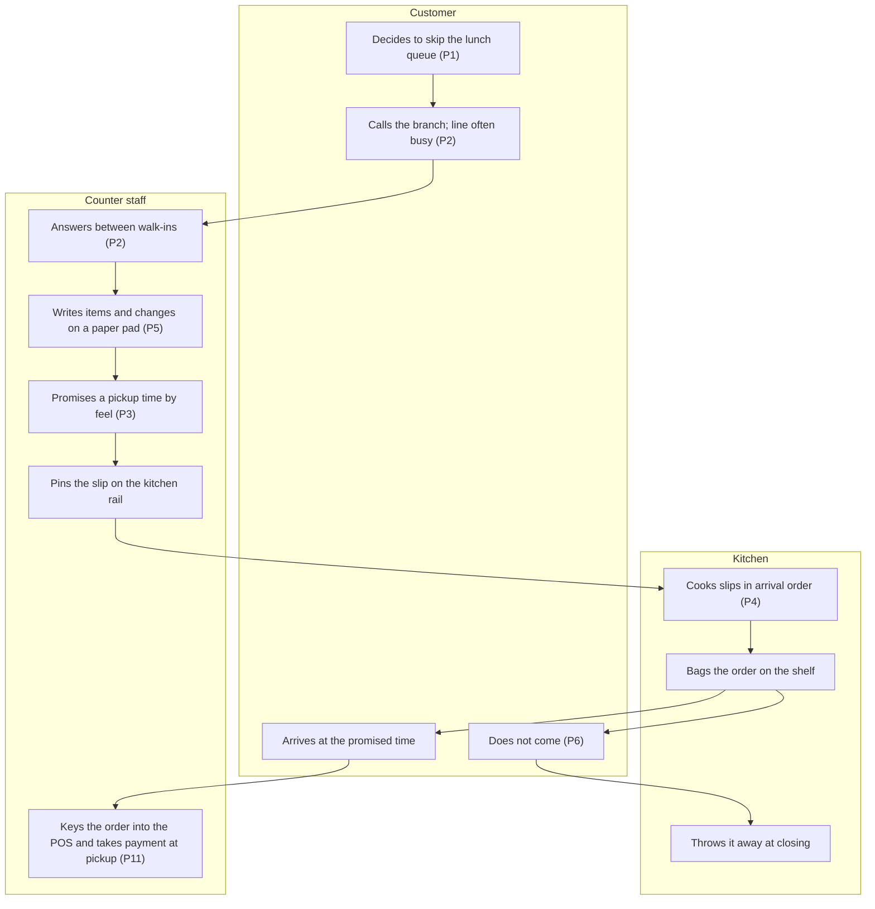
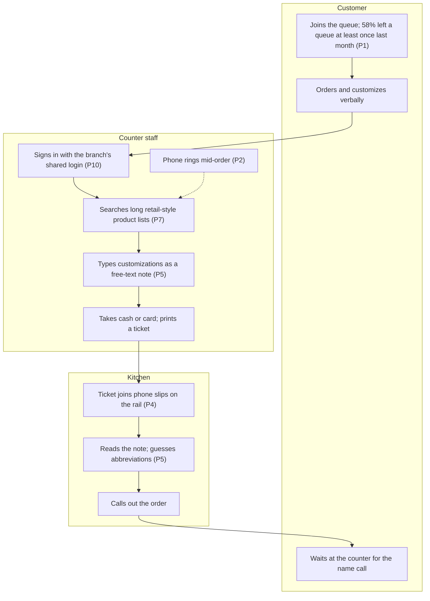
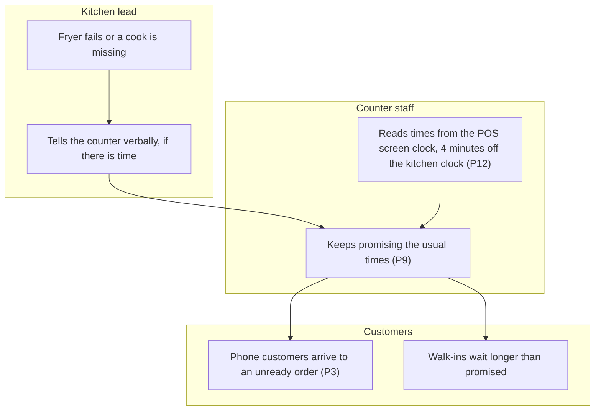
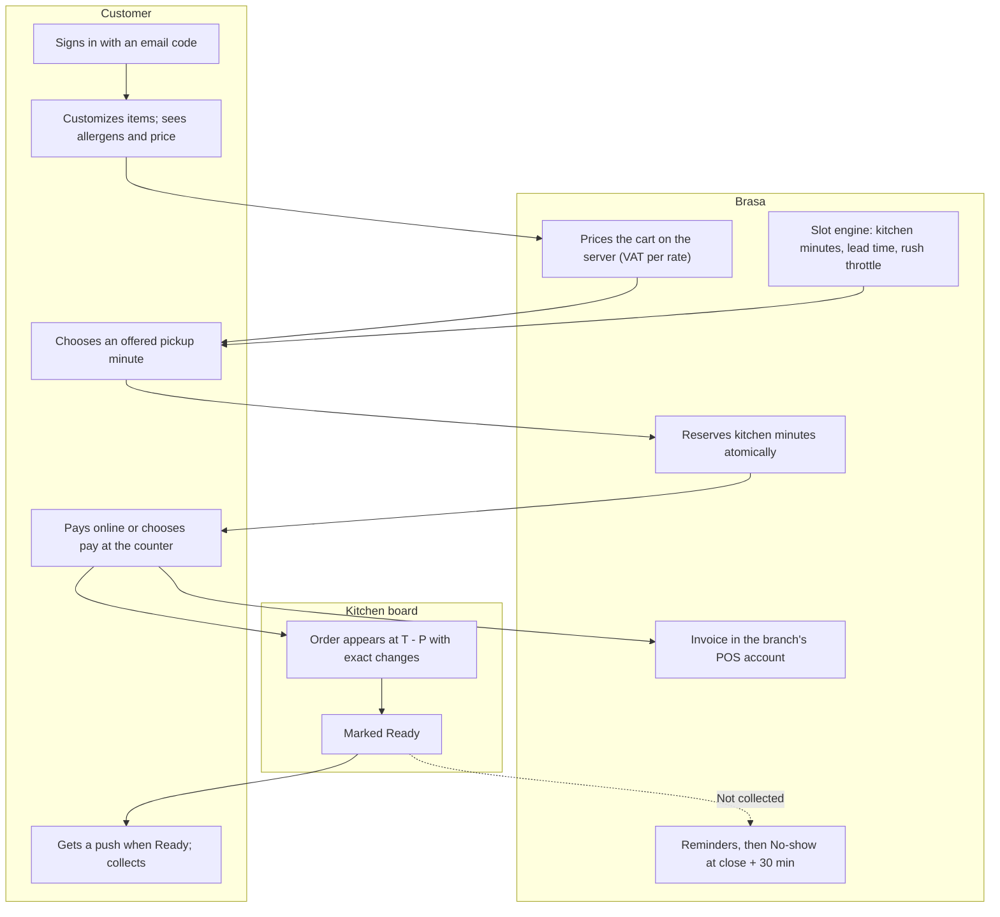
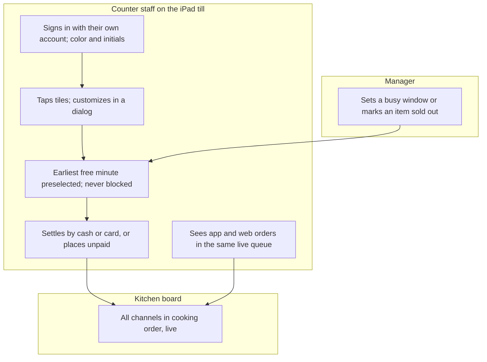

# Current vs Future State Analysis

## Document control

| Field | Value |
|---|---|
| Document ID | BRS-DIS-04 |
| Version | 1.2 |
| Status | Approved |
| Owner | Business Analyst |
| Last updated | 2026-09-22 |
| Reviewers | Operations Director (Product Owner), Branch Managers of Market Hall and Station Quarter, kitchen lead Market Hall, UX Designer, Tech Lead |

| Version | Date | Change |
|---|---|---|
| 1.0 | 2026-02-11 | AS-IS maps, pain points and gap analysis from discovery |
| 1.1 | 2026-03-06 | TO-BE flows aligned with SRS v1.0; gap table traced to FR IDs |
| 1.2 | 2026-09-22 | KPI results to date added; rush capacity gap updated for CR-006 |

### Purpose and scope

This document shows how Brasa Grill's four branches worked before Brasa, where that way of working failed, and how Brasa changes it. It covers three AS-IS processes: the phone pre-order, the walk-in order with paper kitchen tickets, and kitchen trouble during the rush. Each pain point is quantified and traced to the objective and requirement that address it, so the business case and the requirements share one evidence base.

Detailed TO-BE behavior is specified in the [SRS](../02-requirements/SRS.md) and the [process flows](../03-design/diagrams/process-flows.md). The TO-BE views here are business-level.

## 1. Discovery evidence

| Source | Scope | When | Used for |
|---|---|---|---|
| Interviews INT-01 to INT-24 | Owner and Managing Director (1), Operations Director (1), Finance Controller (1), tax adviser (1), Branch Managers (4), kitchen leads (4), counter staff (8), marketing coordinator (1), lunch regulars (3) | 2026-01-13 to 2026-01-29 | Pain points, rules, personas |
| Rush observations OBS-01 to OBS-08 | Market Hall and Station Quarter, 11:30 to 14:00; OBS-01 to OBS-04 from the counter, OBS-05 to OBS-08 from the kitchen (same branch and day four logs apart) | 2026-01-22 and 2026-01-29 | AS-IS maps; 120 timed walk-in transactions; ticket order on the rail |
| Phone call log | All four branches, every call during opening hours, purpose and duration noted by staff | 2026-01-12 to 2026-01-23 (two weeks) | Calls per rush; minutes per call; ready-on-time sample of 310 phone pre-orders |
| POS export | All sales, October to December 2025 (81,600 orders) | Analyzed 2026-01-19 | Order mix, ticket size, phone share, lunch peak |
| Remake log | Remakes and refunds with reason, Q4 2025 | Analyzed 2026-01-20 | Customization error rate |
| Customer survey | n = 212, QR code on receipts and tables at all branches | 2026-01-14 to 2026-01-25 | Queue abandonment, willingness to order ahead, sign-up attitude |
| Prototype test | Clickable prototype with 12 customers and 6 staff | 2026-02-02 to 2026-02-06 | Slot model (DEC-02), sign-in method (DEC-01), till layout |

The Business Analyst de-identified the interview summaries and observation logs before an AI assistant proposed candidate themes. The BA recounted every theme by hand and validated the final list with the Branch Managers of Market Hall and Station Quarter on 2026-02-05 ([AI-assisted BA](../08-ai-assisted-ba/README.md#41-discovery-synthesis-2026-01-30)).

## 2. AS-IS process maps

Nodes marked `P#` show where a pain point (section 3) occurs.

### 2.1 Phone pre-order and uncollected orders

Observed: 38 calls per branch in each weekday rush (24 new orders, 9 "is my order ready?", 5 other questions), about 2.5 minutes each. Phone pre-orders were 14% of all orders in Q4 2025. 480 of 11,420 phone pre-orders (4.2%) were never collected or paid.

### 2.2 Walk-in order and kitchen tickets

Observed: a median of 74 seconds from first item to payment over 120 timed walk-ins, and 1,469 remakes for a wrong customization in Q4 2025 (18 per 1,000 orders).

### 2.3 Kitchen trouble during the rush

## 3. Pain points

Sources count interviews and observation logs that support the pain point (32 in total).

| ID | Pain point | Evidence | Sources | Baseline | Objective | Addressed by |
|---|---|---|---|---|---|---|
| P1 | No own way to order ahead; customers who will not queue go elsewhere | Survey: 58% left a queue in the last month, 64% would order ahead in an app; marketplace apps rejected on commission | 14 | 0% digital orders | OBJ-01 | FR-IAM-01, FR-ORD-01 to FR-ORD-12 |
| P2 | The phone is the only pre-order channel; calls interrupt the counter and orders are written down wrong | Call log; OBS-01 to OBS-04 | 19 | 38 rush calls per branch per weekday | OBJ-02 | FR-ORD-08, FR-ORD-09, FR-NTF-02 |
| P3 | Pickup times are promised by feel | 310 phone pre-orders in the call log | 13 | 71% ready on time | OBJ-03 | FR-BRN-06 to FR-BRN-08 (BR-010 to BR-013) |
| P4 | Tickets reach the kitchen in arrival order, not cooking order | OBS-05 to OBS-08 (kitchen posts) | 9 | Phone slips cooked up to 20 minutes early or late | OBJ-03 | FR-TIL-07, FR-TIL-10 (kitchen start at T - P) |
| P5 | Customizations are lost between counter and kitchen | Remake log; free-text notes in OBS logs | 15 | 18 remakes per 1,000 orders | OBJ-04 | FR-ORD-03, FR-TIL-02, FR-TIL-07 |
| P6 | Uncollected phone pre-orders, with no reminder and no consequence | POS export, closing waste notes | 10 | 4.2% of pickup orders | OBJ-05 | FR-NTF-03, FR-NTF-04 (BR-040 to BR-042) |
| P7 | The POS screen is built for retail lists, not customized food | 120 timed walk-ins | 12 | 74 s median walk-in | OBJ-06 | FR-TIL-01 to FR-TIL-04 |
| P8 | Allergen questions are answered from memory; nothing in writing before a phone order | Interviews with kitchen leads and regulars | 6 | No allergen data in any system | Compliance | FR-MNU-07 (BR-028, CR-001) |
| P9 | Kitchen trouble does not reach the times being promised | OBS-02, OBS-06; manager interviews | 7 | Not measured | OBJ-03 | FR-BRN-09, FR-BRN-10, FR-MNU-08 |
| P10 | One shared POS login per branch; voids and refunds carry no name | Interviews with managers and the Finance Controller | 5 | 0 staff actions traceable to a person | Accountability | FR-IAM-05, FR-IAM-07 (NFR-SEC-05) |
| P11 | Removal credits and phone prices are applied inconsistently | Interviews; POS export shows 3 price levels for the same bowl | 6 | Not measured | OBJ-04 | FR-ORD-05, FR-MNU-06 (BR-021, BR-027, DEC-03) |
| P12 | Clocks on shared devices disagree | OBS-02, OBS-06 only (weak theme) | 2 | 4 minutes difference observed | OBJ-03 | BR-020 (server clock only) |

## 4. TO-BE processes

### 4.1 Order ahead in the app or on the web

### 4.2 Walk-in on the till and the live queue

## 5. Gap analysis

| Capability | AS-IS | TO-BE | Gap type | Requirements |
|---|---|---|---|---|
| Ordering ahead | Phone only | App and web with email-code sign-in | New | FR-IAM-01, FR-ORD-01 to FR-ORD-08 |
| Pickup time | Promised by feel | Kitchen-minute slot engine with lead time and rush factor | New | FR-BRN-06 to FR-BRN-08 |
| Rush capacity for walk-ins | Not managed | The till is never blocked; online share capped per rush block since R1.2 | New | BR-019, FR-BRN-12 (CR-006) |
| Kitchen tickets | Paper rail in arrival order | Kitchen board in cooking order, live on every screen | Replaced | FR-TIL-07, FR-TIL-09 to FR-TIL-11 |
| Customizations | Free-text notes | Structured ingredients and add-ons, shown the same on every screen | Replaced | FR-ORD-03, FR-MNU-03, FR-MNU-04, FR-TIL-02 |
| Prices | Phone list, POS and removal credits differ | One catalog per branch; no removal credits; server pricing; POS articles synced | Changed | FR-ORD-05, FR-MNU-02, FR-MNU-06 |
| Allergens | From memory | 14 allergen groups shown before purchase | New | FR-MNU-07 |
| Kitchen trouble | Verbal | Busy window, delay protection, sold out | New | FR-BRN-09, FR-BRN-10, FR-MNU-08 |
| Payment | At the counter only | Online with a tip, or at the counter by cash or card | Changed | FR-PAY-01 to FR-PAY-05 |
| Invoices | Receipt at the counter | One invoice per paid order in the branch's POS account; reconciliation nightly | Changed | FR-PAY-06, FR-PAY-07, FR-PAY-10 |
| Order status questions | Phone calls | Live status in the app and a push when Ready | New | FR-ORD-09, FR-NTF-02 |
| Uncollected orders | Thrown away | Reminder ladder, No-show at close + 30 min, Prepay-only for 30 days | New | FR-NTF-03, FR-NTF-04 |
| Staff accounts | Shared login | Personal accounts with role, branches and color | New | FR-IAM-04 to FR-IAM-07 |
| Steering data | Spreadsheets from the POS export | Daily operations summary by branch and channel | New | FR-TIL-13 |

## 6. Business-process KPIs

| KPI | AS-IS baseline | TO-BE target | Result to date | Objective |
|---|---|---|---|---|
| Orders through an own digital channel | 0% | 30% or more | 24% (September 2026) | OBJ-01 |
| Rush phone calls per branch per weekday | 38 | 8 or fewer | 11 (September 2026) | OBJ-02 |
| Pickup orders ready on time | 71% | 92% or more | 89% (September 2026) | OBJ-03 |
| Remakes for a wrong customization per 1,000 orders | 18 | 5 or fewer | 4.1 (September 2026) | OBJ-04 |
| Uncollected and unpaid pickup orders | 4.2% | 1.5% or less | 1.1% (September 2026) | OBJ-05 |
| Median walk-in transaction | 74 s | 50 s or less | 48 s (September 2026) | OBJ-06 |

Targets are measured over Q4 2026 ([BRD section 4](../02-requirements/BRD.md#4-business-objectives)).

## Related documents

- [Project charter](project-charter.md)
- [Personas](personas.md)
- [Market and competitor scan](market-and-competitor-scan.md)
- [Business requirements document](../02-requirements/BRD.md)
- [Process flows](../03-design/diagrams/process-flows.md)
- [AI-assisted BA](../08-ai-assisted-ba/README.md)
