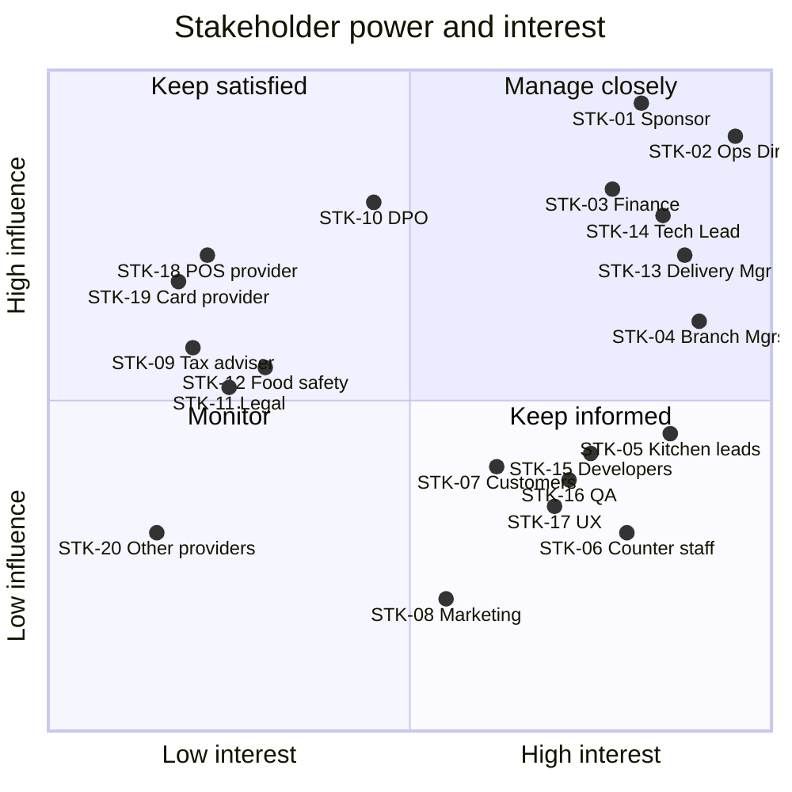

# Stakeholder Register and RACI

## Document control

| Field | Value |
|---|---|
| Document ID | BRS-DIS-02 |
| Version | 1.3 |
| Status | Approved |
| Owner | Business Analyst |
| Last updated | 2026-09-22 |
| Reviewers | Operations Director (Product Owner), Delivery Manager, Finance Controller |

| Version | Date | Change |
|---|---|---|
| 1.0 | 2026-01-14 | Initial register from the kickoff with the sponsor and the Operations Director |
| 1.1 | 2026-02-18 | Updated after discovery: attitudes revised from interview and observation evidence; RACI agreed at steering |
| 1.2 | 2026-06-01 | UAT and rollout roles added; branch round added to the communication plan |
| 1.3 | 2026-09-22 | Incident communication rows added after INC-2026-004 and INC-2026-009; food-safety consultant added (CR-001) |

### Purpose and scope

This register identifies everyone who affects or is affected by Brasa, records how much they care and how much they can influence it, and sets how the team engages them. The Business Analyst maintains it and reviews it at every steering meeting; attitude changes are recorded with the evidence that caused them. Staff below manager level and customers are listed as groups, not by name.

## 1. Stakeholder register

Influence and interest use High, Medium and Low. Attitude uses Champion, Supportive, Neutral, Cautious and Skeptical. The Business Analyst is the author of this register and is not listed.

| ID | Stakeholder (role) | Organization | Interest in Brasa | Influence | Interest level | Attitude | Engagement strategy | Channel and frequency |
|---|---|---|---|---|---|---|---|---|
| STK-01 | Owner and Managing Director (sponsor) | Brasa Grill | Lunch growth without more counter staff; payback; brand | High | High | Champion | Decisions framed as options with cost and risk; business case owned with the Finance Controller | Steering monthly; one-page status every 2 weeks |
| STK-02 | Operations Director (Product Owner), see PER-06 | Brasa Grill | One way of working at four branches; numbers to steer by | High | High | Champion | Daily collaboration; BA prepares refinement-ready stories and CR impact analyses | Stand-up; weekly refinement; CCB chair |
| STK-03 | Finance Controller, see PER-07 | Brasa Grill | VAT, receipts, refunds, reconciliation, running costs | High (veto on money rules) | High | Cautious, then Supportive after DEC-10 and DEC-11 | Worked examples for every money rule; sign-off on WE-1; reconciliation design review | Money-rule review per sprint; CCB for money CRs |
| STK-04 | Branch Managers (four), see PER-05 | Brasa Grill | A calm rush; fair treatment of walk-ins and online customers; control in trouble | Medium to High | High | Supportive; Station Quarter Skeptical about online orders until CR-006 | Observation at their branches; UAT participants; first say on operational settings | Branch round every 2 weeks from May; UAT |
| STK-05 | Kitchen leads (four), see PER-04 | Brasa Grill | A board they can read at 2 m with gloves on; orders in the right order | Medium | High | Cautious ("another screen") | Co-design of the kitchen board; validate kitchen-minute model and rush factor | Rush observations; board walkthroughs per sprint from S3 |
| STK-06 | Counter staff (about 40 across the branches), see PER-03 | Brasa Grill | Fast tiles; one queue; no blame for money mistakes | Low individually, High collectively | High | Mixed: 6 of 8 interviewed positive; worried about refund disputes | Timed tasks in the prototype test; no refunds for Counter Staff (DEC-06); color coding on boards | Prototype test; UAT-04 and UAT-05; release notes on the till |
| STK-07 | Customers (lunch regulars, students, office workers), see PER-01 and PER-02 | Public | Honest pickup times, the price before paying, allergens, an easy cancel | High collectively (OBJ-01) | Medium | Supportive: 64% of surveyed customers would order ahead in an app | Survey (n = 212); prototype test with 12 customers; app store reviews | Survey; release notes; support email |
| STK-08 | Marketing coordinator | Brasa Grill | App adoption, store listing, QR material | Low | Medium | Supportive | Involved in launch material; raised CR-002 | Monthly adoption review |
| STK-09 | External tax adviser | Adviser to the Finance Controller | VAT treatment, tip handling, receipt rules | Medium (veto on tax treatment) | Low | Neutral | Questions batched through the Finance Controller; confirmation in writing (A-04) | As needed |
| STK-10 | Data Protection Officer | External service | Lawful basis, minimization, erasure, processors, DPIA | High (veto on personal-data handling) | Medium | Cautious | Privacy review per epic; DPIA before go-live; review of push and email content | Monthly check-in; per epic |
| STK-11 | Legal counsel | External | Consumer-law wording: order button, cancellation, distance-sale information | Medium | Low | Neutral | Wording requests with screenshots and the rule text (A-06, DEP-05) | As needed |
| STK-12 | Food-safety consultant | External | Allergen information before an online purchase | Medium (compliance finding) | Low | Neutral | Compliance review of the R1 design led to CR-001 | Per review |
| STK-13 | Delivery Manager | Delivery partner | Scope, schedule and budget within the fixed price; incident communication | High | High | Supportive | Joint planning; RAID owner; Communications Lead in incidents | Daily; CCB; steering |
| STK-14 | Tech Lead | Delivery partner | Feasibility, architecture, NFRs, provider integrations | High | High | Supportive | Involve early on rules with timing, money or concurrency impact; ADR reviews; default Incident Commander | Refinement; ADR reviews; incidents |
| STK-15 | Developers (2 Flutter, 1 React, 2 Node.js) | Delivery partner | Unambiguous acceptance criteria; stable scope within a sprint | Medium | High | Supportive | Three-amigos session per story; BA office hours twice a week | Sprint ceremonies; team chat |
| STK-16 | QA Lead and QA engineer | Delivery partner | Testable requirements, traceability, synthetic data, virtual clock | Medium | High | Supportive | Co-own acceptance criteria and the RTM; review every BR for testability | Three-amigos; RTM review per sprint |
| STK-17 | UX Designer | Delivery partner | Usable flows for a 45-minute lunch break and a busy counter; accessibility | Medium | High | Supportive | Co-facilitate observations and the prototype test; joint persona ownership | Weekly design review |
| STK-18 | Cloud POS and invoicing provider | External | Correct API use; rate limits; certified receipts | High (dependency for every receipt) | Low | Neutral | Sandbox early (DEP-01); queued article sync (DEC-13); outbox for invoices | Developer support; status page |
| STK-19 | Card payment provider | External | Standard hosted checkout and reader SDK; correct webhooks | High (dependency for card payments) | Low | Neutral | Hosted checkout and SDK only (NFR-SEC-03); idempotency keys (ADR-003) | Developer support; status page |
| STK-20 | Email, push and hosting providers | External | Volumes, deliverability, data processing terms | Medium | Low | Neutral | EU region and processing agreements (NFR-PRIV-03); priority queue for sign-in codes | Status pages; contract reviews |

## 2. Power/interest grid

Coordinates are the Business Analyst's assessment after discovery (February 2026), reviewed at steering on 2026-02-18.

| Quadrant | Stakeholders | Strategy |
|---|---|---|
| Manage closely (high influence, high interest) | STK-01, STK-02, STK-03, STK-04, STK-13, STK-14 | Involve in decisions; formal sign-off on scope, money rules and go-live |
| Keep satisfied (high influence, lower interest) | STK-10, STK-18, STK-19, and STK-09, STK-11, STK-12 for their specialist rulings | Meet their rules and contracts early; no surprises |
| Keep informed (high interest, lower influence) | STK-05, STK-06, STK-07, STK-15, STK-16, STK-17 | Co-design, prototype test, demos; their adoption decides OBJ-01, OBJ-03 and OBJ-06 |
| Monitor | STK-08, STK-20 | Periodic check |

Counter staff (STK-06) and kitchen leads (STK-05) sit in "Keep informed" individually. The team treats them as a "manage closely" group for till and board design, because OBJ-03 and OBJ-06 depend entirely on them.

## 3. RACI matrix

R = Responsible (does the work), A = Accountable (one per row, final decision), C = Consulted (two-way), I = Informed (one-way). Where a cell shows A without an R in the row, the accountable role also does the work. Branch Managers and kitchen leads are represented by one nominated person per branch.

| Deliverable or decision | Sponsor | Ops Director (PO) | Finance Controller | Branch Mgrs | Kitchen leads | BA | Delivery Mgr | Tech Lead | QA Lead | UX | DPO |
|---|---|---|---|---|---|---|---|---|---|---|---|
| Project charter and budget envelope | A | C | C | I | | R | C | C | I | | |
| BRD: objectives, needs and scope | C | A | C | C | C | R | C | C | C | C | I |
| Business case and cost/benefit (BRD section 11) | A | C | C | | | R | C | | | | |
| SRS baseline and each revision | I | A | C | C | C | R | C | C | C | C | C |
| Slot engine and kitchen timing rules (BR-010 to BR-020) | | A | | C | C | R | | C | C | | |
| Pricing, VAT, tips, invoices and refunds (BR-021 to BR-039) | | C | A | C | | R | | C | C | | |
| Allergen information (BR-028, CR-001) | | A | | C | C | R | | C | C | C | |
| Personal data: content of push and email, retention, erasure (BR-008, NFR-PRIV-01 to NFR-PRIV-03) | | A | | | | R | | C | I | C | C |
| Architecture and ADRs | | I | | | | C | I | A | C | | |
| Requirements traceability matrix | | I | | | | A | | C | R | | |
| UAT plan and scripts | | C | C | C | C | R | I | I | A | C | |
| UAT sign-off per release | I | A | C | R | C | C | I | C | C | | |
| Go/no-go per release | A | R | C | C | | C | C | C | C | | I |
| CR approval (CCB) | I | A | C | I | | R | C | C | C | I | |
| Incident communication to branches | I | I | I | I | | C | R | A | | | |
| Post-incident review | I | C | C | C | | R | C | A | C | | |

Notes:
- The Business Analyst is Responsible for documenting every rule and Accountable only for the traceability matrix, which is the BA's own work product. Rules are owned by their authority: kitchen timing by the Product Owner with the kitchen leads, money rules by the Finance Controller with the tax adviser.
- For incidents the Tech Lead appears as Accountable because that role is the default Incident Commander; whoever acts as Incident Commander holds the accountability ([incident management process](../07-operations/incident-management-process.md)). The Delivery Manager is the Communications Lead.
- The Data Protection Officer advises and can stop a release on personal-data grounds; accountability for the processing stays with Brasa Grill, represented by the Operations Director.

## 4. Communication plan

| Communication | Purpose | Audience | Owner | Frequency | Channel | Artifact |
|---|---|---|---|---|---|---|
| Steering committee | Decide scope, budget, milestones and go-live | STK-01, STK-02, STK-03, STK-13, STK-14 | Sponsor (BA prepares the pack) | Monthly; every 2 weeks in June and July 2026 | Meeting | Status pack with RAID and KPI trend |
| CCB | Decide change requests; review the RAID log | CCB members | Operations Director (chair), BA (secretary) | Weekly, or ad hoc | Video meeting | CR log entry with impact analysis |
| Sprint review and demo | Show working software and collect feedback | Delivery team, Product Owner, Finance Controller; branch managers from S3 | Product Owner | Every 2 weeks | Meeting with recording | Demo notes; feedback added to the backlog by the BA |
| Requirements walkthrough | Confirm understanding before sign-off | Reviewers of each SRS version | Business Analyst | Per SRS version | Workshop | Review comments log; sign-off record |
| Money-rule review | Validate pricing, VAT, tips and refunds | Finance Controller; tax adviser through the Finance Controller | Business Analyst | Each sprint with money content | Workshop with worked examples | Signed rule table |
| Branch round | Operational feedback, UAT and rollout planning | Branch Managers, kitchen leads, Product Owner | Operations Director | Every 2 weeks from May 2026 | Meeting at a branch | Action log |
| Staff release notes | Explain till and board changes in plain language | Counter staff, kitchen leads | UX Designer with the BA | Each release | Message on the till; printed one-pager in the kitchen | Release note |
| Monthly KPI report | Track OBJ-01 to OBJ-06 and the leading indicators | Sponsor, Product Owner, Branch Managers | Business Analyst | Monthly from July 2026 | Email with PDF | KPI report |
| Incident status updates | Inform branches during an incident | Branch Managers, Operations Director | Communications Lead (Delivery Manager) | Per severity cadence | Phone and messaging group | Templates in the incident process |
| Post-incident review summary | Share causes and corrective actions | Operations Director, Finance Controller, Branch Managers, delivery team | Business Analyst | Within 5 business days for SEV-1 and SEV-2 | Email and PIR document | PIR |

## Related documents

- [Project charter](project-charter.md)
- [Personas](personas.md)
- [Current vs future state](current-vs-future-state.md)
- [Business requirements document](../02-requirements/BRD.md)
- [Change request log](../05-delivery/change-request-log.md)
- [Decision log](../05-delivery/decision-log.md)
- [UAT plan and scripts](../06-quality/uat-plan-and-scripts.md)
- [Incident management process](../07-operations/incident-management-process.md)
