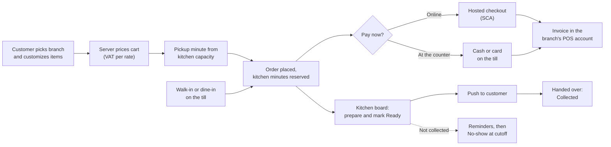

# Business Requirements Document (BRD): Brasa Release 1

## Document control

| Field | Value |
|---|---|
| Document ID | BRS-REQ-BRD |
| Version | 1.2 |
| Status | Approved |
| Owner | Business Analyst |
| Last updated | 2026-09-18 |
| Reviewers | Owner and Managing Director (sponsor); Operations Director (Product Owner); Finance Controller; Tech Lead; QA Lead; Branch Managers (four branches) |
| Approval | See [section 13](#13-approval-and-sign-off) |

| Version | Date | Change |
|---|---|---|
| 1.0 | 2026-02-13 | Baseline at the end of discovery. |
| 1.1 | 2026-04-10 | CR-001 (allergen information before purchase) added to BN-03; CR-002 (guest checkout) recorded as rejected. |
| 1.2 | 2026-09-18 | Post-launch update: results to date for OBJ-01 to OBJ-06; BN-05, BN-06 and BN-07 sharpened by CR-003, CR-004 and CR-007 after INC-2026-004 and INC-2026-009; R1.2 scope (CR-006). |

**Purpose.** This document states why Brasa exists, which business outcomes it must achieve and which business needs the solution must meet. In ISO/IEC/IEEE 29148:2018 terms it is the business requirements specification. It says little about *how*; the [SRS](SRS.md) specifies the system behavior that meets each need.

**Scope of this document.** Brasa R1 (live at all four branches since 2026-06-29), the increments R1.1 and R1.2, and the boundary to R2. Audience: the owner, the Operations Director, branch managers, the Finance Controller and the delivery team.

## 1. Executive summary

Brasa Grill (fictional) runs four grill-bowl and wrap restaurants in one EU member state: Market Hall, Station Quarter, Riverside and Campus. Before Brasa, a customer who wanted to skip the lunch queue had to phone. The counter wrote the order on paper, the kitchen guessed when to start, and walk-ins and phone orders competed at the same POS screen. Discovery in January 2026 measured the cost:

| Pain point | Baseline (discovery, January 2026) |
|---|---|
| Orders placed through an own digital channel | 0% (phone pre-orders were 14% of orders) |
| Phone calls during the lunch rush, per branch per weekday | 38 |
| Pickup orders ready by the promised time | 71% |
| Orders remade or refunded for a wrong customization, per 1,000 orders | 18 |
| Pickup orders never collected and never paid | 4.2% |
| Median walk-in transaction at the counter (first item to payment) | 74 s |

Brasa replaces this with one platform. Customers order and pay in a mobile app or on the web for an exact pickup minute that the kitchen can meet. Staff take walk-in and dine-in orders on an iPad till. The kitchen and the counter work from live boards that show every order from every channel, with exactly what to leave out and add. Invoices are raised in each branch's account at its cloud POS and invoicing provider, so fiscal rules stay with a certified provider.

R1 went live at Market Hall on 2026-06-15 and at all branches on 2026-06-29. Two production incidents (INC-2026-004 and INC-2026-009) each produced a change request that is now live in R1.1. The rush-hour throttle (CR-006) went live in R1.2 on 2026-09-28. Results to date are in section 4. The illustrative model in [section 11](#11-benefits-and-costbenefit-view) shows about EUR 154,800 a year in recurring benefits against about EUR 41,000 a year in running costs. Most of it depends on new orders from customers who used to avoid the lunch queue, which is why slot accuracy and walk-in capacity are Must requirements.

Three scope decisions shape the solution:
- **Exact pickup minutes, not 15-minute slots,** calculated from the kitchen's real capacity (DEC-02, [ADR-001](../03-design/architecture/adr/ADR-001-server-authoritative-slot-reservation.md)).
- **Fiscal receipts stay with the POS provider.** Brasa sends complete, correctly rounded lines and never signs receipts itself (DEC-10).
- **No guest checkout** (CR-002 rejected). Reminders and the no-show policy need a verified email.

## 2. Business context

Brasa Grill sells grill bowls, wraps, sides and drinks for takeaway, with some seating at three branches. About 27,200 orders a month across the four branches, with an average ticket of EUR 13.90. Lunch on weekdays (11:45 to 13:30) brings about 40% of daily orders at Market Hall and Station Quarter.

Four pressures make the old way of working unsustainable:
- **Customers expect to order ahead.** In the January survey (n = 212), 58% of lunch customers said they had left the queue at least once in the last month, and 64% would use an app to order ahead.
- **Phone orders cost the counter its rush.** Each phone order takes about 2.5 minutes of counter time at the worst moment of the day.
- **Food information rules apply to distance sales.** Allergen information must be available before an online purchase is concluded ([compliance mapping](compliance-mapping.md)).
- **Payments and receipts are regulated.** Card payments online need strong customer authentication, and every sale needs a receipt that meets the national cash-register rules.

The current state, the future state and the evidence are in [current-vs-future-state.md](../01-discovery/current-vs-future-state.md).

## 3. Problem statement

> **The problem of** taking pickup orders by phone and on paper, with no view of kitchen capacity, **affects** customers, counter staff, the kitchen and branch managers, **the impact of which is** lost lunch sales, orders that are late or wrong, food wasted on no-shows and a slow counter at the busiest hour. **A successful solution would** let customers order and pay for an exact pickup time the kitchen can meet, put every order from every channel in front of the kitchen live, and make walk-in orders faster than before.

| Problem | Evidence (baseline) | Business impact (illustrative) | Root cause found in discovery |
|---|---|---|---|
| No own digital channel | 0% digital; 14% phone | Customers who will not queue at lunch go elsewhere | No ordering app or web shop; marketplace apps rejected on commission |
| Phone load at the rush | 38 calls per branch per weekday | About 95 minutes of counter time per branch per weekday | Phone was the only way to pre-order or ask about an order |
| Late pickup orders | 71% ready on time | Customers wait at the counter in their lunch break | Paper tickets; no kitchen timing; pickup times promised by feel |
| Wrong customizations | 18 per 1,000 orders | About 5,900 remakes a year | Handwritten changes; "no onion" lost between counter and kitchen |
| No-shows | 4.2% of phone pre-orders | Food cooked and thrown away | No reminder; no consequence; no prepayment |
| Slow counter | 74 s median walk-in | Queue length at lunch | POS screen built for retail lists, not for customized food |

## 4. Business objectives

Objectives map one-to-one, in order, to the discovery KPIs. Targets are measured over Q4 2026 (2026-10-01 to 2026-12-31), the first full quarter after R1.1. Results to date are early indicators, reported monthly to the Product Owner.

| ID | Objective | KPI | Baseline | Target | Result to date | Measurement method | Owner |
|---|---|---|---|---|---|---|---|
| OBJ-01 | Build an own digital ordering channel | Share of orders placed in the app or on the web | 0% | 30% or more | 24% (September 2026) | Orders by channel from the daily operations summary (FR-TIL-13) | Operations Director |
| OBJ-02 | Take the phone out of the rush | Phone calls between 11:45 and 13:30 per branch per weekday | 38 | 8 or fewer | 11 (September 2026) | Phone system call log, sampled two weeks per month | Branch Managers |
| OBJ-03 | Have pickup orders ready on time | Pickup orders marked Ready before the end of their pickup minute | 71% | 92% or more | 86% (August), 89% (September) | Ready time vs pickup minute from the daily summary (US-042) | Kitchen leads |
| OBJ-04 | Get customizations right | Orders remade or refunded for a wrong customization, per 1,000 orders | 18 | 5 or fewer | 4.1 (September 2026) | Manager remake log, reason "wrong customization" | Operations Director |
| OBJ-05 | Cut no-shows | Pickup orders Ready but never collected or paid, as a share of pickup orders | 4.2% | 1.5% or less | 2.3% (July), 1.1% (September) | No-show orders from the daily summary (BR-041) | Branch Managers |
| OBJ-06 | Speed up the counter | Median walk-in transaction, first item to payment complete | 74 s | 50 s or less | 48 s (production sample of 200 orders, September) | Till event timestamps; UAT timed task (NFR-USE-02) | Operations Director |

Leading indicators tracked weekly but not objectives: share of opened pickup sheets with no available minute, walk-in orders during the rush given a pickup minute 15 or more minutes away (34% in August at Station Quarter; target 10% or less after R1.2), push opt-in rate, and refunds waiting in the Manager queue.

## 5. Scope

### 5.1 Epics in scope

| Epic | Name | Modules | Release | Functional requirements | User stories |
|---|---|---|---|---|---|
| EP-01 | Identity & Access | IAM | R1 | 10 | US-001 to US-007 |
| EP-02 | Branches & Pickup Slots | BRN | R1; FR-BRN-12 in R1.2 | 12 | US-008 to US-013 |
| EP-03 | Menu & Catalog | MNU | R1 | 8 | US-014 to US-018 |
| EP-04 | Customer Ordering & Notifications | ORD, NTF | R1 | 19 | US-019 to US-029 |
| EP-05 | Payments & Invoicing | PAY | R1; FR-PAY-05 and FR-PAY-10 in R1.1 | 10 | US-030 to US-035 |
| EP-06 | Till & Live Order Boards | TIL | R1; FR-TIL-11 in R1.1 | 13 | US-036 to US-042 |

### 5.2 Release split

| Release | Date | Content | Basis |
|---|---|---|---|
| R1 pilot | 2026-06-15 | EP-01 to EP-06 at LOC-01 Market Hall | SRS v1.2 |
| R1 all branches | 2026-06-29 | Market Hall, Station Quarter, Riverside, Campus | SRS v1.2 |
| R1.1 | 2026-09-07 | CR-003 (Prepay-only instead of suspension), CR-004 (resync after reconnect), CR-007 (single-capture payments, invoice outbox, reconciliation) | SRS v1.3 |
| R1.2 | 2026-09-28 | CR-006 (rush-hour throttle) | SRS v1.4 |
| R2 | Planning from Q1 2027 | Board-only kitchen role (TBD-01), two rush windows per day (TBD-02), partial refunds (TBD-03), till offline mode (TBD-10) | Open issues |

### 5.3 Out of scope

| Item | Reason | What the business does instead |
|---|---|---|
| Delivery to the customer's address | Different operating model, couriers and packaging | Pickup only; marketplace delivery stays outside Brasa |
| Loyalty, vouchers and marketing messages | Not needed to meet OBJ-01 to OBJ-06; adds consent management | Considered for R2 after Q4 results |
| Guest checkout on the web | CR-002 rejected: reminders and no-show handling need a verified email | Email sign-in takes under a minute (US-001) |
| Order-ahead for another day | Kitchen capacity is planned per day | Today only (TBD-06) |
| Table service and self-order kiosks | Dine-in is a small share; counter dine-in covers it | Dine-in on the till (FR-TIL-02) |
| Payroll, rota and stock | Separate tools work well enough | Daily summary helps staffing (FR-TIL-13) |
| Fiscal receipt signing | Must be done by a certified register | Raised by the cloud POS provider (IF-01) |
| SMS sign-in | Email codes are cheaper and enough | SMS provider integrated but dormant (DEC-09) |

## 6. Stakeholder summary

The full register, with RACI, is in [stakeholder-register-raci.md](../01-discovery/stakeholder-register-raci.md). Personas are in [personas.md](../01-discovery/personas.md).

| Stakeholder group | Represented by | Primary interest | Influence | What they need from Brasa |
|---|---|---|---|---|
| Owner and Managing Director | Sponsor | Growth at lunch; margin | High: funds the project | More orders without more counter staff |
| Operations Director | PER-06 Paul Lindqvist (ADM), Product Owner | Consistent operation of four branches | High: decides priorities | One catalog, one set of rules, numbers to steer by |
| Finance Controller | PER-07 Ines Duarte (ADM) | Correct VAT, receipts, reconciliation | High on money rules | VAT per rate, one invoice per paid order, daily reconciliation |
| Branch Managers | PER-05 Marta Kowalska (MGR) | A calm rush; fair treatment of customers | Medium to high | Controls for trouble (busy window, sold out), no-show list |
| Kitchen leads | PER-04 Sofia Rinaldi (MGR) | Cook the right thing at the right time | Medium: daily users | A board they can trust and read at 2 m |
| Counter staff | PER-03 Amir Haddad (CST) | A fast counter; no blame for mistakes | Low individually, decisive collectively | Big tiles, one queue, no refunds on their shoulders |
| Customers | PER-01 Clara Mendes, PER-02 Tomasz Nowak | Honest pickup times, fair price, allergens | High collectively | Order in under a minute; cancel before a clear deadline |
| External tax adviser | Finance Controller's adviser | VAT and receipts | Veto on tax treatment | Tip handling (A-04), VAT rounding |
| Data Protection Officer (external) | DPO service | GDPR compliance | Veto on personal-data handling | Minimization, erasure, processor agreements |
| Delivery team | Delivery Manager, BA, Tech Lead, developers, QA, UX | Ship safely and on time | High | Prioritized, testable requirements |

## 7. Business needs

Each business need maps to one module. The functional requirements are in [SRS section 3.2](SRS.md#32-functional-requirements), and the full chain is in the [traceability matrix](requirements-traceability-matrix.md).

| ID | Need statement | Business value | Module (epic) | Objectives |
|---|---|---|---|---|
| BN-01 | Customers need to start ordering with only an email address, and every staff member needs their own account with the least privilege for the job. | Low-friction sign-up; accountability for every till action | IAM (EP-01) | OBJ-01, OBJ-05 |
| BN-02 | The business needs to promise only pickup times the kitchen can meet, react to kitchen trouble within a minute, and keep rush capacity for walk-ins. | Orders ready on time; no lost walk-ins | BRN (EP-02) | OBJ-02, OBJ-03 |
| BN-03 | The business needs one accurate catalog per branch that drives every channel and the POS, with allergen information customers can rely on before they buy. | Right price everywhere; compliance; fewer errors | MNU (EP-03) | OBJ-01, OBJ-04 |
| BN-04 | Customers need to customize, price, schedule, follow and cancel an order themselves, with the deadline and total clear before they commit. | Digital share; fewer calls; fewer disputes | ORD (EP-04) | OBJ-01, OBJ-02, OBJ-04 |
| BN-05 | The business needs to take each payment exactly once, through channels that keep card data out of its systems, and give every paid order exactly one valid invoice. | Trust; no double charges; clean books | PAY (EP-05) | OBJ-05, OBJ-06 |
| BN-06 | The counter and the kitchen need one live, trustworthy view of every order, and a till that is faster than the old POS screen. | Ready on time; fewer errors; faster counter | TIL (EP-06) | OBJ-03, OBJ-04, OBJ-06 |
| BN-07 | Customers need to hear when their order is ready or canceled, and uncollected orders need to be chased and closed fairly. | Fewer calls and no-shows; less waste | NTF (EP-04) | OBJ-02, OBJ-05 |

## 8. Business process overview

The order lifecycle below is the backbone every need hangs off. Detailed flows with swimlanes and exceptions are in [process-flows.md](../03-design/diagrams/process-flows.md).

Design consequences the business has agreed to:
- **The kitchen sets the pace.** Customers see only minutes the line can meet (BR-012). At the busiest hour the app will sometimes offer 12:28 when a customer wanted 12:15. The business prefers that to a late order.
- **Walk-ins are never refused.** The till can always overbook (BR-019), and since R1.2 part of each rush quarter-hour is held for the counter (BR-018).
- **Mistakes are fixed by records, not deletions.** Canceled orders, refunds and no-shows stay in the history with actor and reason (BR-029, BR-031).

## 9. Constraints

| Type | Constraint |
|---|---|
| Regulatory | GDPR; VAT Directive and national invoice rules; food information to consumers (allergens); PSD2 strong customer authentication; national cash-register rules (through the POS provider); European Accessibility Act for the customer apps. See [compliance-mapping.md](compliance-mapping.md). |
| Contractual | Fixed-price build of EUR 186,000 with a monthly support retainer. The cloud POS provider and the card payment provider were already contracted by Brasa Grill and are kept. |
| Schedule | Six two-week sprints (S1 from 2026-03-02 to S6 ending 2026-05-22), hardening and UAT to 2026-06-12, pilot on 2026-06-15, all branches by the end of June before the summer terrace season. |
| Team | Delivery Manager, Business Analyst, Tech Lead, 2 Flutter developers, 1 React developer, 2 Node.js developers, QA Lead, 1 QA engineer, UX Designer. Scope is cut, not stretched. |
| Technical | Flutter for the customer app and the till, React for the web panel and Admin Panel, Node.js with Express and MongoDB, Socket.IO for live updates ([system architecture](../03-design/architecture/system-architecture.md)). The till needs connectivity (TBD-10). |
| Commercial | One legal entity and one online merchant account for all branches (TBD-07); prices include VAT. |

## 10. Assumptions and dependencies

Tracked with owners and review dates in the [RAID log](../05-delivery/raid-log.md).

**Assumptions**
- Each branch has one production line; the rush factor reflects extra staff at lunch (A-01).
- Customers accept a pickup minute later than they wanted if it is honest (A-02, confirmed by the pilot: 91% of customers who saw no minute in their first choice still ordered).
- The cloud POS provider meets the national cash-register rules for every receipt it raises (A-03).
- Tips are outside the VAT base and shown as a separate invoice line (A-04, confirmed by the tax adviser on 2026-05-14).
- Synthetic VAT rates are the same for eating in and taking away; the model stores both (A-05).

**Dependencies**
- POS provider sandbox and OAuth credentials per branch (DEP-01).
- Card payment provider: hosted checkout, card reader SDK and sandbox (DEP-02).
- App store accounts and review lead time (DEP-03).
- Branch Wi-Fi with 4G fallback at all four branches (DEP-04).

## 11. Benefits and cost/benefit view

All figures are fictional and illustrative. They show the logic of the business case, not a forecast.

**Model assumptions.**
- 326,160 orders a year (27,180 a month); average ticket EUR 13.90.
- Pickup orders at the 30% target: 97,848 a year.
- Loaded counter staff cost EUR 17.00 an hour; 252 trading weekdays.
- Food and packaging cost 35% of the ticket; a remake costs EUR 4.90; contribution margin 55%.

| # | Benefit | Driver | Calculation | Annual value |
|---|---|---|---|---|
| B1 | Counter time freed from the phone | OBJ-02: 38 to 8 calls | 30 calls x 2.5 min = 1.25 h per branch per weekday x 4 x 252 = 1,260 h x EUR 17.00 | EUR 21,420 |
| B2 | Food not wasted on no-shows | OBJ-05: 4.2% to 1.5% | 2.7% x 97,848 = 2,642 orders x EUR 13.90 x 35% | EUR 12,853 |
| B3 | Remakes avoided | OBJ-04: 18 to 5 per 1,000 | 13 per 1,000 x 326,160 = 4,240 remakes x EUR 4.90 | EUR 20,776 |
| B4 | New orders from customers who avoided the queue | OBJ-01 (assumed 4% net new orders) | 4% x 326,160 = 13,046 orders x EUR 13.90 x 55% | EUR 99,740 |
| B5 | Faster counter | OBJ-06: 74 s to 50 s | 24 s x about 228,000 walk-ins = about 1,520 counter hours, used for rush throughput | Not monetized |
| | **Recurring benefits (B1 to B4)** | | | **About EUR 154,800** |

| Cost | Calculation | Value |
|---|---|---|
| Build (one-time) | Fixed price | EUR 186,000 |
| Running costs | Hosting EUR 650, email EUR 60, POS integration EUR 45 x 4, error monitoring EUR 30, a month | EUR 11,040 a year |
| Support retainer | EUR 2,500 a month | EUR 30,000 a year |
| **Net recurring benefit** | EUR 154,789 - EUR 41,040 | **About EUR 113,750 a year; payback about 20 months** |

**Sensitivity.** B4 is the swing factor:
- At 2% new orders, recurring benefits fall to about EUR 104,900; payback is about 35 months.
- At 0%, savings alone (about EUR 55,000) cover running costs but never repay the build.

That is why slot accuracy (BN-02), walk-in protection (CR-006) and a sign-in that takes under a minute (BN-01) are Must requirements, and why OBJ-01 has a named owner.

## 12. Success criteria and acceptance

**Release acceptance (R1, met on 2026-06-12).**
1. Every Must FR passed system test and every business rule has a passing automated test (NFR-MNT-01). Evidence: [traceability matrix](requirements-traceability-matrix.md) and [test plan](../06-quality/test-strategy-and-plan.md).
2. UAT scripts signed off by the Operations Director and a manager of each branch, with no open Critical or High defects ([UAT plan](../06-quality/uat-plan-and-scripts.md)).
3. No open Critical or High security finding (NFR-SEC-02); DPIA reviewed by the Data Protection Officer.
4. Worked examples WE-1 and WE-2 reproduce exactly ([SRS Appendix B](SRS.md#appendix-b-worked-examples)).

**Business acceptance (Q4 2026).**
1. OBJ-01 to OBJ-06 meet target over Q4 2026, or a corrective plan is agreed with the Product Owner.
2. Thirty consecutive days with a clean nightly reconciliation (FR-PAY-10).
3. No SEV-1 or SEV-2 incident in the quarter with a root cause in a requirement gap; if one occurs, it produces a CR within 5 business days, as INC-2026-004 and INC-2026-009 did (CR-004, CR-007).

## 13. Approval and sign-off

| Role | Responsibility in approval | v1.0 | v1.2 |
|---|---|---|---|
| Owner and Managing Director | Sponsor; funding and business case | Approved 2026-02-18 | Approved 2026-09-22 |
| Operations Director (Product Owner) | Scope, priorities and objectives | Approved 2026-02-18 | Approved 2026-09-21 |
| Business Analyst | Author; completeness and traceability | Submitted 2026-02-13 | Submitted 2026-09-18 |
| Finance Controller | VAT, invoices, payments, cost/benefit | Approved 2026-02-17 | Approved 2026-09-21 |
| Tech Lead | Feasibility and constraints | Approved 2026-02-16 | Approved 2026-09-21 |
| QA Lead | Testability of the success criteria | Reviewed 2026-02-16 | Reviewed 2026-09-21 |
| Branch Managers (four branches) | Operational endorsement | Endorsed 2026-02-18 | Endorsed 2026-09-22 |

## Related documents

- [Project charter](../01-discovery/project-charter.md)
- [Stakeholder register and RACI](../01-discovery/stakeholder-register-raci.md)
- [Personas](../01-discovery/personas.md)
- [Current vs future state](../01-discovery/current-vs-future-state.md)
- [Market and competitor scan](../01-discovery/market-and-competitor-scan.md)
- [Software Requirements Specification](SRS.md)
- [Business rules](business-rules.md)
- [Non-functional requirements](non-functional-requirements.md)
- [Compliance mapping](compliance-mapping.md)
- [Requirements traceability matrix](requirements-traceability-matrix.md)
- [Release and sprint plan](../05-delivery/release-and-sprint-plan.md)
- [Change request log](../05-delivery/change-request-log.md)
- [RAID log](../05-delivery/raid-log.md)
