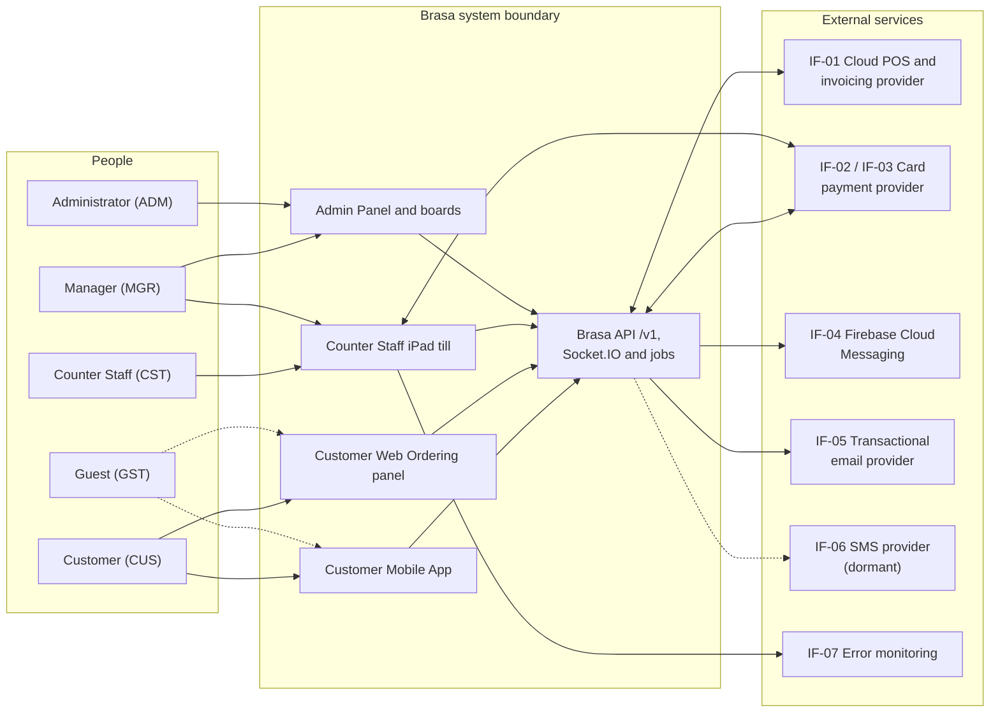

# Software Requirements Specification (SRS): Brasa

## Document control

| Field | Value |
|---|---|
| Document ID | BRS-REQ-SRS |
| Version | 1.4 |
| Status | Approved (baselined) |
| Owner | Business Analyst |
| Last updated | 2026-09-18 |
| Reviewers | Product Owner (Operations Director); Tech Lead; QA Lead; UX Designer; Finance Controller; Data Protection Officer (external) |
| Change control | After a baseline, this document changes only through the [change request log](../05-delivery/change-request-log.md). Each approved CR updates this SRS, the [business rules](business-rules.md), the [traceability matrix](requirements-traceability-matrix.md) and the affected user stories in the same pull request. |

**Purpose and scope.** This SRS specifies what Brasa does, how it interfaces with people and other systems, and the quality it must meet. It covers Release 1 (R1, live since 2026-06-29) and the increments R1.1 and R1.2. It is the contract between the Product Owner and the delivery team, and the basis for test design. Every requirement is written to be verifiable; section 4 says how.

## 1. Introduction

### 1.1 Purpose

This SRS turns the business needs BN-01 to BN-07 in the [BRD](BRD.md) into verifiable software requirements. Its audiences are:
- Developers and the Tech Lead, who design against it.
- QA, who derive test cases from it.
- The UX Designer, who builds screens to the field-level specifications.
- The Finance Controller and the Data Protection Officer, who check that rules with tax, fiscal or privacy weight are stated precisely.

The layout follows the SRS information item in ISO/IEC/IEEE 29148:2018. The overall description is kept as its own section (section 2) for readability.

### 1.2 Scope

Brasa is the pickup-ordering and in-store till platform of Brasa Grill (fictional), a chain of four grill-bowl and wrap restaurants in one EU member state. Four applications share one backend:
- **Customer Mobile App** (iOS and Android) and **Customer Web Ordering panel**: customers choose a branch, customize grill bowls and wraps, pick a pickup minute, pay online or at the counter, and follow the order live.
- **Counter Staff iPad till**: staff take walk-in and dine-in orders, settle by cash or card, and work the live queue of orders from every channel.
- **Admin Panel**: Administrators configure branches, menus and staff; Managers run the kitchen and counter boards of their branches.

This version specifies 72 functional requirements in 7 modules, 45 business rules (detailed in [business-rules.md](business-rules.md)) and 28 non-functional requirements (detailed in [non-functional-requirements.md](non-functional-requirements.md)).

Out of scope:
- Delivery to the customer's address.
- Loyalty, vouchers and marketing messages.
- Table service and self-order kiosks.
- Payroll, rota planning and stock control.

The reasons are in [BRD section 5.3](BRD.md#53-out-of-scope). The business outcomes Brasa must move are OBJ-01 to OBJ-06 ([BRD section 4](BRD.md#4-business-objectives)).

### 1.3 Product overview

| Application | Users | Technology | Release |
|---|---|---|---|
| Customer Mobile App | CUS, GST | Flutter (Dart), one code base for iOS and Android | R1 |
| Customer Web Ordering panel | CUS, GST | React 18 with Redux, single-page app | R1 |
| Counter Staff iPad till | CST, MGR | Flutter (Dart), iPad, landscape only | R1 |
| Admin Panel (including the kitchen and counter boards) | ADM, MGR | React 18 with Redux | R1 |

All four front ends use one REST API (`/v1`, contract in [openapi.yaml](../04-api/openapi.yaml)) served by a Node.js and Express backend with Mongoose on MongoDB. Live updates use Socket.IO ([realtime-events.md](../04-api/realtime-events.md)).

### 1.4 Definitions, acronyms and conventions

Terms are defined in the [glossary](glossary.md). Conventions used in this document:

| Convention | Meaning |
|---|---|
| shall | A mandatory, verifiable requirement. Prose without "shall" is explanatory. |
| Priority | MoSCoW: Must, Should, Could, Won't (this release). |
| Release | R1 (pilot 2026-06-15 at LOC-01, all branches 2026-06-29), R1.1 (2026-09-07), R1.2 (2026-09-28). |
| IDs | FR-<MOD>-NN, BR-NNN, US-NNN, NFR-<CAT>-NN, IF-NN (interfaces, section 3.1.3), TBD-NN (open issues, Appendix A), WE-N (worked examples, Appendix B). IDs are never reused. |
| Time | 24-hour clock in the branch's local time (CET/CEST). The server's clock is the only clock for slots and boards (BR-020). Stored in UTC; dates are ISO 8601. |
| Money | Euros in documents and the UI, with prices including VAT. The API carries integer cents (`amountCents`). |
| Kitchen minute | One minute of the branch's single production line. Pickup slots are calculated in kitchen minutes (BR-011, BR-012). |
| Defaults | Numbers in requirements are defaults. Section 2.7 lists them and who can change them. |

### 1.5 References

| Reference | Use in this SRS |
|---|---|
| [BRD](BRD.md), [business-rules.md](business-rules.md), [non-functional-requirements.md](non-functional-requirements.md), [compliance-mapping.md](compliance-mapping.md), [glossary.md](glossary.md) | Companion volumes of this specification |
| [Requirements traceability matrix](requirements-traceability-matrix.md) | BN to FR to BR to US to API to test case |
| [Data dictionary](../03-design/data/data-dictionary.md), [ERD](../03-design/data/erd.md) | Entity and field definitions |
| [openapi.yaml](../04-api/openapi.yaml), [API guidelines](../04-api/api-guidelines.md), [realtime events](../04-api/realtime-events.md) | API contract, error codes, live events |
| [State machines](../03-design/diagrams/state-machines.md), [sequence diagrams](../03-design/diagrams/sequence-diagrams.md), [wireframes](../03-design/wireframes/README.md) | Behavior and screen design |
| ISO/IEC/IEEE 29148:2018 | Requirements engineering; SRS structure; verification methods |
| ISO/IEC 25010:2011 | Quality model for the NFRs |
| Regulation (EU) 2016/679 (GDPR) | Personal data, erasure, minimization |
| Council Directive 2006/112/EC (VAT Directive) | Invoice content; VAT per rate |
| Regulation (EU) No 1169/2011 (food information to consumers) | Allergen information before purchase (CR-001) |
| Directive (EU) 2015/2366 (PSD2) and its SCA rules | Strong customer authentication for online card payments |
| Directive (EU) 2019/882 (European Accessibility Act); WCAG 2.2; EN 301 549 | Accessibility of the customer apps |
| PCI DSS v4.0; OWASP ASVS 4.0.3; RFC 9457 | Card data scope, security verification, API error format |

### 1.6 Revision history

| Version | Date | Change |
|---|---|---|
| v1.0 | 2026-02-27 | Baseline at the end of discovery. |
| v1.1 | 2026-04-10 | CR-001: allergen information before purchase (FR-MNU-07, BR-028). CR-002 (guest checkout on the web panel) recorded as rejected; FR-IAM-03 unchanged. |
| v1.2 | 2026-06-05 | UAT clarifications: one cancellation boundary for both customer apps ("at exactly 15:00 minutes before pickup is still allowed", BR-030); VAT extracted per rate group, not per line (BR-025, DEF-031); till drafts held per device (FR-TIL-04, DEF-038); paid orders cannot be called up (BR-034). |
| v1.3 | 2026-09-04 | R1.1. CR-003: no-show leads to Prepay-only instead of suspension (BR-041, BR-042, FR-NTF-04). CR-004: resync after reconnect with branch sequence numbers (BR-045, FR-TIL-11; from INC-2026-004). CR-007: payment attempts with idempotency and asynchronous invoicing; nightly reconciliation (BR-035, BR-037, BR-039, FR-PAY-05, FR-PAY-06, FR-PAY-10; from INC-2026-009). CR-005 recorded as rejected. |
| v1.4 | 2026-09-18 | R1.2. CR-006: rush-hour online capacity throttle (BR-018, FR-BRN-12), specified in [spec 001](../08-ai-assisted-ba/specs/001-rush-hour-slot-throttling/spec.md). Appendix A refreshed. |

## 2. Overall description

### 2.1 Product perspective

Brasa is a new product. It replaces phone pre-orders written on paper, the standalone counter POS screen and the paper tickets passed to the kitchen, described in [current-vs-future-state.md](../01-discovery/current-vs-future-state.md). Brasa owns the order, the pickup slot and the live state of the kitchen. It does not own fiscal receipts or card data: invoices and receipts are raised in each branch's account at the cloud POS and invoicing provider, and card data stays with the card payment provider.

Container views, the tech stack and deployment are in [system-architecture.md](../03-design/architecture/system-architecture.md).

### 2.2 Product functions

| Module | Epic | Functional requirements | Must | Should | Could |
|---|---|---|---|---|---|
| IAM | EP-01 Identity & Access | FR-IAM-01 to FR-IAM-10 | 9 | 1 | 0 |
| BRN | EP-02 Branches & Pickup Slots | FR-BRN-01 to FR-BRN-12 | 11 | 1 | 0 |
| MNU | EP-03 Menu & Catalog | FR-MNU-01 to FR-MNU-08 | 6 | 2 | 0 |
| ORD | EP-04 Customer Ordering & Notifications | FR-ORD-01 to FR-ORD-12 | 11 | 0 | 1 |
| NTF | EP-04 Customer Ordering & Notifications | FR-NTF-01 to FR-NTF-07 | 6 | 1 | 0 |
| PAY | EP-05 Payments & Invoicing | FR-PAY-01 to FR-PAY-10 | 9 | 1 | 0 |
| TIL | EP-06 Till & Live Order Boards | FR-TIL-01 to FR-TIL-13 | 11 | 2 | 0 |
| **Total** | | **72** | **63** | **8** | **1** |

The chain runs through the modules:
- MNU (what can be sold) and BRN (when the kitchen can make it) feed ORD and TIL.
- ORD and TIL create orders; PAY settles and invoices them.
- TIL's boards move orders to Ready; NTF tells the customer and chases uncollected orders.
- IAM and the live-update layer (FR-TIL-10, FR-TIL-11) cut across all modules.

### 2.3 User classes and characteristics

| Code | Role | Description | Primary interface | Data scope |
|---|---|---|---|---|
| ADM | Administrator | Head-office staff (Operations Director, Finance Controller) who configure branches, menus, staff and payments. | Admin Panel | All branches; customer accounts; reconciliation |
| MGR | Manager | Shift and branch managers who run the boards, set daily busy windows and sold-out items, and can also use the till. | Admin Panel boards; till | Assigned branches |
| CST | Counter Staff | Employees who take walk-in and dine-in orders and work the live queue on the till. | Till | Assigned branches; no Admin Panel access |
| CUS | Customer | A person with a verified email who orders for pickup. | Mobile app; web panel | Own account and orders |
| GST | Guest | A visitor who browses without signing in. | Mobile app; web panel | Public menu data |
| SYS | System | Scheduled and event-driven jobs: slot engine, reminders, no-show cutoff, outbox, reconciliation. | Background jobs | Per job, branch-scoped where relevant |

What the user classes are like, and what that means for design:
- **Customers (PER-01 Clara Mendes, PER-02 Tomasz Nowak)** order in a short lunch break, often on mobile data, and decide in seconds whether a pickup time works. They need an honest pickup time, a visible cancellation deadline and allergen information before they commit (NFR-USE-01).
- **Counter Staff (PER-03 Amir Haddad)** work a queue of walk-ins while online orders arrive. Every extra tap at the counter costs throughput at the busiest hour (NFR-USE-02). They are not trusted with refunds.
- **Kitchen leads (PER-04 Sofia Rinaldi)** read the kitchen board at arm's length, with gloves on, in a hot and noisy room. The board must be legible without color and must never silently go stale (NFR-ACC-02, NFR-REL-02).
- **Managers (PER-05 Marta Kowalska)** react to what happens on the floor: a fryer failure, a sold-out item, a late order. They need fast, branch-scoped controls.
- **Administrators (PER-06 Paul Lindqvist)** configure four branches and own money and compliance questions. They need audit trails and reconciliation, not live screens.

### 2.4 Operating environment

| Component | Environment |
|---|---|
| Customer Mobile App | iOS 16+ and Android 10+; usable on mobile data at 1 Mbps; forced update below the minimum supported version (NFR-MNT-02) |
| Customer Web Ordering panel, Admin Panel | Last two major versions of Chrome, Edge, Firefox and Safari; boards run full-screen on a 24-inch display in the kitchen and at the counter |
| Counter Staff iPad till | iPadOS 16+ in landscape; the card payment provider's card reader paired over Bluetooth; branch Wi-Fi with 4G hotspot fallback |
| Backend | Node.js LTS with Express and Mongoose; MongoDB replica set (multi-document transactions); Socket.IO with a shared adapter across API instances; managed cloud hosting in an EU region (NFR-PRIV-03) |
| Time zone | All four branches use the same local time zone (CET/CEST); the server converts at the edge |

### 2.5 Design and implementation constraints

| Constraint | Source |
|---|---|
| The server is authoritative for prices, VAT and pickup slots. Clients never send prices or decide availability (BR-027, BR-012). | [ADR-001](../03-design/architecture/adr/ADR-001-server-authoritative-slot-reservation.md) |
| Each kitchen minute of a branch can be held by one order only; this is enforced by a unique index on the reservation, not only by a check in code. | ADR-001 |
| Socket.IO events tell clients that something changed; the versioned branch snapshot over REST is the source of truth after any reconnect (BR-045). | [ADR-002](../03-design/architecture/adr/ADR-002-live-updates-snapshot-and-sequence.md) |
| Payments are attempts with an idempotency key; invoices are raised through an outbox, never inside the payment request (BR-035, BR-037). | [ADR-003](../03-design/architecture/adr/ADR-003-idempotent-payments-and-invoice-outbox.md) |
| REST under `/v1`; JSON with camelCase; cursor pagination; RFC 9457 problem details; `Idempotency-Key` on unsafe POSTs. | [API guidelines](../04-api/api-guidelines.md) |
| Card data never enters Brasa: online payments use the provider's hosted checkout and counter payments use the provider's card reader SDK (NFR-SEC-03). | Compliance mapping |
| Fiscal receipts and invoices are raised only in the branch's POS account; Brasa stores the reference and PDF link. | IF-01 |

### 2.6 Assumptions and dependencies

These are tracked with owners in the [RAID log](../05-delivery/raid-log.md). The ones that would change the meaning of a requirement if they turned out false:
- Each branch has one production line. A kitchen minute is the unit of capacity (TBD-08 covers a second line).
- One legal entity owns all four branches, so one online merchant account at the card payment provider serves all branches (TBD-07).
- The cloud POS provider meets the national cash-register and receipt rules for every invoice it raises. Brasa sends complete lines and VAT; it does not sign receipts itself.
- Tips are not part of the taxable order total; the Finance Controller confirmed this with the external tax adviser on 2026-05-14 (A-04).
- Branch Wi-Fi with a 4G fallback keeps the till online. The till has no offline mode in R1 (TBD-10).

### 2.7 Configuration defaults

Who can change a value: ADM = Administrator for any branch; MGR = Manager for assigned branches; Fixed = platform constant changed only by release.

| Setting | Default | Range | Changed by |
|---|---|---|---|
| Customer one-time code | 6 digits, valid 10 min, single use | Fixed | Fixed |
| Code resend delay; codes per email | 60 s; 5 per rolling hour | Fixed | Fixed |
| Wrong entries per code | 5, then the code is invalid | Fixed | Fixed |
| Staff password | 12 characters minimum, breached-password check | Fixed | Fixed |
| Staff lockout | 5 consecutive failures, 15 min | Fixed | Fixed |
| Staff password reset link | 30 min, single use | Fixed | Fixed |
| Administrator second factor | TOTP, mandatory | Fixed | Fixed |
| Admin Panel idle sign-out | 30 min; boards in board mode exempt, 14 h maximum session | Fixed | Fixed |
| Till session | 14 h maximum, one per device | Fixed | Fixed |
| Weekly hours (LOC-01 to LOC-03) | Mon-Fri 11:00-21:00, rush 11:45-13:30; Sat 12:00-21:00, rush 18:00-19:30; Sun closed | Any chronological values (BR-009) | ADM, MGR |
| Weekly hours (LOC-04 Campus) | Mon-Fri 11:00-17:00, rush 11:45-13:30; Sat-Sun closed | As above | ADM, MGR |
| Online lead time L | 10 min | 5-60 min | ADM, MGR |
| Cancellation cutoff C | 15 min before pickup | 0-60 min | ADM, MGR |
| Minutes per kitchen unit m | 1.0 | 0.5-5.0 in steps of 0.5 | ADM |
| Rush factor f | 0.5 | 0.25-1.0 | ADM |
| Online order limit | 30 kitchen units | 10-60 | ADM |
| Line quantity | 1-20 in every channel | Fixed | Fixed |
| Busy window | One per branch per day, today only | Within opening hours | ADM, MGR |
| Delay protection cap | 20 min | 0-30 min | ADM |
| Rush throttle (R1.2) | Online share 60% of each 15-min rush block; reserve released 20 min before the block | Share 40-100%; release 10-45 min | ADM |
| Prepay-only slot hold | 8 min | Fixed | Fixed |
| Online tip options | 0%, 5%, 10%, 15%; 0% preselected | Fixed | Fixed |
| Counter card tip limit | Entered amount at most 1.5 x the order total | Fixed | Fixed |
| Reminder ladder | Push at anchor + 10 min; email at + 15 min; final email at + 30 min | Fixed | Fixed |
| No-show cutoff | Closing time + 30 min | Fixed | Fixed |
| Prepay-only duration | 30 days from the no-show | Fixed | Fixed |
| Notification retries | 3, at 1, 5 and 15 min after the first attempt | Fixed | Fixed |
| Live connection heartbeat; stale indicator | 10 s; Reconnecting shown after 10 s without heartbeat | Fixed | Fixed |
| Order history shown to customers | 90 days, older by date filter (12 months) | Fixed | Fixed |
| Nightly reconciliation | 03:00 local time, results before 08:00 | Fixed | Fixed |
| Financial record retention | 7 years (synthetic default; statutory period confirmed by the Finance Controller) | Fixed | Fixed |
| Synthetic VAT rates | Food 10% (takeaway and dine-in); drinks 20% | Per product | ADM |

## 3. Specific requirements

### 3.1 External interface requirements

#### 3.1.1 User interfaces

Screen designs are in the [wireframes](../03-design/wireframes/README.md). These conventions apply to every screen:

| Convention | Requirement |
|---|---|
| Status display | Order and payment states are shown with a text label and an icon, never color alone (WCAG 2.2 SC 1.4.1). Board tints for dine-in and employee color are supplementary and always carry a label or initials (NFR-ACC-02). |
| Validation messages | Inline at the field and summarized on submit. Each message states the problem and the fix (NFR-USE-03). The API returns RFC 9457 problem details with a stable code; codes are listed in [api-guidelines.md](../04-api/api-guidelines.md) and mapped to messages in section 3.2. |
| Prices | Shown in euros including VAT, with the locale's decimal separator. Net and VAT appear in the cart, order detail and invoice. |
| Times | Pickup times are whole minutes in 24-hour format. A deadline is shown as a clock time ("Cancel until 12:16"), not a countdown alone. |
| Destructive actions | Confirmation states the consequence, for example "Cancel order SQ-0312? EUR 22.68 will be refunded to the card." |
| Language | National language (default) and English in the customer apps (NFR-L10N-01). Staff apps use the national language with English available. |
| Mobile ergonomics | Touch targets at least 44 x 44 pt; one primary action per screen; supports 200% text scaling and screen readers (NFR-ACC-01). |
| Till ergonomics | Product tiles at least 96 x 72 pt; the cash button needs a 0.6 s press and hold so a stray tap cannot settle an order. |

#### 3.1.2 Hardware interfaces

| Device | Used for | Requirement | When unavailable |
|---|---|---|---|
| iPad (landscape) | Till | Runs the till in landscape only; the screen does not sleep while the till is open. | Staff use another iPad; drafts are per device (FR-TIL-04), so nothing transfers. |
| Card reader (card payment provider) | Counter card payments (FR-PAY-04) | Paired over Bluetooth through the provider's SDK; the merchant signs in on the device once per day. | Cash or "pay later" (unpaid) remain available. |
| Kitchen and counter displays | Boards (FR-TIL-07, FR-TIL-08) | 24-inch display, browser in full-screen board mode, sound enabled after a first interaction. | Any device with a browser can open the board; the live indicator shows the state (FR-TIL-11). |
| Receipt printer | Fiscal receipts | Owned by the POS provider's integration, outside Brasa. | Customer receives the invoice in the app (FR-PAY-07). |
| Customer phone | Push, camera for profile picture | Push only after the customer allows notifications (FR-NTF-01). | Email reminders still run (BR-040). |

#### 3.1.3 Software interfaces

| ID | Interface | Purpose | Direction | Data exchanged | Protocol | Failure handling |
|---|---|---|---|---|---|---|
| IF-01 | Cloud POS and invoicing provider (one account per branch) | Payment methods import (FR-BRN-05); article sync (FR-MNU-06); invoices and cancellation receipts (FR-PAY-06, FR-PAY-09) | Both: API calls out; OAuth authorization per branch | Articles (name, price, VAT rate); invoice lines, VAT per rate, tip line, payment method; invoice number and PDF link. No customer contact data. | HTTPS REST with OAuth 2.0 tokens stored encrypted (NFR-SEC-04) | Invoices go through an outbox and retry with backoff until confirmed; idempotent by order ID (BR-037). An outage never blocks ordering or payment (NFR-REL-04). Expired tokens raise an Administrator alert. |
| IF-02 | Card payment provider: online | Hosted checkout with SCA (FR-PAY-01); payment webhooks (FR-PAY-03); refunds (FR-PAY-08); transaction report (FR-PAY-10) | Both: API calls out; signed webhooks in at `POST /v1/webhooks/payments` | Amount, currency, attempt ID as merchant reference, return URL. Back: status, provider transaction ID, card brand and last 4 digits. | HTTPS REST with idempotency keys; webhook signature and timestamp checked | Webhooks processed once per provider event ID. A checkout with no webhook after 15 min is resolved by a status lookup. Refunds retry 3 times, then go to the Manager queue. |
| IF-03 | Card payment provider: card reader SDK | Card-present payments on the till (FR-PAY-04) | Till to reader to provider | Amount and attempt ID; result and provider transaction ID | Provider SDK over Bluetooth; result verified server-side against the provider API (BR-038) | A timeout never triggers a new charge; the till offers "Verify payment" (BR-035, CR-007). |
| IF-04 | Firebase Cloud Messaging | Push to the mobile app and web push (FR-NTF-01, FR-NTF-02, FR-NTF-03) | Out | Device token; title, short body with order number, branch and pickup time; deep link. No item details. | HTTPS (FCM HTTP v1) | Rejected tokens are deleted (BR-043). Email reminders do not depend on push. |
| IF-05 | Transactional email provider (SMTP) | Sign-in codes, order confirmations, reminders, no-show notices, staff password reset (FR-NTF-05) | Out; bounce events in | Recipient, template, order number, branch, pickup time, payment link | SMTP over TLS; SPF, DKIM and DMARC aligned | Retries per BR-044. A hard bounce flags the address on the customer record. |
| IF-06 | SMS provider (dormant) | Phone-number sign-in, built but not exposed | Out | Phone number and code | HTTPS REST | Disabled by feature flag in R1; no requirement depends on it. Kept to avoid rework if phone sign-in is reopened (DEC-09). |
| IF-07 | Error monitoring service | Crash and error reports from the iPad till (NFR-OBS-01) | Out | Stack traces, release tag, device model, branch code. No customer data. | HTTPS SDK | Best effort; never blocks the till. Customer apps rely on the app stores' crash reports (TBD-04). |

#### 3.1.4 Communications interfaces

- All traffic uses HTTPS with TLS 1.2 or later and HSTS (NFR-SEC-01).
- Live updates use Socket.IO over WebSocket with long-polling fallback. Clients join rooms after authentication: `branch:{branchId}` for staff, `customer:{customerId}` for customers. The server checks the role matrix on every join (FR-IAM-06).
- Every branch event carries a monotonically increasing branch sequence number. Clients load `GET /v1/branches/{branchId}/snapshot` after every connect, reconnect or gap (BR-045).
- Unsafe POSTs carry an `Idempotency-Key`. A replay returns the original response.
- Push and email carry no item details or payment data (NFR-PRIV-01).

### 3.2 Functional requirements

Each module subsection gives a description, the epic, the actors, the requirement table and, where relevant, notes on edge cases and field-level specifications. In the requirement tables:
- **Related business rules** lists every BR that names the FR in [business-rules.md](business-rules.md).
- **Roles** lists the user classes that act in, or are served by, the requirement.

Field-level specifications define what the UI validates. The API enforces the same rules and returns RFC 9457 problem details with the error codes in [api-guidelines.md](../04-api/api-guidelines.md). Messages state the problem and the fix (NFR-USE-03); example values are illustrative.

#### 3.2.1 IAM: Identity & Access

Customer sign-in with an emailed one-time code, staff sign-in, roles, employee and customer administration, and account self-service.

**Epic:** EP-01 Identity & Access. **Actors:** Customer (CUS), Guest (GST), Counter Staff (CST), Manager (MGR), Administrator (ADM), System (SYS). **User stories:** US-001 to US-007.

| ID | Requirement | Priority | Release | Roles | Related business rules |
|---|---|---|---|---|---|
| FR-IAM-01 | The system shall let a customer sign in to the Customer Mobile App and the Customer Web Ordering panel with an email address and a one-time code sent to that address, and shall create the customer account on the first successful verification. | Must | R1 | CUS | BR-001, BR-002 |
| FR-IAM-02 | The system shall enforce the one-time code limits: 6 digits, 10-minute validity, single use, invalidation by a newer code, a 60-second resend delay, 5 codes per email per rolling hour and 5 wrong entries per code. | Must | R1 | CUS, SYS | BR-002 |
| FR-IAM-03 | The system shall let a guest browse branches, menus, prices and allergens in both customer apps without signing in, and shall ask the guest to sign in before adding an item to the cart. | Should | R1 | GST | — |
| FR-IAM-04 | The system shall authenticate Admin Panel users by email and password, require a TOTP second factor for Administrators, and refuse customer accounts. | Must | R1 | ADM, MGR | BR-001, BR-006 |
| FR-IAM-05 | The system shall let Counter Staff and Managers sign in to the till with their own account, select one of their assigned active branches, and keep one session per device for up to 14 hours. | Must | R1 | CST, MGR | BR-004 |
| FR-IAM-06 | The system shall enforce the role-permission matrix in section 3.3 server-side on every request and on every live-update subscription, including branch scoping for Managers and Counter Staff. | Must | R1 | SYS | BR-003 |
| FR-IAM-07 | The Administrator shall be able to create, view, edit and deactivate employee accounts with name, email, role (fixed after creation), assigned branches and board color, and reset an employee's password without knowing it. | Must | R1 | ADM | BR-001, BR-003, BR-005, BR-007 |
| FR-IAM-08 | The Administrator shall be able to search and view customer accounts, suspend and reinstate them, and clear a Prepay-only status, with every change recorded in the audit log. | Must | R1 | ADM | BR-041 |
| FR-IAM-09 | A signed-in customer shall be able to edit their name and mobile number, sign out of the current device, and delete their account. | Must | R1 | CUS | BR-008, BR-043 |
| FR-IAM-10 | The system shall let a staff member reset a forgotten Admin Panel password through a single-use emailed link valid for 30 minutes, without revealing whether the email is registered. | Must | R1 | ADM, MGR | BR-006 |

Notes and edge cases:
- **No passwords for customers.** The account is created at the first successful code entry. A new account has no name or phone; checkout asks for a first name so the counter can call the order (field spec below).
- **Enumeration.** The code request returns the same response whether or not the email exists, except for a suspended account, which is told to contact the branch. A staff email entered in a customer app gets the same neutral response and no code (BR-001). Discovery found that the old flow told callers "this email is not available", which exposed staff addresses.
- **Code lifetime.** The previous system displayed "valid for 10 minutes" but never enforced it. Brasa enforces it server-side (TC-IAM-002).
- **Role is fixed.** Changing an employee from Counter Staff to Manager means deactivating the account and creating a new one, so audit history never mixes privilege levels (BR-003, DEC-04).
- **Deactivation is immediate.** The old system let deactivated employees keep signing in. Brasa revokes refresh tokens and disconnects live sessions within 60 seconds (BR-005).
- **Sign-out on one device.** Removing the push token of the current device only (BR-043). The previous system cleared push for every device of the account.
- **Kitchen board session.** In R1 the kitchen display runs under the shift Manager's board-mode session. A board-only role is TBD-01.

**Field specification: customer sign-in (both apps)**

| Field | Type | Required | Validation | Message shown to user |
|---|---|---|---|---|
| Email address | Email | Yes | Valid syntax; trimmed; stored lowercase; at most 254 characters | "Enter an email address in the form name@example.com." |
| Send code | Action | n/a | At most 5 codes per email per rolling hour (BR-002) | "You have asked for 5 codes in the last hour. Try again at 12:41 or use a different email." |
| One-time code | 6 numeric boxes; paste fills all | Yes | Exactly 6 digits; not expired; not used; fewer than 5 wrong entries | "Enter all 6 digits from the email." / "This code is not correct. You have 3 tries left." / "This code has expired. Send a new code." / "Too many wrong codes. Send a new code." |
| Resend code | Action with countdown | n/a | Enabled 60 s after the last send; sending invalidates the previous code | Button reads "Send a new code in 0:42" until enabled. |
| Suspended account | n/a | n/a | Account status Suspended | "This account is suspended. Contact the branch or support@example.com." |
| First name (asked at first checkout) | Text, 1-40 | Yes, before the first order | Letters, spaces, apostrophes and hyphens | "Enter the first name we should call at the counter." |

**Field specification: employee account (Admin Panel)**

| Field | Type | Required | Validation | Message shown to user |
|---|---|---|---|---|
| Name | Text, 2-60 | Yes | Letters, spaces, apostrophes, hyphens | "Enter the employee's full name." |
| Email | Email | Yes | Valid syntax; unique across staff and customer accounts (BR-001) | "This email already belongs to an account. Use a different email." |
| Role | Select: Administrator, Manager, Counter Staff | Yes | Disabled after creation (BR-003) | Helper text: "The role cannot be changed later." |
| Assigned branches | Multi-select | Yes for Manager and Counter Staff | At least one active branch | "Assign at least one branch so this person can use the till and boards." |
| Board color | Palette of 16 | Yes for Manager and Counter Staff | Not used by another active employee (BR-007) | "Teal is already used by Amir H. Choose another color." |
| Initials | Text, 2-3 | Yes | Letters; unique among active employees of the assigned branches | "AH is already used at Market Hall. Add a letter, for example AHA." |
| Temporary password | Secret | Yes on create | BR-006 | "Use at least 12 characters. A phrase of three or four words works well." |

#### 3.2.2 BRN: Branches & Pickup Slots

Branch configuration, opening and rush hours, order timings, the POS connection, and the slot engine that decides which pickup minutes the kitchen can meet.

**Epic:** EP-02 Branches & Pickup Slots. **Actors:** Administrator (ADM), Manager (MGR), Customer (CUS), System (SYS). **User stories:** US-008 to US-013.

| ID | Requirement | Priority | Release | Roles | Related business rules |
|---|---|---|---|---|---|
| FR-BRN-01 | The Administrator shall be able to create, edit, reorder and deactivate branches with name, short code, address, tagline and a default-branch flag; a deactivated branch disappears from the customer apps and the till at once. | Must | R1 | ADM | — |
| FR-BRN-02 | The Administrator, and a Manager for assigned branches, shall be able to maintain each branch's weekly opening hours with an optional rush window per day. | Must | R1 | ADM, MGR | BR-009 |
| FR-BRN-03 | The Administrator, and a Manager for assigned branches, shall be able to record closure dates on which no pickup times are offered to customers. | Should | R1 | ADM, MGR | BR-009 |
| FR-BRN-04 | The Administrator shall be able to set a branch's order timings (online lead time, cancellation cutoff, minutes per kitchen unit, rush factor and online order limit) within the ranges in section 2.7; a Manager can change only the lead time and cancellation cutoff of assigned branches. | Must | R1 | ADM, MGR | BR-010, BR-014 |
| FR-BRN-05 | The Administrator shall be able to connect each branch to its account at the cloud POS and invoicing provider, see the connection status, and import the branch's cash and card payment methods. | Must | R1 | ADM | — |
| FR-BRN-06 | The system shall compute, for a branch, a cart and a channel, the pickup minutes of the current day and mark each one available or unavailable. | Must | R1 | CUS, SYS | BR-010, BR-012, BR-020 |
| FR-BRN-07 | The system shall compute an order's kitchen minutes from its units in kitchen-time categories, the branch's minutes per unit and the rush factor. | Must | R1 | SYS | BR-011 |
| FR-BRN-08 | The system shall reserve an order's kitchen minutes atomically when the order is placed, so that two orders can never hold the same kitchen minute at a branch. | Must | R1 | SYS | BR-012, BR-013 |
| FR-BRN-09 | A Manager or Administrator shall be able to set and remove one busy window for today at a branch; minutes inside it are unavailable to new orders from the moment it is saved. | Must | R1 | MGR, ADM | BR-015 |
| FR-BRN-10 | The system shall apply kitchen delay protection while orders are late and show the blocked minutes on the boards, where a Manager can release them early. | Must | R1 | SYS, MGR | BR-016 |
| FR-BRN-11 | The system shall release an order's unused kitchen minutes when it is canceled, collected or becomes a no-show, and push the changed availability to open pickup-time pickers within 2 seconds. | Must | R1 | SYS | BR-017 |
| FR-BRN-12 | The system shall cap the kitchen minutes that online orders can hold in each 15-minute rush block, and release the reserved share to online orders before the block starts. | Must | R1.2 | SYS, ADM | BR-018 |

Notes and edge cases:
- **Why minutes, not 15-minute slots.** Discovery showed that orders take 1 to 8 minutes of line time and that customers time their pickup to the minute of their lunch break. Fifteen-minute slots wasted up to 40% of line capacity in the prototype test (DEC-02).
- **One rush window per day.** Saturday dinner has a different window from weekday lunch, so the window is set per weekday. Two windows on one day (lunch and dinner) is TBD-02.
- **Kitchen block is contiguous.** An order's kitchen minutes are the P minutes immediately before its pickup minute (BR-012). A single free minute between two orders can only be used by an order that needs one minute. Appendix B, WE-2, shows this.
- **Rush factor is decided by the pickup minute,** not by the time of ordering. The rush window end is exclusive: with rush 11:45-13:30, a pickup at 13:29 uses the rush factor and 13:30 does not.
- **Busy window validation.** The previous system accepted an end before the start and windows outside opening hours. Brasa validates both (field spec below) and keeps the window for today only.
- **Delay protection releases itself.** In the previous system staff had to free blocked minutes by hand and often forgot, so the afternoon looked fully booked. Brasa releases blocks automatically when no order is late (BR-016); the manual release stays for Managers.
- **POS connection.** Only cash-type methods and the provider's card method are imported; other methods would not settle through Brasa and are ignored with a note on the connection screen.

**Field specification: branch order timings and hours (Admin Panel)**

| Field | Type | Required | Validation | Message shown to user |
|---|---|---|---|---|
| Open (per weekday) | Checkbox | Yes | Unchecked disables the four times for that day | — |
| Open time; close time | Time (HH:MM) | Yes when open | open < close | "Closing time must be after opening time (11:00)." |
| Rush start; rush end | Time (HH:MM) | No | Both or neither; open <= rush start < rush end <= close (BR-009) | "Set both rush times or neither." / "Rush hours must sit inside opening hours (11:00-21:00) and end after they start." |
| Online lead time (min) | Integer stepper | Yes | 5-60 | "Enter a lead time between 5 and 60 minutes." |
| Cancellation cutoff (min) | Integer stepper | Yes | 0-60 | "Enter a cutoff between 0 and 60 minutes before pickup." |
| Minutes per kitchen unit | Decimal stepper (0.5) | Yes (ADM only) | 0.5-5.0 | "Enter a value between 0.5 and 5.0 in steps of 0.5." |
| Rush factor | Decimal | Yes (ADM only) | 0.25-1.0 | "Enter a rush factor between 0.25 and 1.0." |
| Online order limit (kitchen units) | Integer | Yes (ADM only) | 10-60 | "Enter a limit between 10 and 60 units." |

**Field specification: busy window (boards)**

| Field | Type | Required | Validation | Message shown to user |
|---|---|---|---|---|
| Start | Time (HH:MM), today | Yes | Not in the past; within today's opening hours | "Start must be between now (14:05) and closing time (21:00)." |
| End | Time (HH:MM), today | Yes | After start; at or before closing time | "End must be after the start." / "End must be no later than closing time (21:00)." |
| Reason | Select: Equipment, Staffing, Supplies, Other | Yes | "Other" needs a note of 5-140 characters | "Add a short note when the reason is Other." |
| Save | Action | n/a | Replaces any existing window for today (BR-015) | Confirmation: "Replace today's busy window 15:00-15:30 with 16:00-16:45?" |

#### 3.2.3 MNU: Menu & Catalog

Categories, products, shared ingredients and add-ons, deposits, POS article mapping, allergen information and daily sold-out status.

**Epic:** EP-03 Menu & Catalog. **Actors:** Administrator (ADM), Manager (MGR), Customer (CUS), System (SYS). **User stories:** US-014 to US-018.

| ID | Requirement | Priority | Release | Roles | Related business rules |
|---|---|---|---|---|---|
| FR-MNU-01 | The Administrator shall be able to maintain each branch's menu categories: name, image, tile color, display order, active flag and whether the category counts toward kitchen time. | Must | R1 | ADM | BR-011 |
| FR-MNU-02 | The Administrator shall be able to maintain products per branch: name, description, gross price, category, takeaway and dine-in VAT rates, image, tile color, display order, "show in customer apps" flag, active flag, removable ingredients, available add-ons and an optional deposit product. | Must | R1 | ADM | BR-024 |
| FR-MNU-03 | The Administrator shall be able to maintain a shared list of ingredients with name, allergens and active flag, and attach ingredients to products as removable; ingredients carry no price. | Must | R1 | ADM | BR-021 |
| FR-MNU-04 | The Administrator shall be able to maintain a shared list of add-ons with name, gross price, allergens and active flag, and attach add-ons to products. | Must | R1 | ADM | BR-022 |
| FR-MNU-05 | The system shall support deposit products and show deposits as combined, non-editable lines in carts, orders and invoices. | Should | R1 | ADM, SYS | BR-026 |
| FR-MNU-06 | The system shall map every product and add-on to an article in the branch's POS account, create the article when no mapping exists, and push changes to name, price, VAT rate and active status to the POS within 5 minutes. | Must | R1 | SYS | — |
| FR-MNU-07 | The system shall hold the 14 EU allergen groups for products, ingredients and add-ons and show the combined allergens of an item before it can be added to the cart in both customer apps. | Must | R1 | CUS, ADM | BR-028 |
| FR-MNU-08 | A Manager shall be able to mark a product sold out at an assigned branch for the rest of the day; it shows as unavailable in every channel and resets at the start of the next day. | Should | R1 | MGR | — |

Notes and edge cases:
- **Ingredients have no price (BR-021).** In the previous system an ingredient's price was subtracted when a customer removed it. The owners decided in discovery that removing onions does not reduce labor or cost, and that removal credits did not match the POS articles (DEC-03). Removing an ingredient is free and never reduces the price.
- **Shared ingredients and add-ons, per-branch products.** Ingredients and add-ons are shared by all branches so allergen data is kept once. Products, prices and categories are per branch because the Campus branch sells a smaller menu at student prices.
- **Hidden but sellable.** A product with "show in customer apps" off still appears on the till (for example a staff meal or a counter-only side).
- **Article sync.** The previous system did not push a product's active status to the POS. FR-MNU-06 includes active status, so a retired product cannot be rung up on the POS by mistake.
- **Allergens and removals (BR-028).** Removing an ingredient does not remove its allergens from the display. The sheet says "Removing an ingredient does not make this item free from its allergens", because the line shares equipment.

#### 3.2.4 ORD: Customer Ordering

Branch selection, menu browsing, customization, cart and pricing, pickup time, placement, order history, cancellation and reorder in the two customer apps.

**Epic:** EP-04 Customer Ordering & Notifications. **Actors:** Customer (CUS), Guest (GST), System (SYS). **User stories:** US-019 to US-025.

| ID | Requirement | Priority | Release | Roles | Related business rules |
|---|---|---|---|---|---|
| FR-ORD-01 | The system shall list active branches in the Administrator's display order with today's opening hours and an open or closed indicator, and remember the customer's selected branch on the device. | Must | R1 | CUS, GST | — |
| FR-ORD-02 | The system shall show the selected branch's menu by category with product name, description, price, allergens and availability, showing only active products flagged for the customer apps. | Must | R1 | CUS, GST | — |
| FR-ORD-03 | The system shall let a customer customize an item by removing included ingredients and selecting add-ons, set a quantity from 1 to 20, and see the running line total before adding it to the cart. | Must | R1 | CUS | BR-014, BR-021, BR-022, BR-023, BR-028 |
| FR-ORD-04 | The system shall keep one cart per customer per branch, let the customer edit lines, change quantities and remove lines, and merge lines whose product and choices are identical. | Must | R1 | CUS | BR-026 |
| FR-ORD-05 | The system shall price the cart and the order on the server and show net, VAT per rate and total. | Must | R1 | CUS, SYS | BR-023, BR-024, BR-025, BR-027 |
| FR-ORD-06 | The system shall show the customer the pickup minutes for the cart and explain why none are offered: branch closed, fully booked today, or order too large. | Must | R1 | CUS | BR-010, BR-011 |
| FR-ORD-07 | The system shall place an order only after re-pricing the cart, confirming that the branch is open, reserving the kitchen minutes and applying the customer's payment choice (pay online now or pay at the counter); Prepay-only customers must pay online. | Must | R1 | CUS, SYS | BR-013, BR-027, BR-042 |
| FR-ORD-08 | On placement the system shall show a confirmation with the order number, branch, pickup time and cancellation deadline, and send a confirmation email with the same details. | Must | R1 | CUS | BR-033 |
| FR-ORD-09 | The system shall show the customer's orders of the last 90 days with a date filter, and update each order's status live while the screen is open. | Must | R1 | CUS | BR-029 |
| FR-ORD-10 | The system shall show an order's detail: items with removed ingredients and add-ons, deposit line, net, VAT per rate, total, tip, payment status and, when paid, the invoice. | Must | R1 | CUS | BR-034 |
| FR-ORD-11 | The system shall let a customer cancel an order within the cancellation window and show the deadline on the order until it passes. | Must | R1 | CUS | BR-017, BR-030 |
| FR-ORD-12 | The system shall let a customer reorder a past order at the same branch by copying its lines into the cart at current prices and flagging items that are no longer available. | Could | R1 | CUS | — |

Notes and edge cases:
- **Prices on the client are display only (BR-027).** The app shows a running total for speed, but the server re-prices at every cart change and at placement. If a price changed in between, placement is refused once with the new total.
- **Pickup minute re-check (BR-013).** Two customers can see the same free minute. The first to place wins; the second sees "12:31 was just taken. Choose another time." with a refreshed list.
- **Order too large (BR-014).** An online cart above 30 kitchen units gets no pickup times and the message "Orders over 30 bowls and wraps need a call to the branch so the kitchen can plan." with the branch phone number.
- **One cancellation boundary.** In the previous system the mobile app used "more than 15 minutes" and the web panel "15 minutes or more". BR-030 sets one rule for both: canceling at exactly 15:00 minutes before pickup is allowed (DEF-022, SRS v1.2).
- **Customer apps show the same history.** The previous web panel showed only today's orders while the app showed 30 days. Both now show 90 days (FR-ORD-09).
- **Order number (BR-033).** The previous reference was derived from the pickup time and was not unique. Brasa issues a branch-coded number such as MH-0142 that staff can call out.

**Field specification: item customization sheet (both apps)**

| Field | Type | Required | Validation | Message shown to user |
|---|---|---|---|---|
| Included ingredients | Checkbox per ingredient, all checked | n/a | Unchecking removes the ingredient; price unchanged (BR-021) | Helper text: "Removing an ingredient does not change the price." |
| Add-ons | Checkbox per add-on with price | No | Each add-on once per item (BR-022); inactive add-ons hidden | — |
| Allergens | Read-only chips | n/a | Product, included ingredients and selected add-ons (BR-028) | "Contains: gluten, milk, sesame. Removing an ingredient does not make this item free from its allergens." |
| Quantity | Stepper | Yes | 1-20 (BR-014) | "You can add up to 20 of one item. For larger orders, call the branch." |
| Add to cart (running total) | Action | n/a | Total = (price + add-ons) x quantity (BR-023); guest must sign in (FR-IAM-03) | Button reads "Add 1 for EUR 11.40". |

**Field specification: pickup time and placement (both apps)**

| Field | Type | Required | Validation | Message shown to user |
|---|---|---|---|---|
| Pickup minute | Grid of minutes, available or unavailable | Yes | Available per BR-010 to BR-012 at the time of display; re-checked at placement (BR-013) | "Choose a pickup time." / "12:31 was just taken. Choose another time." |
| No times offered | Empty state | n/a | Reason from the slot engine | "Market Hall is closed today." / "Today's pickup times at Market Hall are fully booked." / "Orders over 30 bowls and wraps need a call to the branch." |
| Payment choice | Radio: Pay online now; Pay at the counter | Yes | Prepay-only accounts see only Pay online now (BR-042) | "Your account needs online payment until 2026-10-16 because a ready order was not collected." |
| Place order | Action | n/a | Re-price (BR-027), branch open, kitchen minutes reserved (BR-013) | "The total changed to EUR 34.50 because a price was updated. Check your cart and place the order again." |

#### 3.2.5 PAY: Payments & Invoicing

Online payment with tip, counter settlement by cash or card, single-capture payment attempts, invoices and cancellation receipts in the POS account, refunds and nightly reconciliation.

**Epic:** EP-05 Payments & Invoicing. **Actors:** Customer (CUS), Counter Staff (CST), Manager (MGR), Administrator (ADM), System (SYS). **User stories:** US-030 to US-035.

| ID | Requirement | Priority | Release | Roles | Related business rules |
|---|---|---|---|---|---|
| FR-PAY-01 | The system shall take online payments through the card payment provider's hosted checkout, including strong customer authentication, for the order total plus the selected tip. | Must | R1 | CUS | BR-038, BR-042 |
| FR-PAY-02 | The system shall offer online tip options of 0, 5, 10 and 15% with 0% preselected, and show the amount to pay before checkout. | Should | R1 | CUS | BR-036 |
| FR-PAY-03 | The system shall mark an online payment Succeeded only from the provider's signed webhook, process each provider event once, and update the order on every channel within 2 seconds of the webhook. | Must | R1 | SYS | BR-035, BR-038 |
| FR-PAY-04 | The till shall settle an unpaid order by cash (press-and-hold control) or by card through the card reader, with an optional tip keyed as the total amount on the card path. | Must | R1 | CST, MGR | BR-035, BR-036 |
| FR-PAY-05 | The system shall manage payments as attempts with an idempotency key so that an order is charged at most once, and a retried confirmation never starts a new charge. | Must | R1.1 | SYS | BR-035 |
| FR-PAY-06 | After a payment succeeds, the system shall raise one invoice in the branch's POS account, retrying through an outbox until the POS confirms, and store the invoice number and PDF link. | Must | R1 | SYS | BR-025, BR-037 |
| FR-PAY-07 | The system shall let a customer view and download the invoice PDF of a paid order in both customer apps. | Must | R1 | CUS | BR-037 |
| FR-PAY-08 | The system shall refund a canceled online-paid order in full through the provider's refund API, and route refunds that still fail after 3 retries to a Manager queue. | Must | R1 | SYS, MGR | BR-030, BR-031 |
| FR-PAY-09 | The system shall raise a cancellation receipt in the POS account when an invoiced order is canceled, and let a Manager record a counter refund with method and reference. | Must | R1 | SYS, MGR | BR-031 |
| FR-PAY-10 | The system shall reconcile the previous day's provider transactions, Brasa payments and POS invoices each night and show mismatches to Administrators. | Must | R1.1 | SYS, ADM | BR-039 |

Notes and edge cases:
- **Pay online at any time before collection.** An order placed "pay at the counter" can still be paid online from the order card until it is collected or canceled. The previous web panel had no online payment; both apps now do.
- **Counter staff cannot refund.** Counter Staff can cancel unpaid orders only. Canceling a paid order needs a Manager because it moves money (BR-031, DEC-06).
- **Card reader timeouts (CR-007).** When the reader or the confirmation call times out, the till never offers "pay again". It offers "Verify payment", which asks the provider about the same attempt (BR-035). This closed the cause of INC-2026-009.
- **Online payment pending at the counter.** If a customer started an online checkout and then wants to pay cash, the till shows "Online payment in progress". A Manager can expire the checkout through the provider and then settle at the counter.
- **Tips (BR-036).** Tips are recorded apart from the order total, appear as a separate line on the invoice, and are outside the VAT calculation (A-04).
- **Invoices are asynchronous (CR-007).** A paid order shows "Invoice being prepared" until the POS confirms, normally within 10 seconds. An outage at the POS provider never blocks payment (NFR-REL-04).

**Field specification: counter card payment with tip (till)**

| Field | Type | Required | Validation | Message shown to user |
|---|---|---|---|---|
| Amount to charge | Numeric keypad (EUR) | Yes | Valid amount; at least the order total; at most 1.5 x the total (BR-036) | "Enter an amount, for example 20.00." / "The amount must be at least the order total, EUR 18.60." / "That tip is more than half the order. Check the amount." |
| No tip | Action | n/a | Charges the order total | — |
| Card reader status | Read-only | n/a | Reader paired and merchant signed in | "Card reader not connected. Turn it on and tap Retry, or take cash." |
| Verify payment | Action (after a timeout) | n/a | Queries the same attempt; never starts a new charge (BR-035) | "Checking the card payment with the provider. Do not charge the card again." |

#### 3.2.6 TIL: Till & Live Order Boards

The iPad till, the live queue, the kitchen and counter boards in the Admin Panel, board display rules, live updates and resync, staff alerts and the daily operations summary.

**Epic:** EP-06 Till & Live Order Boards. **Actors:** Counter Staff (CST), Manager (MGR), Administrator (ADM), System (SYS). **User stories:** US-036 to US-042.

| ID | Requirement | Priority | Release | Roles | Related business rules |
|---|---|---|---|---|---|
| FR-TIL-01 | The till shall run in landscape on iPad with three panels: product tiles grouped by category in the menu's colors, the order being built, and the live queue of the branch. | Must | R1 | CST, MGR | — |
| FR-TIL-02 | The till shall let staff add products through a customization dialog (ingredients, add-ons, quantity 1 to 20) and choose Take away or Dine in; dine-in orders exist only on the till. | Must | R1 | CST, MGR | BR-014, BR-032 |
| FR-TIL-03 | The till shall preselect the earliest free pickup minute once the first item is added, let staff choose another, and offer overbooked minutes when none are free. | Must | R1 | CST, MGR | BR-019 |
| FR-TIL-04 | The till shall place an order unpaid from the time field, or place and settle it in one action from a payment button, and keep the order being built per device. | Must | R1 | CST, MGR | — |
| FR-TIL-05 | The till shall show the branch's live queue from all channels, let staff call up an unpaid order to change or settle it, and mark a paid order Collected with Deliver. | Must | R1 | CST, MGR | BR-029, BR-034 |
| FR-TIL-06 | The till shall let staff cancel an order with a press and hold and a reason. | Must | R1 | CST, MGR | BR-031 |
| FR-TIL-07 | The Admin Panel kitchen board shall show the branch's open orders by pickup time with items, removed ingredients, add-ons, order type and status, without customer contact data, and let staff mark an order Ready. | Must | R1 | MGR, ADM | BR-029, BR-032 |
| FR-TIL-08 | The Admin Panel counter board shall show the same orders with the customer's name and contact details, payment status and method, and let staff mark an order Ready or cancel it with a reason. | Must | R1 | MGR, ADM | BR-031 |
| FR-TIL-09 | Boards and the till queue shall show who took an order and its state: a tint for dine-in or the employee's color with initials, and a text status badge. | Must | R1 | CST, MGR, ADM | BR-007, BR-020 |
| FR-TIL-10 | The system shall propagate every order change to the boards, tills and the customer's app within 2 seconds at the 95th percentile, scoped to the branch. | Must | R1 | SYS | BR-020, BR-045 |
| FR-TIL-11 | Boards and tills shall show a live-connection indicator and, after a reconnect or a sequence gap, re-subscribe and load a branch snapshot before showing further changes. | Must | R1.1 | SYS | BR-045 |
| FR-TIL-12 | The boards shall play a sound and show a message for new, changed and customer-canceled orders, refresh silently for status changes, and keep the last 50 alerts of the session in an alert list. | Should | R1 | MGR, ADM | — |
| FR-TIL-13 | The Admin Panel shall show a daily operations summary per branch and channel (orders, ready on time, late, canceled, no-shows, overbooked, sales) with CSV export. | Should | R1 | ADM, MGR | — |

Notes and edge cases:
- **Drafts per device.** In the previous system two tills signed in with the same account shared one draft and overwrote each other. Brasa keeps the draft per device and per account (DEF-038).
- **Called-up orders are locked.** An order called up on one till disappears from other tills' queues and shows "Open on Till 2 (AH)" on the boards until it is saved or released (BR-034).
- **Till cancellations are not deletions.** The previous till removed canceled orders permanently and left their invoices outstanding. Brasa keeps every canceled order with reason and actor, and raises a cancellation receipt where needed (BR-031).
- **Two-channel display.** The previous boards used one color per row with a precedence order, so a late till order showed the employee's color and its lateness was hidden. Brasa separates the tint (who or what) from the status badge (Queued, Preparing, Late, Ready, Canceled) (business rules table 3.4).
- **Live indicator and resync (CR-004).** INC-2026-004 showed that a till could reconnect after a network drop without re-joining its branch room and then show a frozen queue for 40 minutes with no warning. FR-TIL-11 makes staleness visible and self-healing.
- **Alert sound.** Browsers block sound until the user interacts with the page. Board mode starts with a "Start board" button, which also unlocks sound.

**Field specification: staff cancellation (till and counter board)**

| Field | Type | Required | Validation | Message shown to user |
|---|---|---|---|---|
| Reason | Select: Customer request, Item unavailable, Duplicate order, Kitchen problem, Other | Yes | "Other" needs a note of 5-140 characters | "Choose why this order is canceled." |
| Refund summary | Read-only | n/a | Shows refund amount and route (online automatic, counter manual) | "EUR 22.68 will be refunded to the card ending 4421." |
| Permission | n/a | n/a | Counter Staff cannot cancel paid orders (BR-031) | "Only a Manager can cancel a paid order. Ask your Manager." |
| Confirm (press and hold 0.6 s) | Action | n/a | Order not Collected | "Order MH-0142 was already collected and cannot be canceled." |

#### 3.2.7 NTF: Notifications & Uncollected Orders

Push registration, status notifications, the uncollected-order reminder ladder, the no-show cutoff and transactional email.

**Epic:** EP-04 Customer Ordering & Notifications. **Actors:** Customer (CUS), System (SYS). **User stories:** US-026 to US-029.

| ID | Requirement | Priority | Release | Roles | Related business rules |
|---|---|---|---|---|---|
| FR-NTF-01 | The system shall register a push token per device for signed-in customers in both apps after the customer allows notifications, and remove only that device's token on sign-out. | Must | R1 | CUS | BR-043 |
| FR-NTF-02 | The system shall send a push notification when an order is marked Ready, canceled by staff, or refunded. | Must | R1 | CUS | — |
| FR-NTF-03 | The system shall run the uncollected-order reminder ladder for Ready, unpaid pickup orders. | Must | R1 | SYS | BR-040 |
| FR-NTF-04 | The system shall mark uncollected Ready orders as No-show at the cutoff and apply the Prepay-only status to the account, emailing the customer. | Must | R1 | SYS | BR-041 |
| FR-NTF-05 | The system shall send transactional email (sign-in codes, order confirmations, reminders, no-show notices, staff password reset) through the transactional email provider in the customer's chosen language. | Must | R1 | SYS | BR-044 |
| FR-NTF-06 | The system shall log every notification with event, recipient, channel, status and attempts, and deduplicate and retry sends. | Must | R1 | SYS | BR-044 |
| FR-NTF-07 | Tapping a notification shall open the related order in the app and refresh the order list. | Should | R1 | CUS | — |

Notes and edge cases:
- **Anchor for the ladder (BR-040).** The ladder counts from the later of the pickup minute and the ready time, so a customer is never chased because the kitchen was late.
- **No-show consequence changed in R1.1 (CR-003).** In R1 an unpaid no-show suspended the account, and only an Administrator could reinstate it. In the first three weeks, 23 accounts were suspended and 9 suspensions were disputed, mostly because staff had handed the order over without marking it. Since R1.1, a no-show sets Prepay-only for 30 days instead.
- **Order confirmation email.** The previous system sent nothing at placement. The confirmation email (FR-ORD-08) states the cancellation deadline, which discovery linked to fewer disputes.
- **Content.** Push and email carry the order number, branch and pickup time only, never items or payment data (NFR-PRIV-01).

### 3.3 Role-permission matrix

Permissions are enforced server-side (FR-IAM-06, BR-003). "Assigned" means the Manager's or Counter Staff member's assigned branches.

| Capability | ADM | MGR | CST | CUS | GST |
|---|---|---|---|---|---|
| Browse branches and menus | Yes | Yes | Yes (till) | Yes | Yes |
| Place a customer order (app, web) | No | No | No | Yes | No (sign in) |
| Cancel own order within the window | n/a | n/a | n/a | Yes | n/a |
| Take till orders, dine-in, settle by cash or card | No (refused at till sign-in, BR-004) | Assigned | Assigned | No | No |
| Cancel unpaid order (till, counter board) | Yes (board) | Assigned | Assigned (till) | No | No |
| Cancel paid order and record counter refund | Yes (board) | Assigned | No | No | No |
| Mark Ready (kitchen and counter boards) | Yes | Assigned | No | No | No |
| View customer contact details (counter board) | Yes | Assigned | No | Own only | No |
| Set busy window, release delay block, mark sold out | Yes | Assigned | No | No | No |
| Edit opening hours, rush hours, lead time, cutoff | Yes | Assigned | No | No | No |
| Edit kitchen factors, online limit, rush throttle | Yes | No | No | No | No |
| Create or deactivate branches; POS connection | Yes | No | No | No | No |
| Maintain categories, products, ingredients, add-ons | Yes | No | No | No | No |
| Manage employees | Yes | No | No | No | No |
| Manage customer accounts; clear Prepay-only | Yes | No | No | No | No |
| Daily operations summary | All branches | Assigned | No | No | No |
| Reconciliation report; online payment settings | Yes | No | No | No | No |

### 3.4 Quality requirements

The 28 NFRs are in [non-functional-requirements.md](non-functional-requirements.md), classified by ISO/IEC 25010. The ones that most shape the design:

| NFR | Summary | Why it matters here |
|---|---|---|
| NFR-PERF-01 | Pickup-slot list in 800 ms or less at p95 | Customers choose a time in a lunch break |
| NFR-PERF-03 | Order change on every screen within 2 s at p95 | The kitchen works from the board, not from paper |
| NFR-REL-02 | Current state within 5 s of reconnect; stale state never shown without a warning | INC-2026-004 |
| NFR-REL-04 | POS outage never blocks ordering or payment | Fiscal invoices are raised outside Brasa |
| NFR-SEC-03 | No card data in Brasa systems | Keeps PCI DSS scope to SAQ A for e-commerce |
| NFR-USE-02 | Walk-in till transaction 50 s median or less | OBJ-06 |
| NFR-ACC-02 | Board status never by color alone | Kitchen legibility and WCAG 1.4.1 |
| NFR-OBS-02 | Business anomaly alerts, including double capture | INC-2026-009 |

### 3.5 Data requirements

Entities, fields and retention are in the [data dictionary](../03-design/data/data-dictionary.md) and the [ERD](../03-design/data/erd.md). Key rules:
- Money is stored as integer cents with the currency EUR. VAT rates are stored as integer per-mille (100 = 10.0%).
- An order stores a priced snapshot of every line (product name, unit price, add-ons, removed ingredients, VAT rate). Later catalog changes never change a placed order.
- Orders, payments, invoices and refunds are never deleted. Customer personal data is erased or anonymized per BR-008 and NFR-PRIV-02.
- Kitchen reservations are stored one document per kitchen minute with a unique index on branch, date and minute (ADR-001).

## 4. Verification

| Requirement class | Primary method | Evidence |
|---|---|---|
| Functional requirements | Test: system test cases traced in the [RTM](requirements-traceability-matrix.md) | [test-cases.csv](../06-quality/test-cases.csv), CI reports |
| Business rules | Test: automated unit or API test per rule (NFR-MNT-01); decision-table rows as test data | CI coverage gate |
| Worked examples WE-1 and WE-2 | Test: canonical cases TC-ORD-005 and TC-BRN-003, run on every release | Featured cases in [test-cases.md](../06-quality/test-cases.md) |
| Performance and reliability NFRs | Test: load test at the peak profile (NFR-PERF-05); chaos test for socket drops | Load and chaos reports per release |
| Security and privacy NFRs | Inspection and test: OWASP ASVS L2 checklist, external penetration test, DPIA review | Pen test report, DPIA |
| Accessibility NFRs | Inspection and test: automated checks plus manual screen-reader passes | Accessibility report |
| Usability NFRs | Demonstration: timed tasks in UAT ([UAT plan](../06-quality/uat-plan-and-scripts.md)) | UAT sign-off |

## Appendix A. Open issues

Each row records the behavior that R1.2 implements today, so nothing ambiguous is left implicit.

| ID | Issue | Behavior in R1.2 | Owner | Target |
|---|---|---|---|---|
| TBD-01 | Board-only role for the kitchen display | The kitchen display runs in board mode under the shift Manager's session, with a 14 h maximum | Product Owner | R2 |
| TBD-02 | Two rush windows on one day (lunch and dinner) | One rush window per weekday | Product Owner | R2 |
| TBD-03 | Partial refunds (one item of an order) | Full refunds only; partial adjustments are done in the POS by a Manager | Finance Controller | R2 |
| TBD-04 | Crash reporting in the customer apps | App store consoles only; error monitoring on the till | Tech Lead | R2 |
| TBD-05 | Tax treatment of tips if national rules change | Tip as a separate line outside VAT (A-04, confirmed 2026-05-14) | Finance Controller | Review yearly |
| TBD-06 | Order-ahead for another day | Today only | Product Owner | Not planned |
| TBD-07 | Separate online merchant account per branch | One merchant account for the single legal entity | Finance Controller | On any change of ownership |
| TBD-08 | Second production line at Market Hall | One line; the rush factor stands in for extra staff | Operations Director | Q1 2027 review |
| TBD-09 | Reorder when an add-on is retired | The add-on is dropped and the line is flagged "changed" | Product Owner | R2 |
| TBD-10 | Till offline mode during an internet outage | No offline mode; runbook switches the counter to the POS provider's own app | Tech Lead | R2 |

## Appendix B. Worked examples

Both examples use the same canonical order, MH-0142, placed by PER-01 Clara Mendes at LOC-01 Market Hall on Friday 2026-09-18. The numbers here are identical in [business-rules.md](business-rules.md), [US-021](../05-delivery/user-stories/EP-04-customer-ordering-and-notifications.md), [US-011](../05-delivery/user-stories/EP-02-branches-and-pickup-slots.md) and the [test cases](../06-quality/test-cases.md).

### WE-1. Order total with add-ons, removed ingredients, VAT and rounding

| Line | Item | Base | Add-ons | Removed (no credit) | Unit price | Qty | Line total | VAT rate |
|---|---|---|---|---|---|---|---|---|
| 1 | Chicken Grill Bowl | 9.40 | Halloumi 1.50; Garlic sauce 0.50 | Red onion; Coriander | 11.40 | 1 | 11.40 | 10% |
| 2 | Chicken Wrap | 7.90 | Extra chicken 2.20 | Pickled chili | 10.10 | 2 | 20.20 | 10% |
| 3 | Sparkling lemonade 0.33 l | 2.90 | — | — | 2.90 | 1 | 2.90 | 20% |

| VAT rate | Gross | VAT = gross x r / (100 + r), half up | Net |
|---|---|---|---|
| 10% | 31.60 | 31.60 x 10 / 110 = 2.8727 -> 2.87 | 28.73 |
| 20% | 2.90 | 2.90 x 20 / 120 = 0.4833 -> 0.48 | 2.42 |
| **Order** | **34.50** | **3.35** | **31.15** |

- Removing Red onion, Coriander and Pickled chili changes nothing (BR-021).
- Per-line VAT would give 1.04 + 1.84 + 0.48 = 3.36, one cent more than the POS invoice. BR-025 extracts VAT per rate group, which matches the invoice.
- Clara pays online with a 5% tip: 34.50 x 5 / 100 = 1.725, rounded half up to **1.73** (BR-036). Half-even rounding would give 1.72. The card is charged **EUR 36.23**. The invoice shows the tip as a separate line outside VAT.

### WE-2. Pickup-slot calculation during the rush hour

Settings at Market Hall: rush 11:45-13:30, online lead time L = 10 min, m = 1.0 minute per kitchen unit, rush factor f = 0.5. Clara opens the pickup-time sheet at 12:04:20.

- Kitchen units U = 3 (one bowl and two wraps; drinks do not count toward kitchen time).
- For any pickup minute from 11:45 to 13:29, P = ceil(3 x 1.0 x 0.5) = ceil(1.5) = **2** kitchen minutes. For 13:30 or later, P = 3.
- Earliest pickup = 12:04:20 + 10 min = 12:14:20, rounded up to **12:15**.

Kitchen minutes already held:

| Order | Channel | Pickup | Units | P (rush) | Kitchen minutes held |
|---|---|---|---|---|---|
| MH-0131 | App | 12:15 | 6 | 3 | 12:12-12:14 |
| MH-0133 | App | 12:18 | 5 | 3 | 12:15-12:17 |
| MH-0134 | Till | 12:19 | 2 | 1 | 12:18 |
| MH-0136 | Web | 12:23 | 7 | 4 | 12:19-12:22 |
| MH-0138 | App | 12:26 | 3 | 2 | 12:24-12:25 |

| Pickup T | Kitchen minutes needed (T - 2 to T - 1) | Result |
|---|---|---|
| 12:15 to 12:23 | 12:13-12:14 up to 12:21-12:22 | Unavailable: every pair overlaps MH-0131, MH-0133, MH-0134 or MH-0136 |
| 12:24 | 12:22-12:23 | Unavailable: 12:22 held by MH-0136 |
| 12:25 | 12:23-12:24 | Unavailable: 12:24 held by MH-0138. The single free minute 12:23 cannot hold a 2-minute order |
| 12:26, 12:27 | 12:24-12:25, 12:25-12:26 | Unavailable: held by MH-0138 |
| **12:28** | 12:26-12:27 | **First available minute** |

Clara chooses **12:31**. Order MH-0142 holds kitchen minutes 12:29-12:30, and its cancellation deadline is **12:16** (12:31 minus 15 minutes). The R1.2 rush throttle (BR-018) does not change this result: the 12:15 block's reserve was released at 11:55, and in the 12:30 block MH-0142 is the first online order (1 of 9 online minutes).

## Related documents

- [Business Requirements Document](BRD.md)
- [Business rules](business-rules.md)
- [Non-functional requirements](non-functional-requirements.md)
- [Compliance mapping](compliance-mapping.md)
- [Glossary](glossary.md)
- [Requirements traceability matrix](requirements-traceability-matrix.md)
- [System architecture](../03-design/architecture/system-architecture.md)
- [Data dictionary](../03-design/data/data-dictionary.md)
- [OpenAPI contract](../04-api/openapi.yaml)
- [Epics](../05-delivery/epics.md)
- [Change request log](../05-delivery/change-request-log.md)
- [Test cases](../06-quality/test-cases.md)
