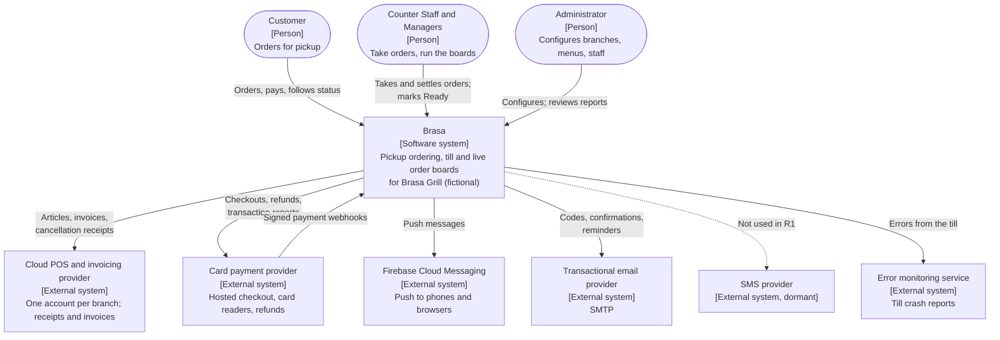
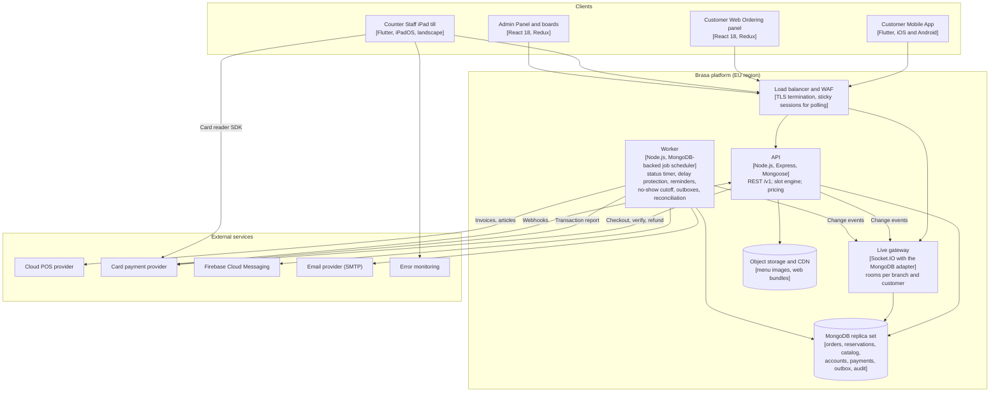

# System Architecture: Brasa

## Document control

| Field | Value |
|---|---|
| Document ID | BRS-DES-ARCH |
| Version | 1.3 |
| Status | Approved |
| Owner | Tech Lead (co-authored with the Business Analyst) |
| Last updated | 2026-09-18 |
| Reviewers | Product Owner (Operations Director); QA Lead; Finance Controller (payments and invoicing sections) |

**Purpose and scope.** The C4 context and container views of Brasa, the technology stack, how the containers talk to each other and to external services, and the deployment. The decisions behind the shape are in the ADRs ([ADR-001](adr/ADR-001-server-authoritative-slot-reservation.md), [ADR-002](adr/ADR-002-live-updates-snapshot-and-sequence.md), [ADR-003](adr/ADR-003-idempotent-payments-and-invoice-outbox.md)).

## 1. System context (C4 level 1)

## 2. Containers (C4 level 2)

| Container | Responsibility | Talks to | Key requirements |
|---|---|---|---|
| Customer Mobile App | Branch selection, menu, customization, cart, pickup time, payment handoff, order status, push | API, live gateway, FCM | FR-ORD-01 to FR-ORD-12, FR-PAY-01, FR-NTF-01 |
| Customer Web Ordering panel | Same journey in the browser, web push | API, live gateway, FCM | As the mobile app |
| Counter Staff iPad till | Tiles, order panel, live queue, call-up, cash and card settlement | API, live gateway, card reader SDK, error monitoring | FR-TIL-01 to FR-TIL-06, FR-PAY-04 |
| Admin Panel and boards | Configuration, kitchen and counter boards, reports | API, live gateway | FR-BRN, FR-MNU, FR-TIL-07 to FR-TIL-13, FR-IAM-07, FR-IAM-08 |
| API | Authentication, role matrix, pricing, slot engine, order lifecycle, payment attempts, webhooks | MongoDB, live gateway, card payment provider | All FRs; ADR-001, ADR-003 |
| Live gateway | Authenticated rooms; publishes events with the branch sequence number | MongoDB (adapter and sequence counters) | FR-TIL-10, FR-TIL-11; ADR-002 |
| Worker | Timed transitions, delay protection, reminder ladder, no-show cutoff, invoice and article outboxes, notification dispatch, reconciliation | MongoDB, POS, FCM, email, card payment provider | FR-BRN-10, FR-NTF-02 to FR-NTF-06, FR-PAY-06, FR-PAY-10, FR-MNU-06 |
| MongoDB | System of record; unique indexes enforce kitchen minutes, idempotency and one invoice per order | — | ADR-001, ADR-003 |

## 3. Technology stack

| Layer | Technology | Purpose | Notes |
|---|---|---|---|
| Customer mobile app | Flutter (Dart) | One code base for iOS and Android | Store releases with phased rollout; forced update below the minimum version |
| Counter till | Flutter (Dart) on iPad | Landscape till with the card reader SDK | Screen kept awake; draft held per device |
| Customer web panel | React 18 with Redux | Browser ordering | Static bundle on the CDN |
| Admin Panel and boards | React 18 with Redux | Configuration and live boards | Board mode: full screen, sound unlocked by "Start board" |
| API | Node.js (LTS), Express, Mongoose | REST `/v1`, OpenAPI 3.1 contract first | Stateless; scaled horizontally |
| Database | MongoDB replica set | Orders, kitchen reservations, catalog, accounts, payments, outbox, audit | Multi-document transactions for placement and payment state |
| Live updates | Socket.IO with the MongoDB adapter | Branch and customer rooms; events carry the branch sequence number | WebSocket with long-polling fallback |
| Background jobs | Node.js worker with a MongoDB-backed job scheduler | Timers, ladders, outboxes, reconciliation | Single-run per job via a unique run key |
| Fiscal receipts and invoices | Cloud POS and invoicing provider (per branch) | Articles, invoices, cancellation receipts, payment methods | OAuth per branch; outbox; rate limit 60 calls per minute |
| Card payments | Card payment provider (online and counter) | Hosted checkout with SCA, card reader SDK, refunds, transaction report | Attempt ID as merchant reference and idempotency key |
| Push | Firebase Cloud Messaging | Push to the mobile app and web push | Token per device |
| Email | Transactional email provider (SMTP) | Codes, confirmations, reminders, staff password reset | SPF, DKIM, DMARC |
| SMS | SMS provider | Phone sign-in, dormant | Feature flag off (DEC-09) |
| Error monitoring | Error monitoring service | Till crash and error reports | Release and branch tags; no personal data |
| Hosting | Managed containers in an EU region; managed MongoDB; object storage and CDN | Production, staging, development | Backups with point-in-time recovery (NFR-REL-03) |

## 4. Key interactions

| Interaction | Path | Detail |
|---|---|---|
| Show pickup minutes | App -> API (slot engine) -> MongoDB | Reads the day's kitchen reservations, busy window, delay block and throttle counters for the branch; computes availability per minute ([sequence 1](../diagrams/sequence-diagrams.md)) |
| Place an order | App -> API -> MongoDB transaction -> live gateway | Re-prices, inserts the order and one reservation document per kitchen minute; a duplicate key means the minute was taken (ADR-001) |
| Live board update | API or worker -> live gateway -> boards, tills, customer | Every change increments the branch sequence; clients load a snapshot on any gap (ADR-002) |
| Online payment | App -> API (attempt) -> provider checkout -> webhook -> API -> outbox -> worker -> POS invoice | Only the webhook marks Succeeded (BR-038); invoice raised asynchronously (ADR-003) |
| Counter card payment | Till -> API (attempt) -> card reader SDK -> provider -> till -> API verify | A timeout leads to Verify payment, never a new charge (BR-035) |
| Reminders and no-show | Worker timers -> FCM and email | Ladder from the anchor (BR-040); cutoff at closing + 30 min (BR-041) |

## 5. Deployment and operations

| Concern | Approach | Requirement |
|---|---|---|
| Environments | Development, staging (provider sandboxes, virtual clock enabled), production. The virtual clock is compiled out of production builds. | Test strategy |
| Scaling | Two API instances minimum, auto-scaling on CPU and open sockets; one worker with a standby that takes over through the job lease | NFR-PERF-05 |
| Availability | Health checks; rolling deploys outside opening hours; feature flags for online ordering per branch | NFR-REL-01 |
| Data protection | Managed MongoDB with continuous backup, point-in-time recovery, monthly restore drill | NFR-REL-03 |
| Secrets | Managed secret store; provider keys and POS tokens encrypted; never sent to clients | NFR-SEC-04 |
| Observability | Structured logs with correlation IDs; metrics for latency, socket connections per branch, outbox age; business anomaly alerts | NFR-OBS-01, NFR-OBS-02 |
| Security | WAF, TLS 1.2+, rate limits on code requests and sign-in, OWASP ASVS L2 checklist, yearly pen test | NFR-SEC-01, NFR-SEC-02 |

## Related documents

- [ADR-001 Server-authoritative slot reservation](adr/ADR-001-server-authoritative-slot-reservation.md)
- [ADR-002 Live updates: snapshot and sequence](adr/ADR-002-live-updates-snapshot-and-sequence.md)
- [ADR-003 Idempotent payments and invoice outbox](adr/ADR-003-idempotent-payments-and-invoice-outbox.md)
- [ERD](../data/erd.md)
- [Sequence diagrams](../diagrams/sequence-diagrams.md)
- [OpenAPI contract](../../04-api/openapi.yaml)
- [Realtime events](../../04-api/realtime-events.md)
- [Non-functional requirements](../../02-requirements/non-functional-requirements.md)
