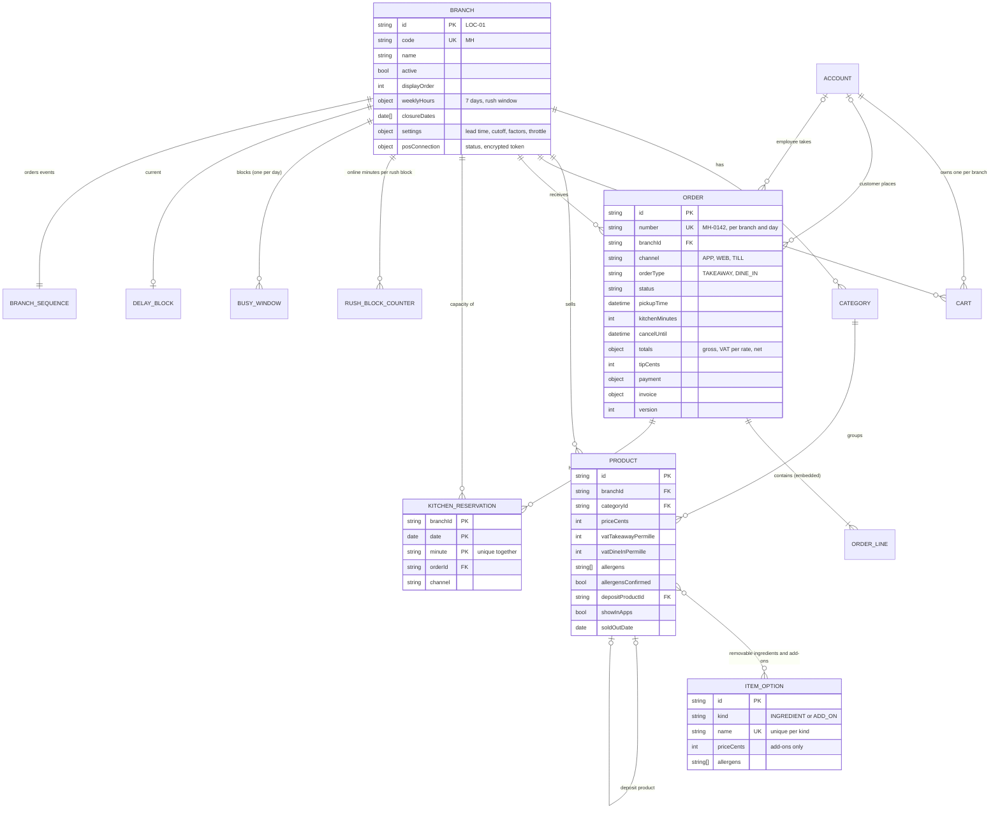
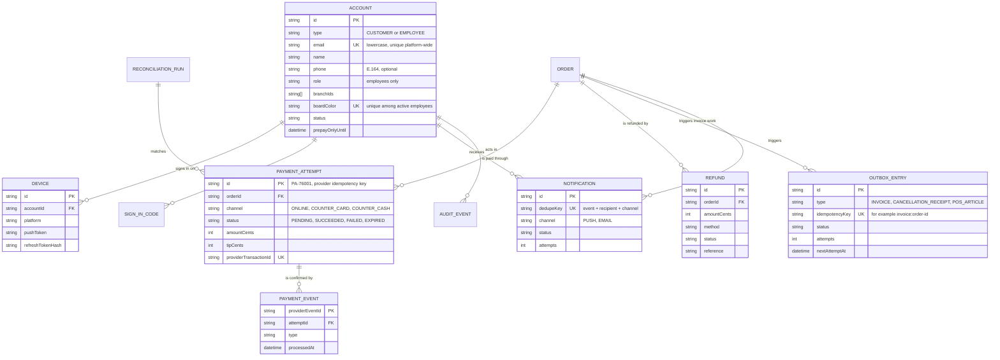

# Entity-Relationship Model: Brasa

## Document control

| Field | Value |
|---|---|
| Document ID | BRS-DES-ERD |
| Version | 1.3 |
| Status | Approved |
| Owner | Business Analyst (co-authored with the Tech Lead) |
| Last updated | 2026-09-18 |
| Reviewers | Tech Lead; Node.js developers; Data Protection Officer (external) |

**Purpose and scope.** The logical data model of Brasa: entities, keys, relationships and the constraints that enforce business rules. Brasa stores data in MongoDB, so an entity is a collection and "embedded" marks data stored inside its parent document. Field-level definitions, formats and retention are in the [data dictionary](data-dictionary.md).

## 1. Model overview

| Area | Entities | Notes |
|---|---|---|
| Accounts | ACCOUNT, DEVICE, SIGN_IN_CODE | One email, one account (BR-001); customers and employees share the entity |
| Branches | BRANCH, BUSY_WINDOW, DELAY_BLOCK, BRANCH_SEQUENCE | Weekly hours, closure dates and settings are embedded in BRANCH |
| Catalog | CATEGORY, PRODUCT, ITEM_OPTION | Products per branch; ingredients and add-ons shared (ITEM_OPTION) |
| Ordering | CART, ORDER, ORDER_LINE (embedded), KITCHEN_RESERVATION, RUSH_BLOCK_COUNTER | The order keeps a priced snapshot of its lines; the counter serves the rush throttle (R1.2) |
| Money | PAYMENT_ATTEMPT, PAYMENT_EVENT, REFUND, INVOICE_REF (embedded in ORDER), RECONCILIATION_RUN | One successful attempt per order (BR-035) |
| Platform | OUTBOX_ENTRY, NOTIFICATION, AUDIT_EVENT | Asynchronous work, sends and the audit trail |

## 2. Ordering and capacity

Constraints that carry business rules:

| Constraint | Collection | Enforces |
|---|---|---|
| Unique (branchId, date, minute) | KITCHEN_RESERVATION | One order per kitchen minute (BR-012, BR-013, ADR-001) |
| Unique (branchId, date, blockStart); conditional increment up to the online cap | RUSH_BLOCK_COUNTER | Online cap per rush block (BR-018, spec 001) |
| Unique (branchId, date, number) | ORDER | Order number per branch per day (BR-033) |
| Unique (customerId, branchId) | CART | One cart per customer per branch (FR-ORD-04) |
| Unique (kind, lower(name)) | ITEM_OPTION | Unique ingredient and add-on names (DEF-027) |
| Unique (branchId, date) | BUSY_WINDOW | One busy window per branch per day (BR-015) |
| Check: depositProductId is not the product's own ID and the deposit product has no deposit | PRODUCT | One level of deposit (BR-026), checked in the API on save |

## 3. Accounts, payments and invoicing

| Constraint | Collection | Enforces |
|---|---|---|
| Unique lower(email) across customers and employees | ACCOUNT | BR-001 |
| Partial unique (orderId) where status = SUCCEEDED | PAYMENT_ATTEMPT | At most one successful payment per order (BR-035, ADR-003) |
| Partial unique (orderId) where status = PENDING | PAYMENT_ATTEMPT | No second attempt while one is pending (table 3.6, Y3) |
| Unique providerEventId | PAYMENT_EVENT | Each webhook processed once (Y7) |
| Unique idempotencyKey | OUTBOX_ENTRY | One invoice per paid order (BR-037) |
| Unique dedupeKey | NOTIFICATION | One send per event, recipient and channel (BR-044) |
| Unique (deviceId) | DEVICE | One push token per device (BR-043) |

## 4. Order lines: why a snapshot

Each order embeds its lines as priced at placement: product name, unit price, add-on names and prices, removed ingredient names and VAT rate. Catalog changes after placement never change an order (US-014-AC6), and an invoice can always be rebuilt from the order alone. The cost is duplication of names and prices, which is small and intended.

## Related documents

- [Data dictionary](data-dictionary.md)
- [System architecture](../architecture/system-architecture.md)
- [ADR-001 Server-authoritative slot reservation](../architecture/adr/ADR-001-server-authoritative-slot-reservation.md)
- [ADR-003 Idempotent payments and invoice outbox](../architecture/adr/ADR-003-idempotent-payments-and-invoice-outbox.md)
- [Business rules](../../02-requirements/business-rules.md)
