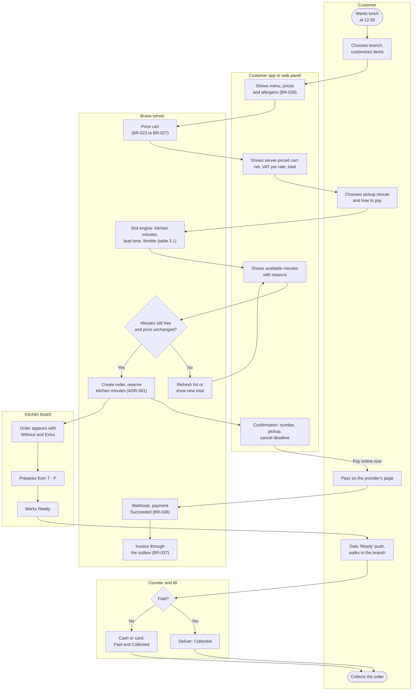
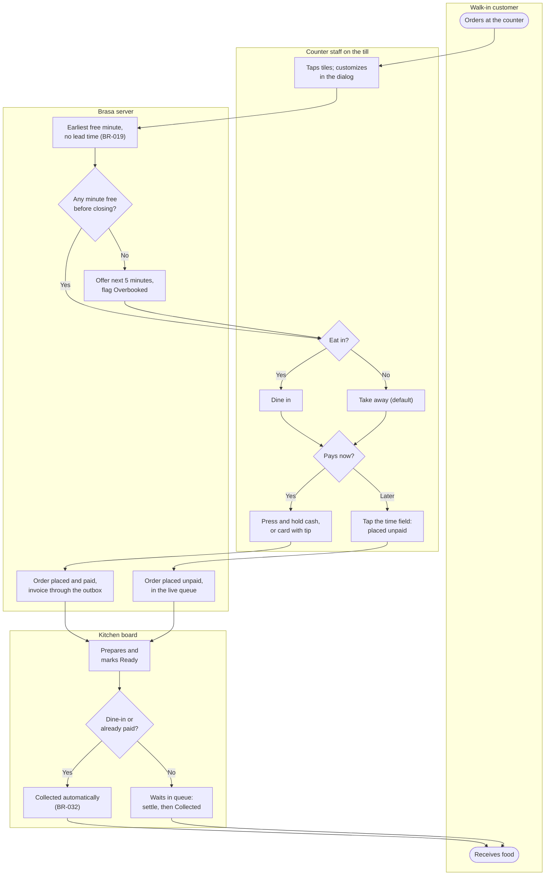
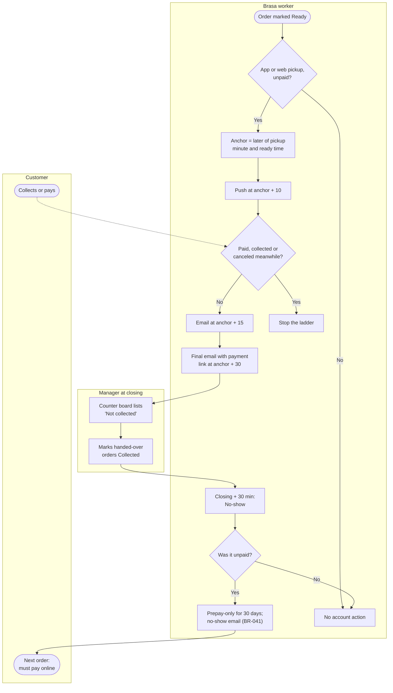
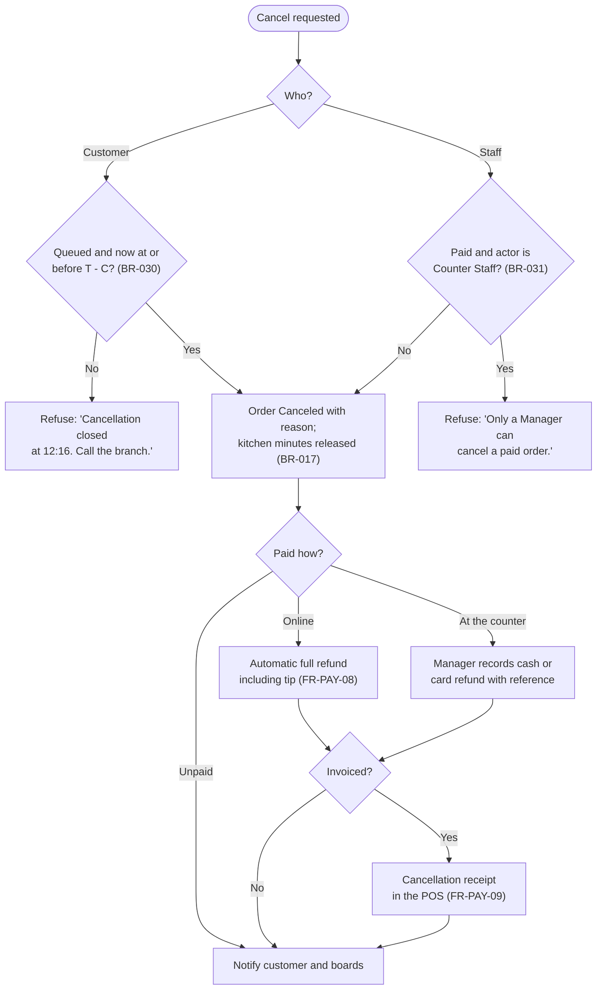

# Process Flows (TO-BE): Brasa

## Document control

| Field | Value |
|---|---|
| Document ID | BRS-DES-PF |
| Version | 1.3 |
| Status | Approved |
| Owner | Business Analyst |
| Last updated | 2026-09-18 |
| Reviewers | Product Owner (Operations Director); Branch Manager (Station Quarter); Kitchen Lead (Market Hall); QA Lead |

**Purpose and scope.** BPMN-style swimlane flows of the future state: a customer pickup order, a walk-in order at the till, kitchen trouble, uncollected orders, and cancellation with refund. Lanes are subgraphs; decisions are diamonds; the rules that drive each decision are named on the shape. The AS-IS flows are in [current-vs-future-state.md](../../01-discovery/current-vs-future-state.md).

## 1. Customer pickup order

Exceptions handled elsewhere: customer cancellation (flow 5), kitchen late or in trouble (flow 3), customer does not come (flow 4).

## 2. Walk-in or dine-in order at the till

Target: median 50 s or less from first tile to cash payment (NFR-USE-02, OBJ-06); UAT measured 41 s.

## 3. Kitchen trouble: busy window and delay protection

```mermaid
flowchart TB
  subgraph MG["Manager"]
    M1(["Fryer fails at 14:05"])
    M2["Sets busy window<br/>15:00-15:30, reason Equipment"]
    M3["Optionally releases<br/>the delay block early"]
  end
  subgraph AP["Admin Panel"]
    M4{"Window valid?<br/>(BR-015)"}
    M5["Shows the problem<br/>and the fix"]
  end
  subgraph EN["Slot engine"]
    M6["Blocks kitchen minutes<br/>15:00 to 15:29 for new orders"]
    M7["Every minute: any order late?"]
    M8{"Late order exists?"}
    M9["Block next D free minutes<br/>after the lead time,<br/>D = minutes late, max 20 (BR-016)"]
    M10["No delay block"]
  end
  subgraph BD["Boards and apps"]
    M11["Pickers refresh<br/>within 2 s"]
    M12["Boards show the block<br/>and the late order first"]
  end
  M1 --> M2 --> M4
  M4 -- "No" --> M5 --> M2
  M4 -- "Yes" --> M6 --> M11
  M7 --> M8
  M8 -- "Yes" --> M9 --> M12 --> M11
  M8 -- "No" --> M10 --> M11
  M12 --> M3 --> M10
```

## 4. Uncollected order: reminders, no-show and Prepay-only

Changed in R1.1 by CR-003: the R1 flow suspended the account at U11 and had no "Not collected" list (U13, U14).

## 5. Cancellation and refund

## Related documents

- [Business rules](../../02-requirements/business-rules.md)
- [Sequence diagrams](sequence-diagrams.md)
- [State machines](state-machines.md)
- [Current vs future state](../../01-discovery/current-vs-future-state.md)
- [User stories](../../05-delivery/epics.md)
