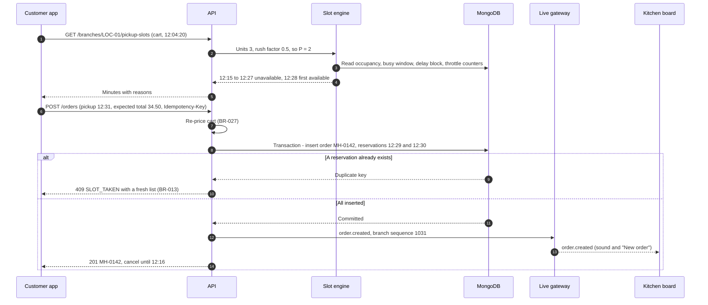
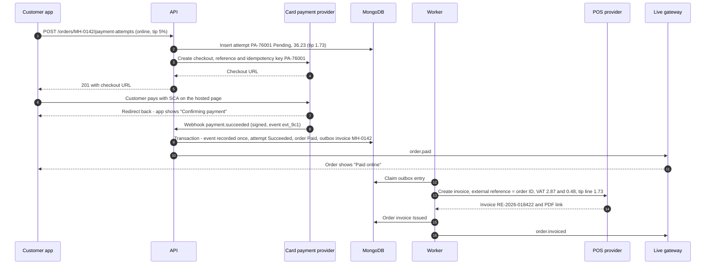
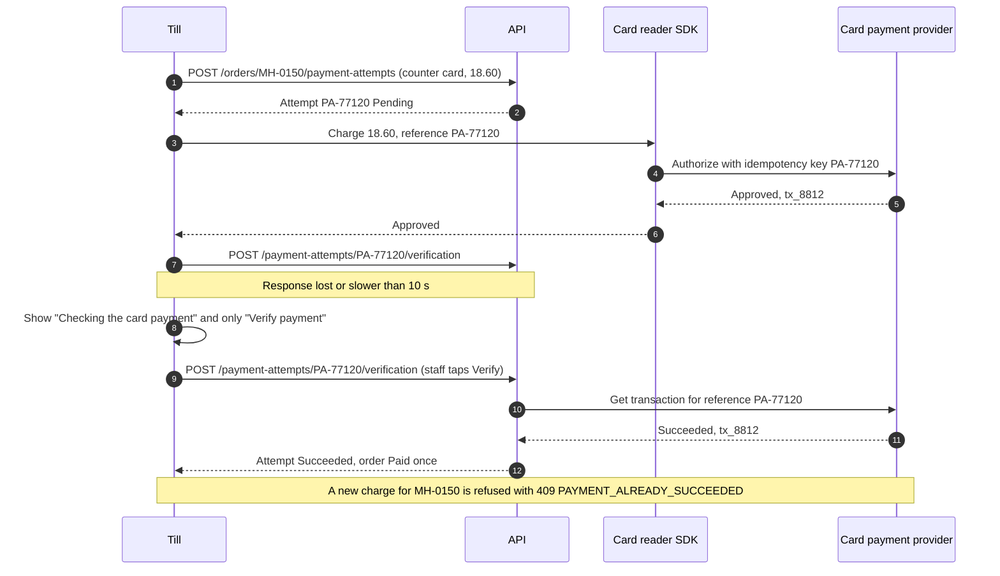
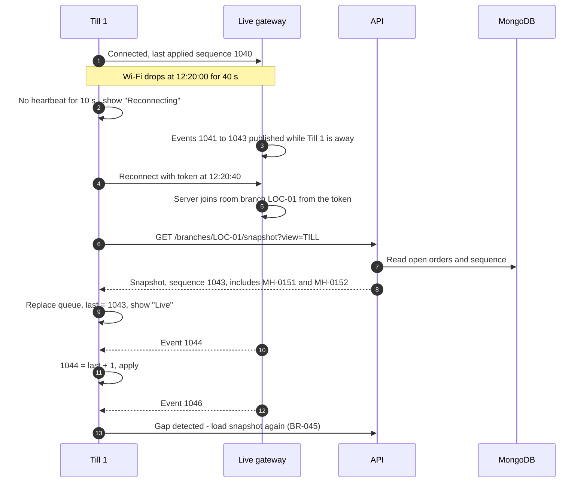
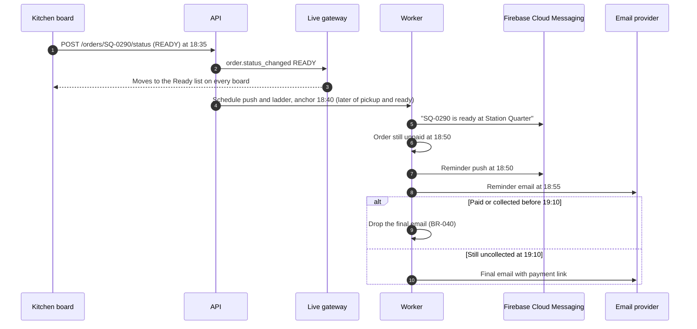
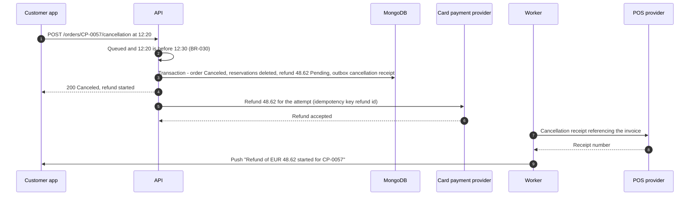

# Sequence Diagrams: Brasa

## Document control

| Field | Value |
|---|---|
| Document ID | BRS-DES-SEQ |
| Version | 1.3 |
| Status | Approved |
| Owner | Business Analyst (co-authored with the Tech Lead) |
| Last updated | 2026-09-18 |
| Reviewers | Tech Lead; Node.js, Flutter and React developers; QA Lead |

**Purpose and scope.** How the containers in the [system architecture](../architecture/system-architecture.md) work together at runtime for the flows where order, timing and failure handling matter. Each diagram names the rules it implements. Operation names match [openapi.yaml](../../04-api/openapi.yaml); event names match [realtime-events.md](../../04-api/realtime-events.md).

## 1. Pickup minutes and placement with an atomic reservation (WE-2)

## 2. Online payment, webhook and invoice outbox (WE-1)

## 3. Counter card payment with a timeout (INC-2026-009 fix)

## 4. Reconnect and resync (INC-2026-004 fix)

## 5. Mark Ready, notify and start the reminder ladder

## 6. Customer cancels a paid order inside the window

## Related documents

- [System architecture](../architecture/system-architecture.md)
- [ADR-001](../architecture/adr/ADR-001-server-authoritative-slot-reservation.md), [ADR-002](../architecture/adr/ADR-002-live-updates-snapshot-and-sequence.md), [ADR-003](../architecture/adr/ADR-003-idempotent-payments-and-invoice-outbox.md)
- [State machines](state-machines.md)
- [Realtime events](../../04-api/realtime-events.md)
- [Business rules](../../02-requirements/business-rules.md)
