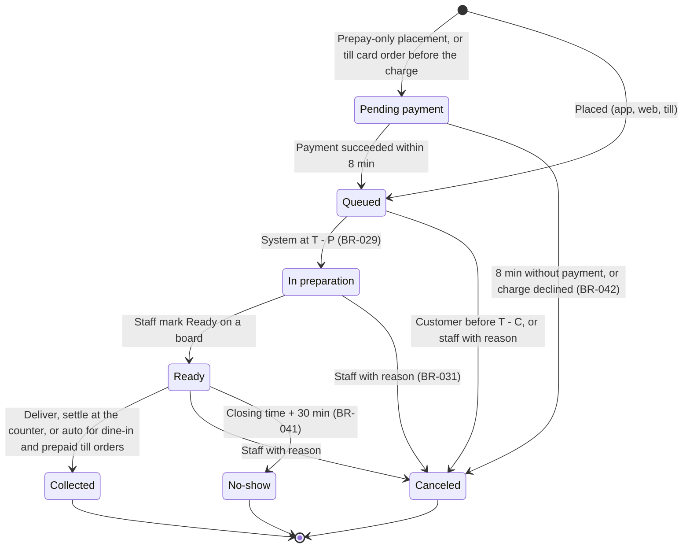
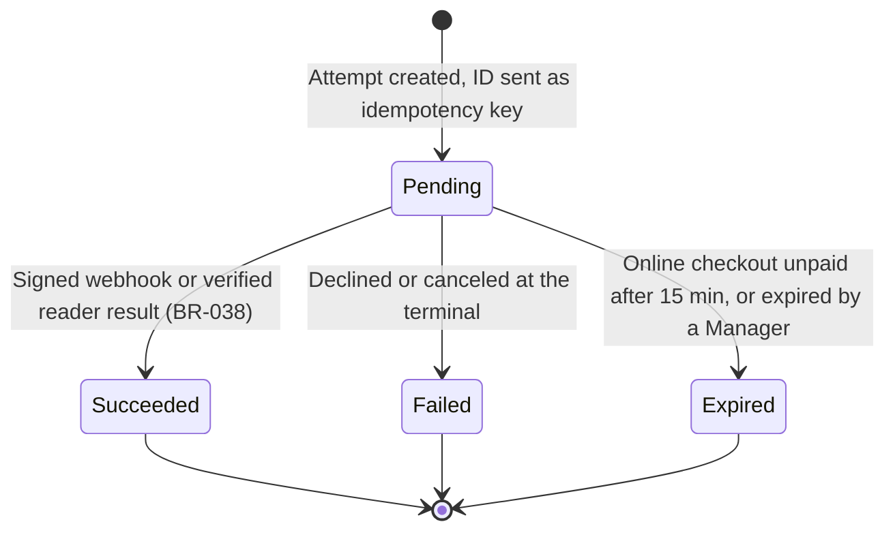
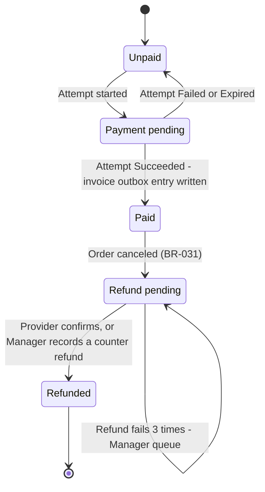
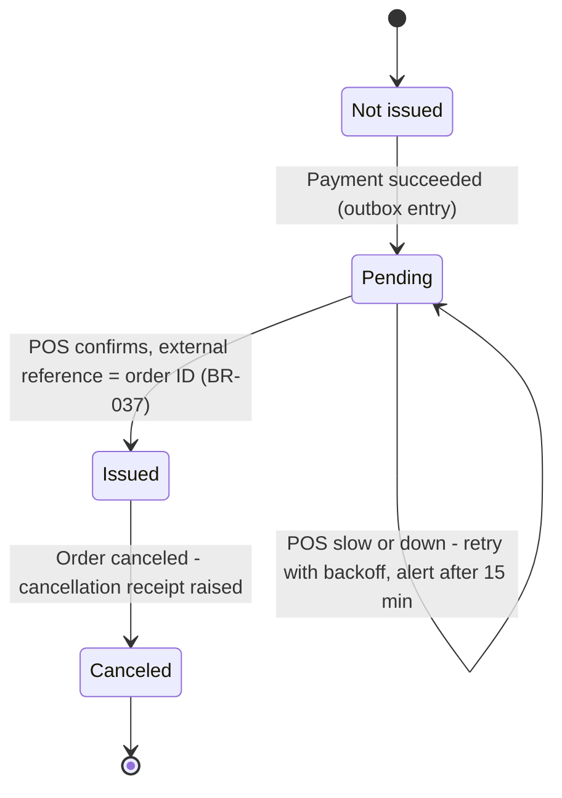
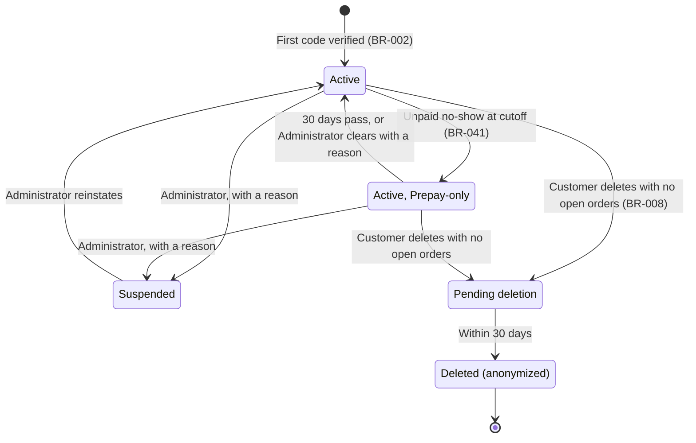
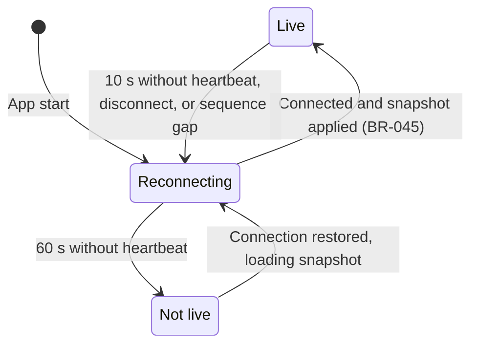
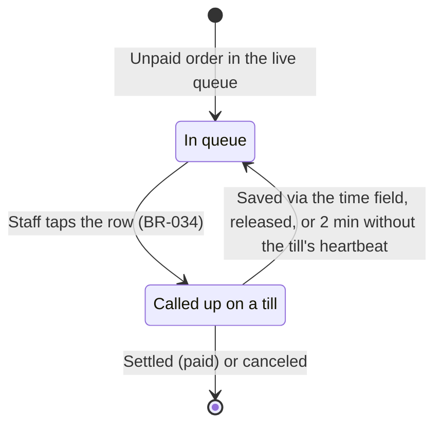

# State Machines: Brasa

## Document control

| Field | Value |
|---|---|
| Document ID | BRS-DES-SM |
| Version | 1.3 |
| Status | Approved |
| Owner | Business Analyst |
| Last updated | 2026-09-04 |
| Reviewers | Tech Lead; QA Lead; Finance Controller (payment and invoice machines) |

**Purpose and scope.** The life cycles of the entities whose state drives business rules: the order, the payment attempt, the order's payment and invoice status, the customer account, the live-connection indicator and the till call-up lock. Every transition names its trigger and rule. Transitions not shown are refused by the API with 409.

## 1. Order

| From | To | Trigger | Side effects |
|---|---|---|---|
| (new) | Queued | Placement | Kitchen minutes reserved; board alert; confirmation email |
| Queued | In preparation | Server clock reaches T - P | Customer card shows "Preparing" |
| In preparation | Ready | Kitchen board | Push to customer; reminder ladder starts if unpaid (BR-040) |
| Ready | Collected | Deliver, counter settlement, or BR-032 | Future kitchen minutes released |
| Any open | Canceled | Customer within window or staff with reason | Minutes released; refund and cancellation receipt if paid and invoiced |
| Ready | No-show | Cutoff | Prepay-only if unpaid |

## 2. Payment attempt

At most one attempt per order can be Pending and at most one Succeeded (partial unique indexes, ADR-003). A new attempt is allowed only when none is Pending or Succeeded (business rules table 3.6).

## 3. Order payment and invoice status

## 4. Customer account

## 5. Live connection indicator on boards and tills

## 6. Till call-up lock

## Related documents

- [Business rules](../../02-requirements/business-rules.md)
- [Process flows](process-flows.md)
- [Sequence diagrams](sequence-diagrams.md)
- [Data dictionary](../data/data-dictionary.md)
