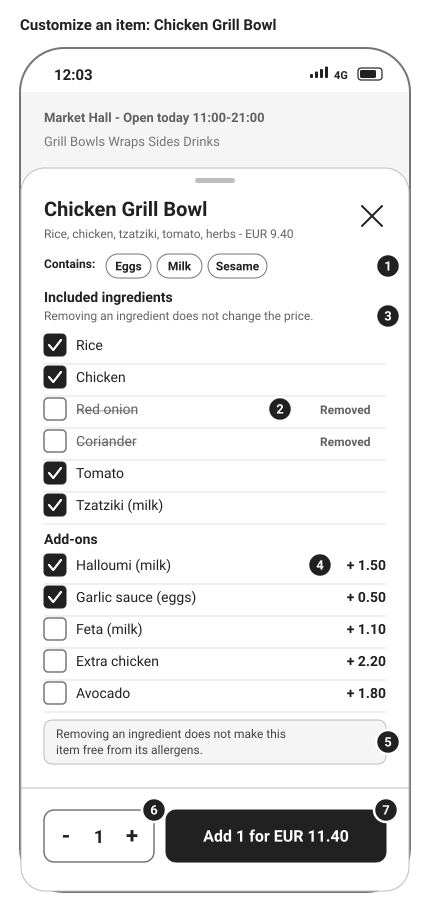
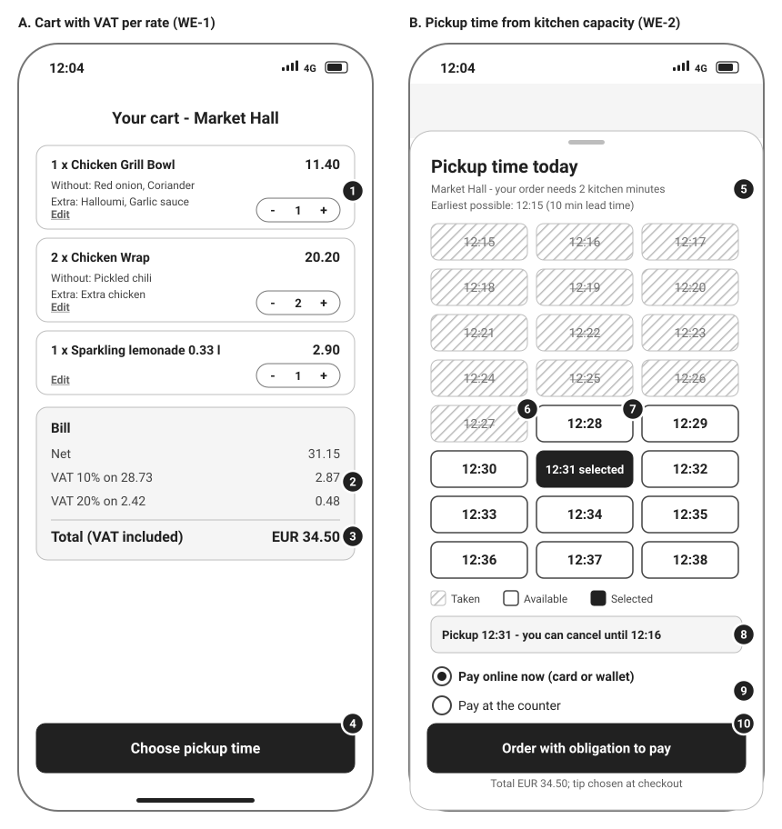
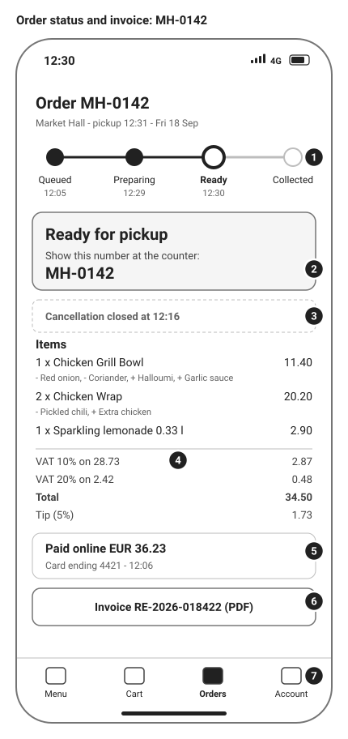
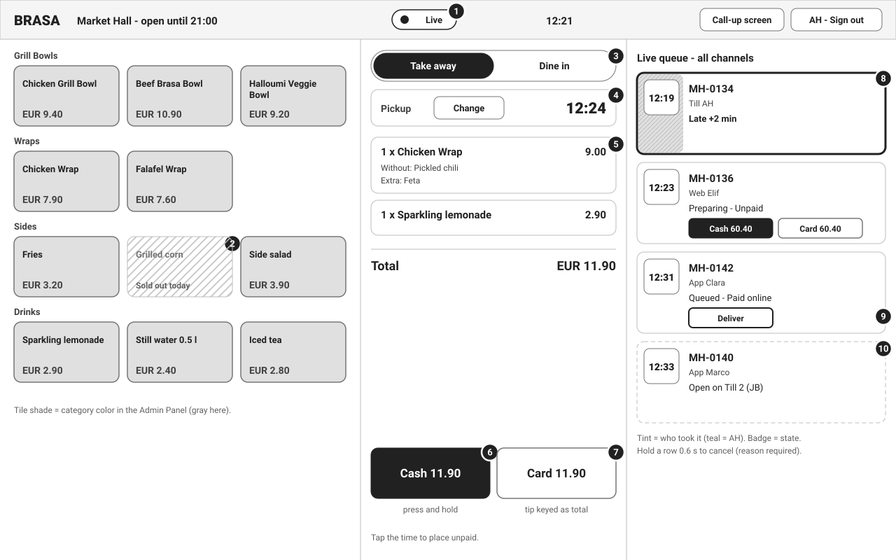
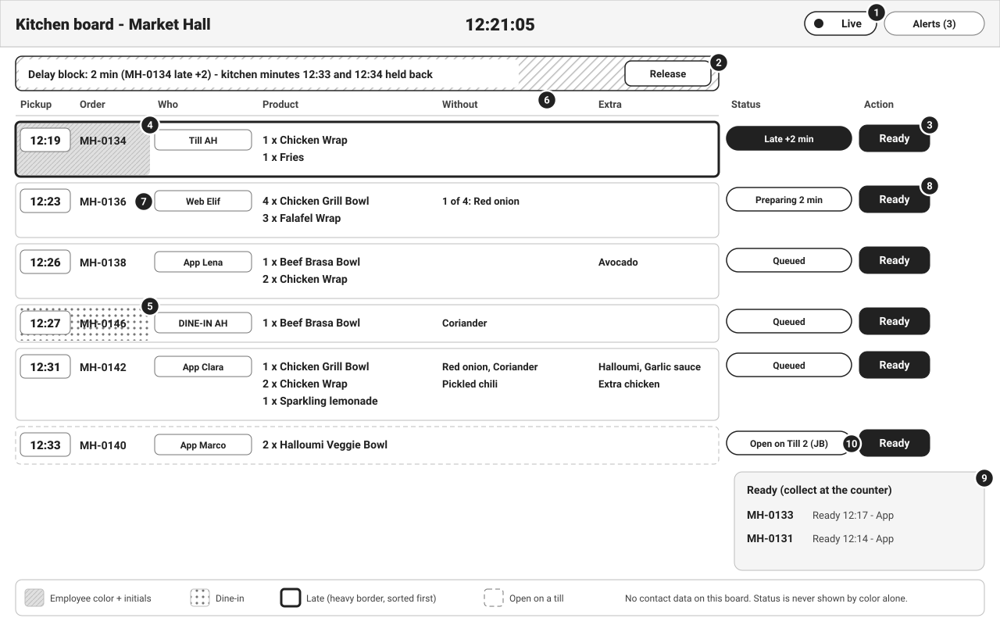

# Wireframes (Low Fidelity)

## Document control

| Field | Value |
|---|---|
| Document ID | BRS-UX-01 |
| Version | 1.3 |
| Status | Approved |
| Owner | Business Analyst |
| Last updated | 2026-09-18 |
| Reviewers | UX Designer, Product Owner (Operations Director), Kitchen Lead (Market Hall), QA Lead |

| Version | Date | Change |
|---|---|---|
| 1.0 | 2026-02-27 | Baseline wireframes for the SRS v1.0 walkthroughs |
| 1.1 | 2026-04-10 | Allergen chips and removal note (CR-001) |
| 1.2 | 2026-06-05 | UAT: separate tint and status badge on boards; order button wording (A-06) |
| 1.3 | 2026-09-04 | Live indicator on the till and boards (CR-004); delay block banner with Release |

### Purpose and scope

These five low-fidelity wireframes show layout, content priority and behavior for the screens where the requirements are most sensitive to interaction design: customizing an item, the cart and pickup time, order status, the till, and the kitchen board. They are grayscale on purpose, so reviewers judge structure and rules rather than styling. Patterns and labels carry every state; color never does.

Each wireframe has numbered callouts that match the annotation table under it (callout, element, behavior, FR/BR reference). Visual design, final copy and component specifications belong to the UX Designer.

Sample data comes from the [synthetic test data](../../06-quality/test-data/README.md) and the canonical order MH-0142 (WE-1 and WE-2), so wireframes, stories, tests and UAT scripts describe the same orders. All names and data are fictional. Times are 24-hour, local time.

| Wireframe | App and frame | Persona | Moment | Stories |
|---|---|---|---|---|
| mob-01 Customize an item | Customer Mobile App, 390 x 844 | PER-01 Clara Mendes | Friday 2026-09-18 12:03, Market Hall | US-017, US-020 |
| mob-02 Cart and pickup time | Customer Mobile App, two 390 x 844 frames | PER-01 Clara Mendes | 12:04, the WE-2 bookings | US-021, US-022, US-011 |
| mob-03 Order status and invoice | Customer Mobile App, 390 x 844 | PER-01 Clara Mendes | 12:30, after Ready | US-023, US-026, US-033 |
| till-01 Walk-in order and live queue | Counter Staff iPad till, 1280 x 800 landscape | PER-03 Amir Haddad | 12:21, Market Hall | US-036, US-037, US-040, US-041 |
| web-01 Kitchen board | Admin Panel in board mode, 1280 x 800 | PER-04 Sofia Rinaldi | 12:21:05, Market Hall | US-038, US-040, US-012 |

## mob-01 Customize an item

Clara has unticked Red onion and Coriander and ticked Halloumi and Garlic sauce.

| # | Element | Behavior | FR/BR ref |
|---|---|---|---|
| 1 | Allergen chips | Allergens of the product, its included ingredients and the selected add-ons, shown before Add. Ticking Garlic sauce added Eggs. | FR-MNU-07, BR-028 |
| 2 | Removed ingredient | Unticked, struck through, labeled "Removed". The price does not change. | BR-021 |
| 3 | No-credit note | States plainly that removing an ingredient does not change the price. | BR-021, DEC-03 |
| 4 | Add-on with price | Once per item; its price is added to each unit. | BR-022 |
| 5 | Allergen note | Removing an ingredient does not remove its allergens, because the line shares equipment. | BR-028 |
| 6 | Quantity stepper | 1 to 20; at 20 the plus button is disabled with the large-order message. | BR-014 |
| 7 | Running total | (9.40 + 1.50 + 0.50) x 1 = 11.40. Display only: the server prices the line when it is added. A guest is asked to sign in here and keeps the choices. | BR-023, BR-027, FR-IAM-03 |

## mob-02 Cart and pickup time

Frame A is the WE-1 cart. Frame B is the WE-2 pickup sheet opened at 12:04:20.

| # | Element | Behavior | FR/BR ref |
|---|---|---|---|
| 1 | Cart line | Quantity, line total, removed ingredients ("Without") and add-ons ("Extra"), edit link and stepper. Identical lines merge. | FR-ORD-04 |
| 2 | VAT per rate | VAT extracted once per rate group with its net basis: 2.87 on 28.73 and 0.48 on 2.42. Matches the POS invoice to the cent. | BR-025 |
| 3 | Total | 34.50 including VAT, shown before any commitment. | FR-ORD-05 |
| 4 | Choose pickup time | Opens frame B. | FR-ORD-06 |
| 5 | Kitchen minutes | Explains why the list looks as it does: 3 units at the rush factor need 2 kitchen minutes; earliest 12:15 after the 10-minute lead time. | BR-010, BR-011 |
| 6 | Taken minute | Hatched and struck through, not selectable. 12:15 to 12:27 are taken by the WE-2 bookings, including 12:25, whose 2-minute block would need the held minute 12:24. | BR-012 |
| 7 | First available | 12:28 (kitchen minutes 12:26 and 12:27). | BR-012, WE-2 |
| 8 | Selected minute and deadline | The deadline is shown as a clock time as soon as a minute is chosen: 12:31 minus 15 minutes = 12:16. | BR-030 |
| 9 | Payment choice | Pay online now or at the counter. A Prepay-only customer sees only online payment. | FR-ORD-07, BR-042 |
| 10 | Order button | Labeled "Order with obligation to pay" to meet Article 8(2) of the Consumer Rights Directive (A-06). Placement re-checks the minute and the price. | BR-013, BR-027 |

## mob-03 Order status and invoice

| # | Element | Behavior | FR/BR ref |
|---|---|---|---|
| 1 | Status tracker | Live from server events: Queued 12:05, Preparing from 12:29 (pickup minus 2 kitchen minutes), Ready 12:30. | BR-029, FR-ORD-09 |
| 2 | Ready card | The order number is what staff call and the customer shows. | BR-033 |
| 3 | Cancellation label | Replaces the Cancel button once the deadline has passed. | BR-030, FR-ORD-11 |
| 4 | Price breakdown | Items with Without and Extra; VAT per rate; total; tip shown apart from the total. | BR-025, BR-036 |
| 5 | Payment | Method, amount charged (36.23), card ending; no card data beyond the last 4 digits. | FR-PAY-03, NFR-SEC-03 |
| 6 | Invoice | Opens the PDF from the branch's POS account. Shows "Invoice being prepared" until the outbox has raised it. | FR-PAY-07, BR-037 |
| 7 | Tab bar | Orders is active; tapping a push notification opens this screen. | FR-NTF-07 |

## till-01 Walk-in order and live queue

Amir is taking a walk-in order at 12:21 while the WE-2 orders are in the kitchen.

| # | Element | Behavior | FR/BR ref |
|---|---|---|---|
| 1 | Live indicator | Live, Reconnecting (after 10 s without heartbeat, with the last update time) or Not live (after 60 s, full-width banner). | FR-TIL-11, BR-045 |
| 2 | Sold-out tile | Hatched, labeled, not tappable until tomorrow. | FR-MNU-08 |
| 3 | Order type | Take away by default; disabled while the order is empty; Dine in exists only on the till. | FR-TIL-02, BR-032 |
| 4 | Pickup minute | Preselected when the first item is added: 12:24, the first free one-minute block (kitchen minute 12:23). Change opens the picker; when nothing is free, the next 5 minutes are offered as Overbooked. | FR-TIL-03, BR-019 |
| 5 | Order lines | Customizations shown on each line; tap to edit. The draft belongs to this iPad. | FR-TIL-04 |
| 6 | Cash | Press and hold for 0.6 s to settle, so a stray tap cannot. | FR-PAY-04 |
| 7 | Card | Keypad for the amount with tip (total to 1.5 x total). After a timeout only "Verify payment" is offered. | BR-036, BR-035 |
| 8 | Late till order | Teal tint with initials AH, heavy border, "Late +2 min", sorted first. | FR-TIL-09, BR-007 |
| 9 | Deliver | A paid order is handed over with Deliver and becomes Collected. | FR-TIL-05 |
| 10 | Locked order | Called up on Till 2 by JB; dashed and not actionable here until saved, released or expired. | BR-034 |

## web-01 Kitchen board

| # | Element | Behavior | FR/BR ref |
|---|---|---|---|
| 1 | Clock, live indicator, alerts | Server time; Live state; the alert list keeps the last 50 alerts of the session. | BR-020, FR-TIL-12 |
| 2 | Delay block | MH-0134 is 2 minutes late, so the next 2 free kitchen minutes after the online lead time (12:33 and 12:34) are held back. Release is a Manager action and is audited. | BR-016, FR-BRN-10 |
| 3 | Late order first | Badge "Late +2 min", heavy border, top of the list. | Business rules table 3.4b |
| 4 | Employee tint | Teal with the initials AH: who took the order. | BR-007, table 3.4a |
| 5 | Dine-in | Dotted pattern with "DINE-IN AH". Becomes Collected when marked Ready. | BR-032 |
| 6 | Without and Extra | Separate columns so a removal is never lost between counter and kitchen. | OBJ-04, FR-TIL-07 |
| 7 | Customer | Channel and first name only; no email, phone or payment on the kitchen board. | NFR-PRIV-01 |
| 8 | Ready | One tap; every board, till and the customer's app update within 2 s and the customer gets a push. | FR-TIL-07, NFR-PERF-03 |
| 9 | Ready list | Ready orders wait here until collected; dine-in and prepaid till orders close themselves. | BR-029 |
| 10 | Open on a till | Badge while a till has the order called up. The kitchen can still mark it Ready. | BR-034, US-038 |

## Design notes: accessibility and states

The customer apps are designed to WCAG 2.2 AA with 200% text scaling and screen-reader support (NFR-ACC-01). The till and boards follow the same rules voluntarily (NFR-ACC-02).

**Targets.** Mobile targets are at least 44 x 44 pt; primary actions are 52-56 px tall and full width at the bottom. Till tiles are at least 96 x 72 pt; payment buttons are 72 px tall.

**Contrast.** Text colors on white: #212121 (16.1:1), #424242 (10.0:1), #616161 (6.2:1), #757575 (4.6:1), all at least 4.5:1. Black text on each of the 16 employee colors is at least 4.5:1 (TC-NFR-011).

**Status without color.** Every state combines a text label with a shape or pattern: hatched for taken or sold out, a heavy border for late, dotted for dine-in, dashed for locked. Screen readers announce the label, for example "12:28, available" and "MH-0134, late by 2 minutes, taken by AH". DEF-069 (TalkBack reads pickup minutes as "button" without the time) is open for R1.3.

**Live and stale states.** Boards and tills show Live, Reconnecting or Not live (FR-TIL-11). The customer's order screen shows the time of the last update when it has not received an event for 60 s.

**Messages.** Every message states the problem and the fix, never a raw code (NFR-USE-03), for example "12:31 was just taken. Choose another time."

## Related documents

- [Process flows](../diagrams/process-flows.md)
- [State machines](../diagrams/state-machines.md)
- [Personas](../../01-discovery/personas.md)
- [EP-04 Customer ordering stories](../../05-delivery/user-stories/EP-04-customer-ordering-and-notifications.md)
- [EP-06 Till and live board stories](../../05-delivery/user-stories/EP-06-till-and-live-order-boards.md)
- [Business rules](../../02-requirements/business-rules.md)
- [Synthetic test data](../../06-quality/test-data/README.md)
