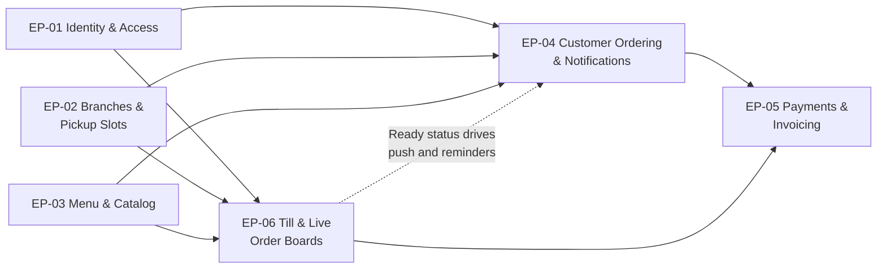

# Epics: Brasa

## Document control

| Field | Value |
|---|---|
| Document ID | BRS-DEL-EPICS |
| Version | 1.4 |
| Status | Baselined |
| Owner | Business Analyst |
| Last updated | 2026-09-18 |
| Reviewers | Product Owner (Operations Director); Delivery Manager; Tech Lead; QA Lead |

**Purpose and scope.** This is the index of the six epics that deliver Brasa R1 to R1.2: goal, business need, objectives, size and the stories in each. The stories, with INVEST metadata and Gherkin acceptance criteria, are in the [user-stories](user-stories/) folder. The same epics and stories are in [jira-import.csv](jira-import.csv), generated from the story files.

## 1. Overview

| Epic | Name | Business need | Objectives | SRS modules | FRs | Stories | Points | Acceptance criteria | Release |
|---|---|---|---|---|---|---|---|---|---|
| [EP-01](user-stories/EP-01-identity-and-access.md) | Identity & Access | BN-01 | OBJ-01, OBJ-05 | IAM | 10 | 7 | 26 | 37 | R1 |
| [EP-02](user-stories/EP-02-branches-and-pickup-slots.md) | Branches & Pickup Slots | BN-02 | OBJ-02, OBJ-03 | BRN | 12 | 6 | 34 | 32 | R1; US-013 in R1.2 |
| [EP-03](user-stories/EP-03-menu-and-catalog.md) | Menu & Catalog | BN-03 | OBJ-01, OBJ-04 | MNU | 8 | 5 | 20 | 23 | R1 |
| [EP-04](user-stories/EP-04-customer-ordering-and-notifications.md) | Customer Ordering & Notifications | BN-04, BN-07 | OBJ-01, OBJ-02, OBJ-04, OBJ-05 | ORD, NTF | 19 | 11 | 47 | 55 | R1 |
| [EP-05](user-stories/EP-05-payments-and-invoicing.md) | Payments & Invoicing | BN-05 | OBJ-05, OBJ-06 | PAY | 10 | 6 | 36 | 31 | R1; US-032 and US-035 in R1.1 |
| [EP-06](user-stories/EP-06-till-and-live-order-boards.md) | Till & Live Order Boards | BN-06 | OBJ-03, OBJ-04, OBJ-06 | TIL | 13 | 7 | 40 | 36 | R1; US-041 in R1.1 |
| **Total** | | | | | **72** | **42** | **203** | **214** | |

Priority of the 42 stories: 38 Must, 3 Should, 1 Could.

## 2. How the epics depend on each other

The build order followed the arrows: accounts, branches and the catalog in S1 and S2; the slot engine in S2 (US-011) because every ordering story depends on it; ordering, the till and the kitchen board in S3; payments and the boards' detail in S3 to S5.

## 3. Epics

### EP-01 Identity & Access

**Goal.** Let customers start ordering with nothing more than an email address, and give every staff member their own account with the least privilege their job needs.

| Story | Title | Priority | Points | Sprint |
|---|---|---|---|---|
| US-001 | Sign in with an email code | Must | 5 | S1 |
| US-002 | Browse the menu as a guest | Should | 2 | S2 |
| US-003 | Sign in to the Admin Panel securely | Must | 5 | S1 |
| US-004 | Sign in to the till for my branch | Must | 3 | S2 |
| US-005 | Manage employee accounts, roles and colors | Must | 5 | S1 |
| US-006 | Manage or delete my account | Must | 3 | S5 |
| US-007 | Review, suspend and reinstate customers | Must | 3 | S5 |

Key decisions: one email, one account (BR-001); staff roles fixed at creation (DEC-04); Administrators refused at the till (DEC-05). Changed in R1.1 by CR-003 (US-007).

### EP-02 Branches & Pickup Slots

**Goal.** Promise customers only pickup times the kitchen can keep, react to trouble in the kitchen within a minute, and protect walk-in trade at the busiest hour.

| Story | Title | Priority | Points | Sprint |
|---|---|---|---|---|
| US-008 | Set up a branch with opening and rush hours | Must | 5 | S1 |
| US-009 | Tune a branch's order timings | Must | 3 | S2 |
| US-010 | Connect a branch to the POS provider | Must | 5 | S3 |
| US-011 | Offer only pickup times the kitchen can meet | Must | 8 | S2 |
| US-012 | Hold back pickup times when the kitchen is in trouble | Must | 5 | S5 |
| US-013 | Keep rush-hour capacity for walk-in customers | Must | 8 | S11 |

US-011 carries worked example WE-2. US-013 was specified as [spec 001](../08-ai-assisted-ba/specs/001-rush-hour-slot-throttling/spec.md) and delivered in R1.2 (CR-006).

### EP-03 Menu & Catalog

**Goal.** Keep one accurate catalog per branch that drives the apps, the till, the kitchen timing and the POS invoices, with allergen information customers can rely on.

| Story | Title | Priority | Points | Sprint |
|---|---|---|---|---|
| US-014 | Maintain categories and products for a branch | Must | 5 | S1 |
| US-015 | Maintain shared ingredients and add-ons | Must | 3 | S1 |
| US-016 | Keep products in step with the POS | Must | 5 | S5 |
| US-017 | See allergens before I order | Must | 5 | S4 |
| US-018 | Mark an item sold out for today | Should | 2 | S6 |

US-017 was added by CR-001 during the build.

### EP-04 Customer Ordering & Notifications

**Goal.** Let a customer order a customized bowl or wrap for an exact pickup minute in under a minute, know the price and the cancellation deadline before committing, and hear about the order without having to call.

| Story | Title | Priority | Points | Sprint |
|---|---|---|---|---|
| US-019 | Choose a branch and browse its menu | Must | 3 | S2 |
| US-020 | Customize a bowl or wrap | Must | 5 | S2 |
| US-021 | Check my cart and its total | Must | 5 | S3 |
| US-022 | Pick a pickup time and place the order | Must | 8 | S3 |
| US-023 | Follow my order live and see my history | Must | 5 | S4 |
| US-024 | Cancel my order before the deadline | Must | 3 | S4 |
| US-025 | Reorder a past order | Could | 2 | S6 |
| US-026 | Get told when my order is ready or canceled | Must | 5 | S4 |
| US-027 | Remind customers about uncollected orders | Must | 3 | S6 |
| US-028 | Handle no-shows at closing | Must | 5 | S5 |
| US-029 | Send transactional email reliably | Must | 3 | S2 |

US-021 carries worked example WE-1. US-022 and US-028 changed in R1.1 (CR-003).

### EP-05 Payments & Invoicing

**Goal.** Take every payment exactly once, through channels that keep card data out of Brasa, and give every paid order exactly one valid invoice from the branch's POS account.

| Story | Title | Priority | Points | Sprint |
|---|---|---|---|---|
| US-030 | Pay online with an optional tip | Must | 8 | S3 |
| US-031 | Settle an order at the counter | Must | 5 | S5 |
| US-032 | Charge a customer once, even when a step times out | Must | 8 | S10 |
| US-033 | Get the invoice for a paid order | Must | 5 | S4 |
| US-034 | Refund a canceled paid order | Must | 5 | S6 |
| US-035 | Reconcile yesterday's payments | Must | 5 | S10 |

US-032 and US-035 were added by CR-007 after INC-2026-009; US-031 and US-033 were revised.

### EP-06 Till & Live Order Boards

**Goal.** Give the counter and the kitchen one live, trustworthy view of every order from every channel, and make walk-in orders faster to take than before.

| Story | Title | Priority | Points | Sprint |
|---|---|---|---|---|
| US-036 | Take a walk-in or dine-in order on the till | Must | 8 | S3 |
| US-037 | Work the live queue on the till | Must | 8 | S4 |
| US-038 | Cook from the kitchen board | Must | 5 | S3 |
| US-039 | Run the counter board | Must | 5 | S5 |
| US-040 | See who took an order and its state at a glance | Must | 3 | S4 |
| US-041 | Recover the live view after a connection drop | Must | 8 | S8 |
| US-042 | Review the day's operations | Should | 3 | S6 |

US-041 was added by CR-004 after INC-2026-004.

## Related documents

- [Release and sprint plan](release-and-sprint-plan.md)
- [Definition of Ready and Done](definition-of-ready-and-done.md)
- [Change request log](change-request-log.md)
- [Jira import](jira-import.csv)
- [Business Requirements Document](../02-requirements/BRD.md)
- [Requirements traceability matrix](../02-requirements/requirements-traceability-matrix.md)
