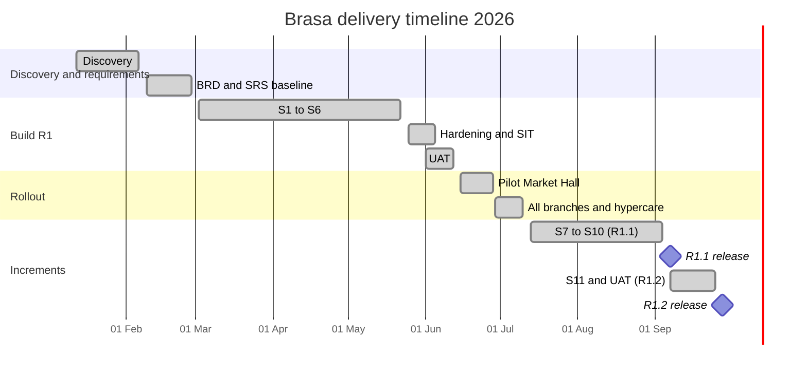

# Release and Sprint Plan: Brasa

## Document control

| Field | Value |
|---|---|
| Document ID | BRS-DEL-PLAN |
| Version | 1.5 |
| Status | Active |
| Owner | Delivery Manager (co-authored with the Business Analyst) |
| Last updated | 2026-09-28 |
| Reviewers | Product Owner (Operations Director); Tech Lead; QA Lead |

**Purpose and scope.** How Brasa was planned and delivered: milestones, releases, sprint goals with planned and completed points, ceremonies, and the rollout from one pilot branch to four. It covers discovery in January 2026 to R1.2 on 2026-09-28.

## 1. Milestones

| Milestone | Date | Exit criteria | Status |
|---|---|---|---|
| Discovery complete | 2026-02-06 | Interviews, rush observations at two branches, survey (n = 212), POS export analysis | Done |
| BRD baselined | 2026-02-13 (approved 2026-02-18) | Objectives with baselines and targets signed by the sponsor | Done |
| SRS v1.0 baselined | 2026-02-27 | All Must FRs testable; open issues listed | Done |
| Build S1 to S6 | 2026-03-02 to 2026-05-22 | Sprint goals met; DoD per story | Done |
| Hardening and SIT | 2026-05-25 to 2026-06-05 | Load, chaos and security tests; no open Critical or High defects | Done |
| UAT | 2026-06-01 to 2026-06-12 | UAT scripts signed by the Product Owner and a manager per branch | Done |
| Go/no-go | 2026-06-12 | Release acceptance criteria in BRD section 12 | Go |
| Pilot at LOC-01 Market Hall | 2026-06-15 | Two weeks without SEV-1; reconciliation clean | Done |
| All branches (R1) | 2026-06-29 | Station Quarter, Riverside and Campus live | Done |
| Hypercare | 2026-06-15 to 2026-07-10 | Daily triage; incident process staffed | Done |
| R1.1 (1.1.0) | 2026-09-07 | CR-003, CR-007 (CR-004 shipped early in 1.0.5) | Done |
| R1.2 (1.2.0) | 2026-09-28 | CR-006 rush throttle | Done |
| Business acceptance | 2026-12-31 | OBJ-01 to OBJ-06 measured over Q4 | In progress |

## 2. Releases

| Release | Version | Date | Content | Basis |
|---|---|---|---|---|
| R1 pilot | 1.0.0 | 2026-06-15 | EP-01 to EP-06 at Market Hall | SRS v1.2 |
| R1 all branches | 1.0.1 | 2026-06-29 | Rollout plus 4 UAT follow-up fixes | SRS v1.2 |
| Hotfix | 1.0.3 | 2026-07-18 | Tills and boards re-join the branch room after reconnect (INC-2026-004) | Emergency change, CR-004 |
| Patch | 1.0.5 | 2026-08-10 | US-041: snapshot resync, sequence numbers, live indicator (CR-004), shipped ahead of R1.1 because every branch depends on it daily | CR-004 |
| Hotfix | 1.0.6 | 2026-08-24 | Till "Retry" after a card timeout removed; "Verify payment" only (INC-2026-009) | Emergency change, CR-007 |
| R1.1 | 1.1.0 | 2026-09-07 | CR-003 Prepay-only; CR-007 payment attempts, invoice outbox, reconciliation | SRS v1.3 |
| R1.2 | 1.2.0 | 2026-09-28 | CR-006 rush throttle (US-013) | SRS v1.4 |
| R1.3 | 1.3.0 | Planned 2026-10-19 | DEF-069 and DEF-071 fixes | Defect backlog |

Mobile releases go through both app stores with phased rollout (20%, 50%, 100% over three days). The API is backward compatible within `/v1`, so the API ships first and apps follow (NFR-MNT-02).

## 3. Team and capacity

| Role | People | Notes |
|---|---|---|
| Delivery Manager | 1 | Runs ceremonies, release calendar, vendor follow-up |
| Business Analyst | 1 | Backlog refinement, acceptance criteria, UAT, change control |
| Tech Lead | 1 | Architecture, code review, ADRs |
| Flutter developers | 2 | Customer app and till |
| React developer | 1 | Web panel and Admin Panel |
| Node.js developers | 2 | API, slot engine, jobs, integrations |
| QA Lead, QA engineer | 2 | Test design, automation, device lab |
| UX Designer | 1 | Wireframes to final UI, usability sessions |

## 4. Sprint goals and results

Two-week sprints starting on Mondays. Points are story points of the stories in the [story files](user-stories/); revision work on existing stories after a CR is shown separately.

| Sprint | Dates | Goal | Stories completed | Planned | Completed |
|---|---|---|---|---|---|
| S1 | 2026-03-02 to 2026-03-13 | Staff and customers can sign in; branches and the catalog exist | US-001, US-003, US-005, US-008, US-014, US-015 | 28 | 28 |
| S2 | 2026-03-16 to 2026-03-27 | The slot engine answers "when can the kitchen make this?" | US-002, US-004, US-009, US-011, US-019, US-020, US-029 | 32 | 27 |
| S3 | 2026-03-30 to 2026-04-10 | A customer can order and pay; the till and the kitchen board work | US-010, US-021, US-022, US-030, US-036, US-038 | 44 | 39 |
| S4 | 2026-04-13 to 2026-04-24 | Orders are followed live; allergens before purchase (CR-001) | US-017, US-023, US-024, US-026, US-033, US-037, US-040 | 36 | 34 |
| S5 | 2026-04-27 to 2026-05-08 | The branch can handle trouble, payments at the counter, no-shows | US-006, US-007, US-012, US-016, US-028, US-031, US-039 | 33 | 31 |
| S6 | 2026-05-11 to 2026-05-22 | Close the gaps; 40% of capacity kept for defects and performance | US-018, US-025, US-027, US-034, US-042 | 15 | 15 |
| S7 | 2026-07-13 to 2026-07-24 | Hypercare follow-ups; INC-2026-004 hotfix and analysis of CR-003 and CR-004 | None (hotfix 1.0.3; impact analysis) | — | — |
| S8 | 2026-07-27 to 2026-08-07 | Boards and tills never go silently stale (CR-004) | US-041 | 8 | 8 |
| S9 | 2026-08-10 to 2026-08-21 | Prepay-only instead of suspension (CR-003); spec 001 for the throttle | Revisions of US-007, US-022, US-028 (11 points) | 11 | 11 |
| S10 | 2026-08-24 to 2026-09-04 | Charge once, invoice once, reconcile daily (CR-007) | US-032, US-035; revisions of US-031, US-033 (6 points) | 19 | 19 |
| S11 | 2026-09-07 to 2026-09-18 | Keep rush capacity for walk-ins (CR-006) | US-013 | 8 | 8 |

Carry-overs and why:
- **S2 to S3: US-010 (POS connection).** The POS provider's sandbox credentials arrived on 2026-03-25 (DEP-01, I-01).
- **S3 to S5: US-016 (article sync).** The POS provider's rate limit (60 calls per minute) forced a queued, batched sync design (DEC-13).
- **S4 to S6: US-018 (2 points), and S5 to S6: US-025 (2 points).** Both were displaced by CR-001 (allergens, 5 points added to S4) and by unplanned performance work on the slot engine: the S4 load test measured the pickup-slot list at 1.4 s p95 against the 800 ms target (NFR-PERF-01). Precomputing the day's occupied kitchen minutes per branch brought it to 310 ms.

The R1 build velocity averaged 29 points per sprint (174 points over S1 to S6) against a planned 31.

## 5. Ceremonies

| Ceremony | When | Who | Output |
|---|---|---|---|
| Sprint planning | Day 1, 2 h | Team, Product Owner | Sprint goal; committed stories that meet the [Definition of Ready](definition-of-ready-and-done.md) |
| Daily stand-up | Daily, 15 min | Team | Blockers raised; BA available for clarifications straight after |
| Three amigos | Before a story enters a sprint, 30 min | BA, developer, QA | Gherkin agreed; data and edge cases named |
| Backlog refinement | Weekly, 1 h, led by the BA | BA, Tech Lead, QA Lead, Product Owner | Stories sized; open questions recorded as TBD or decisions |
| Sprint review | Last day, 1 h | Team, Product Owner, two branch managers in rotation | Demo on real devices; feedback becomes backlog items |
| Retrospective | Last day, 45 min | Team | One or two actions with owners |
| Change control board | Weekly, 30 min, chaired by the Product Owner | Product Owner, BA, Tech Lead, Delivery Manager, Finance Controller when money rules are affected | CR decisions ([change request log](change-request-log.md)) |
| Release go/no-go | Before each release | Product Owner, Tech Lead, QA Lead, BA, Operations Director | Go or no-go against the release checklist |

## 6. Rollout plan for R1

| Step | Date | Branch | Success criteria | Rollback |
|---|---|---|---|---|
| Staff training | 2026-06-08 to 2026-06-12 | All | Every counter employee completes the US-036 walk-in script on a training branch | n/a |
| Pilot | 2026-06-15 | LOC-01 Market Hall | 10 trading days with no SEV-1; ready on time 80% or more; reconciliation clean | Online ordering off by feature flag; till keeps running; old POS screen available as the provider's own app |
| Wave 2 | 2026-06-29 | LOC-02, LOC-03, LOC-04 | As for the pilot, after one week | Per branch, by feature flag |
| Hypercare ends | 2026-07-10 | All | Daily incidents below 2 for 5 days | n/a |

Pilot results (2026-06-15 to 2026-06-26): ready on time 84%, 412 digital orders, one SEV-3 (push certificate on iOS), reconciliation done by hand and clean. The go decision for wave 2 was taken on 2026-06-26.

## Related documents

- [Epics](epics.md)
- [Definition of Ready and Done](definition-of-ready-and-done.md)
- [Change request log](change-request-log.md)
- [Decision log](decision-log.md)
- [RAID log](raid-log.md)
- [Test strategy and plan](../06-quality/test-strategy-and-plan.md)
- [UAT plan and scripts](../06-quality/uat-plan-and-scripts.md)
- [Incident management process](../07-operations/incident-management-process.md)
