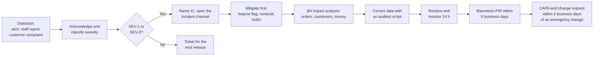

# Incident Management Process: Brasa

## Document control

| Field | Value |
|---|---|
| Document ID | BRS-OPS-IM |
| Version | 1.2 |
| Status | Active |
| Owner | Delivery Manager (co-authored with the Business Analyst) |
| Last updated | 2026-08-28 |
| Reviewers | Tech Lead; Product Owner (Operations Director); Finance Controller; Branch Managers |

| Version | Date | Change |
|---|---|---|
| 1.0 | 2026-06-10 | For go-live and hypercare |
| 1.1 | 2026-07-24 | After INC-2026-004: "branch working from a stale screen" is SEV-2; till fallback runbook; no-connected-client alert |
| 1.2 | 2026-08-28 | After INC-2026-009: any report of a double charge is SEV-2 until disproved; duplicate-charge runbook; BA impact analysis named as a step |

**Purpose and scope.** How production incidents in Brasa are detected, classified, handled, communicated and learned from, across the four apps, the API and the provider integrations. The process is blameless: reviews look for the conditions that made an error possible, never for someone to blame.

## 1. Severity

| Severity | Definition | Brasa examples | Response |
|---|---|---|---|
| SEV-1 | Ordering or payment is down at two or more branches, or money or personal data is wrong at scale | API down at lunch; card payments failing everywhere; personal data shown to the wrong customer | Acknowledge 10 min; Incident Commander 15 min; updates every 30 min; PIR required |
| SEV-2 | A core flow is degraded at a branch with a costly workaround, or any double charge | A till or board working from stale data (INC-2026-004); customers charged twice (INC-2026-009) | Acknowledge 15 min; IC 30 min; updates every 60 min; PIR required |
| SEV-3 | A feature fails with a reasonable workaround | Push delayed; POS token expired before opening; one card reader unpaired | Acknowledge within the business day; fix in the next release |
| SEV-4 | Cosmetic or minor | Typo in an email template | Backlog |

When unsure, classify higher and downgrade later.

## 2. Roles

| Role | Who (by default) | Responsibility |
|---|---|---|
| Incident Commander (IC) | Tech Lead; Delivery Manager as backup | Owns the incident; decides mitigations; keeps the timeline |
| Technical Lead | On-call developer | Diagnoses and applies technical mitigations |
| Communications Lead | Delivery Manager | Messages to branch managers, the Operations Director and, if needed, customers |
| Business impact analyst | Business Analyst | Counts affected orders, customers and money from the data, without exposing personal data; proposes data corrections; checks which requirement or rule failed |
| Branch contact | Manager on shift | Applies runbooks at the branch; reports what staff see |

## 3. Flow

## 4. Detection sources

| Source | Examples | Since |
|---|---|---|
| Technical alerts | API error rate, latency, worker lag, socket disconnect rate | R1 |
| Business anomaly alerts (NFR-OBS-02) | Two successful payments for one order; a branch with no connected board or till for 2 min; reconciliation mismatch; online orders but none marked Ready for 20 min; invoice outbox older than 15 min | R1.1 |
| Staff | Branch manager calls the support line | R1 |
| Customers | Complaint at the counter or by email | R1 |

Both SEV-2 incidents of 2026 were found by customers. The anomaly alerts added since would have detected each within 5 minutes.

## 5. Runbooks

| Situation | Branch action | Technical action |
|---|---|---|
| Till shows "Reconnecting" or "Not live" | Switch the router to the 4G fallback; use the counter board as the source of truth; restart the till app if it stays Not live for 2 minutes | Check the branch's socket connections and last heartbeat |
| Card payments failing | Take cash or "pay later"; never charge a card twice; use "Verify payment" after a timeout | Check the card payment provider's status; pause card payments by feature flag if needed |
| POS provider slow or down | Continue as normal; invoices follow automatically | Watch the outbox age; inform Finance if it exceeds 1 hour |
| Customer reports a double charge | Note the time, amount and card ending; never refund at the counter | SEV-2: check attempts and provider transactions; Finance refunds through the provider; BA runs the impact query |
| Online ordering must stop at one branch | Manager calls support | Feature flag per branch; the till keeps working |

## 5.1 Post-incident reviews

- Required for SEV-1 and SEV-2; author is the BA or the IC; reviewed within 5 business days.
- Structure: summary, impact, timeline, detection and response analysis against the targets, 5 Whys, contributing factors, requirement-gap classification, what went well and poorly, CAPA with owners and dates, the requirement and documentation changes, lessons learned.
- Every emergency change made during an incident is followed by a change request within 2 business days ([change request log](../05-delivery/change-request-log.md)).

## 6. Incident register 2026

| ID | Date | Severity | Summary | PIR | Change |
|---|---|---|---|---|---|
| INC-2026-001 | 2026-06-16 | SEV-3 | Push not delivered on iOS for 3 h at the pilot (push certificate set for the wrong environment); email and in-app status unaffected | No | Release checklist item |
| INC-2026-002 | 2026-06-22 | SEV-4 | Typo in the national-language reminder email | No | — |
| INC-2026-003 | 2026-07-02 | SEV-3 | POS access token at Riverside expired overnight; reconnected before opening | No | "Reconnect needed" alert (US-010-AC2) |
| INC-2026-004 | 2026-07-17 | SEV-2 | Both tills at Station Quarter worked from a frozen queue for 40 minutes after a router restart | [Yes](incidents/INC-2026-004-till-board-desync-after-reconnect.md) | CR-004 |
| INC-2026-005 | 2026-07-23 | SEV-3 | Pickup-slot list at 1.9 s p95 for 20 minutes after a migration dropped an index | No | Migration checklist |
| INC-2026-006 | 2026-08-01 | SEV-4 | Daily summary CSV used the wrong date format | No | — |
| INC-2026-007 | 2026-08-07 | SEV-3 | Email provider throttling delayed sign-in codes by up to 9 minutes for 25 minutes | No | Priority queue for codes |
| INC-2026-008 | 2026-08-14 | SEV-3 | Card reader firmware update left Campus readers unpaired at opening; cash only for 40 minutes | No | Spare reader per branch (R-10) |
| INC-2026-009 | 2026-08-22 | SEV-2 | 23 customers charged twice after card confirmations timed out and the till's Retry charged again | [Yes](incidents/INC-2026-009-duplicate-card-capture-on-retry.md) | CR-007 |
| INC-2026-010 | 2026-09-05 | SEV-4 | Wrong Saturday rush window entered at Riverside (configuration, not a fault) | No | Hours preview added to the form |
| INC-2026-011 | 2026-09-19 | SEV-3 | Push delivery delayed by up to 15 minutes by the push service; order screens unaffected | No | — |

## Related documents

- [INC-2026-004 Till and board desync after reconnect](incidents/INC-2026-004-till-board-desync-after-reconnect.md)
- [INC-2026-009 Duplicate card capture on retry](incidents/INC-2026-009-duplicate-card-capture-on-retry.md)
- [Change request log](../05-delivery/change-request-log.md)
- [Non-functional requirements](../02-requirements/non-functional-requirements.md)
- [System architecture](../03-design/architecture/system-architecture.md)
