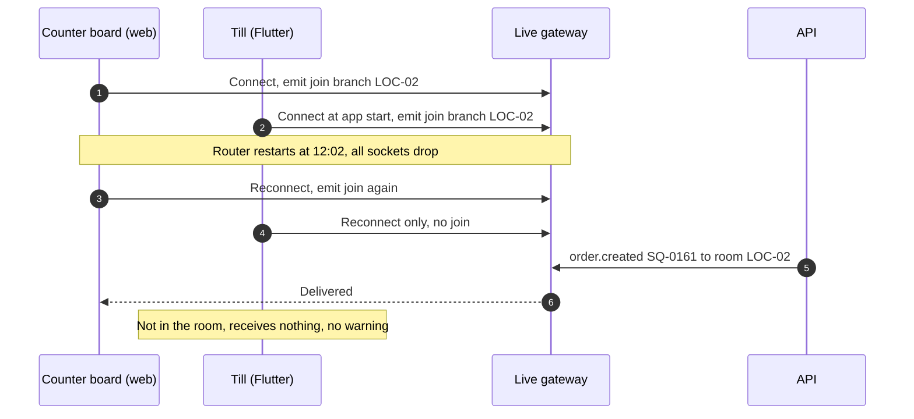

# Post-Incident Review: INC-2026-004 Till and Board Desync After Reconnect

## Document control

| Field | Value |
|---|---|
| Document ID | PIR-2026-004 |
| Version | 1.1 |
| Status | Approved |
| Owner | Business Analyst |
| Last updated | 2026-09-04 |
| Reviewers | Tech Lead (Incident Commander), Flutter developer (Technical Lead), Delivery Manager (Communications Lead), Branch Manager (Station Quarter), Product Owner, QA Lead |

| Version | Date | Change |
|---|---|---|
| 1.0 | 2026-07-23 | Approved at the review meeting |
| 1.1 | 2026-09-04 | CAPA closed; requirement changes baselined in SRS v1.3 (CR-004) |

## Incident summary

| Field | Value |
|---|---|
| Incident ID | INC-2026-004 |
| Title | Tills worked from a frozen queue after a router restart |
| Severity | SEV-2 |
| Status | Closed |
| Branch | LOC-02 Station Quarter |
| Start | 2026-07-17 12:03:40 (tills reconnect without their branch room) |
| Detected | 12:38 (branch manager compares the tills with the counter board) |
| Mitigated | 12:44 (both till apps restarted) |
| Resolved | 2026-07-18 07:40 (hotfix 1.0.3 deployed and verified) |
| Stale period | 40 min 20 s |
| Incident Commander | Tech Lead |
| PIR author | Business Analyst |
| Related CR | CR-004 (server-side rooms, branch sequence, snapshot resync, live indicator) |
| Related ADR / NFR | ADR-002, NFR-REL-02, NFR-OBS-02 |

## 1. Executive summary

At 12:02 on Friday 2026-07-17, at the start of the lunch rush, the internet router at Station Quarter restarted after a firmware update pushed by the internet provider. Every device lost its connection for about 95 seconds. The two browser boards reconnected and re-joined their branch's live room, because the web client asked to join on every connect. The two iPad tills reconnected but never re-joined: the Flutter client asked to join only once, at app start. For the next 40 minutes the tills received no live events. Their queues looked normal and showed no warning.

Counter staff could not find 23 app and web orders placed in that period. They re-keyed 3 of them as walk-ins, so the kitchen cooked those 3 twice. Four customers who had paid online were handed their food after staff checked their phones, but the orders were never marked Collected. Two unpaid app orders that had been re-keyed stayed open and became no-shows at closing, which, under the R1 rule, suspended both customers' accounts.

A customer complaint led the manager to compare the tills with the counter board at 12:38; restarting the tills at 12:44 restored them. A hotfix the next morning made the tills re-join their room on every connect. CR-004 then moved room membership to the server, added a branch sequence number, a snapshot on every connect or gap, and a visible live indicator (US-041).

## 2. Customer and business impact

| Dimension | Impact |
|---|---|
| Branch and time | Station Quarter, 12:03:40 to 12:44 on a Friday lunch |
| Orders placed in the period | 37 (23 app and web, 14 till) |
| Orders not visible on the tills | 23 app and web orders; status changes of 9 earlier orders |
| Orders cooked twice | 3 (re-keyed as walk-ins); food cost about EUR 15.80 |
| Customers who waited more than 10 minutes at the counter | 6 |
| Paid orders handed over but not marked Collected | 4; corrected the same afternoon |
| Accounts suspended by mistake | 2 (no-show at 21:30 for the re-keyed orders); reinstated by an Administrator on 2026-07-18 at 08:15 |
| Money | No customer charged twice: the re-keyed orders were paid at the counter and their app twins were unpaid |
| Personal data | None exposed |

## 3. Timeline

All times local, Friday 2026-07-17.

| Time | Event | Actor (role) |
|---|---|---|
| 12:02:05 | The internet provider pushes a firmware update; the branch router restarts | Internet provider |
| 12:02:10 | Tills, boards and staff phones lose connectivity | — |
| 12:03:40 | Router back. Boards reconnect and emit `join`; tills reconnect and do not | System |
| 12:03:40 to 12:44 | Server events for Station Quarter reach the boards but not the tills | System |
| 12:09 | First app order not visible on the tills (SQ-0161) | System |
| 12:14 | A customer says she ordered on the app; the counter cannot find the order and re-keys it as a walk-in | Counter staff |
| 12:21 and 12:26 | Two more re-keyed orders | Counter staff |
| 12:31 | A customer shows her app with "Ready" and asks why the counter says the order does not exist | Customer |
| **12:38** | **Detected:** the manager sees orders on the counter board that are missing on both tills | Branch Manager |
| **12:44** | **Mitigated:** the manager restarts both till apps; queues match the counter board | Branch Manager |
| 12:47 | Manager calls the support line | Branch Manager |
| 12:58 | On-call Flutter developer acknowledges; SEV-2 declared at 13:02; Tech Lead is IC | IC |
| 13:30 | Cause found: the Flutter socket client joins its room only after the first connect | Technical Lead |
| 14:10 | BA impact query (order counts only): 23 orders missing on tills, 3 duplicates, 4 unmarked handovers | Business Analyst |
| 14:30 | Duplicates canceled with reason "Duplicate order - INC-2026-004"; handovers marked Collected | Branch Manager |
| 21:30 | No-show cutoff suspends 2 accounts (the duplicates' app twins, still open) | System |
| 2026-07-18 07:40 | **Resolved:** hotfix 1.0.3 deployed: tills join on every connect; verified with a router restart at the training branch | Technical Lead |
| 2026-07-18 08:15 | Administrator reinstates the 2 accounts and emails both customers | Administrator |
| 2026-07-20 | CR-004 raised | Tech Lead |
| 2026-07-23 | PIR review | Business Analyst |
| 2026-07-24 | CR-004 approved; ADR-002 accepted | CCB |

### How the desync happened

## 4. Detection analysis

Detection took 34 minutes and came from a customer.
- **No signal existed.** The till did not know it was missing events; the server did not watch which devices were in which room.
- **The screen looked normal.** Nothing distinguished a quiet queue from a stale one.
- **With today's controls** a till that is not in its room never exists, because the server joins rooms on connect (ADR-002). If a till still stopped receiving events, it would show "Reconnecting" after 10 seconds (FR-TIL-11), and NFR-OBS-02 (b) pages on-call when a branch has no connected till for 2 minutes during opening hours.

## 5. Response analysis

| Measure | Target (SEV-2) | Actual | Met? |
|---|---|---|---|
| Acknowledge | 15 min | 11 min (12:47 to 12:58) | Yes |
| IC assigned | 30 min from acknowledgement | 4 min | Yes |
| Mitigation | — | 6 min after detection, by the branch manager | n/a |
| Updates to branch managers | Every 60 min | Met | Yes |

The fastest step was the manager's own: comparing two screens and restarting the tills. The runbook now makes that the first action (incident process section 5).

## 6. Root cause analysis

### 6.1 Five whys

1. **Why did the kitchen cook 3 orders twice?** Because counter staff re-keyed app orders they could not find on the till.
2. **Why could they not find them?** Because the tills received no live events after 12:03:40.
3. **Why did the tills receive no events?** Because after the automatic reconnect they were no longer in their branch's room; the Flutter client asked to join only at app start.
4. **Why did nobody notice for 34 minutes?** Because the till showed no connection or freshness state, so a stale queue looked like a quiet one.
5. **Why was the system built that way?** Because FR-TIL-10 and NFR-PERF-03 specified how fast changes must appear, but no requirement said what must happen after a disconnect or how staleness is shown. No acceptance criterion covered a reconnect, so the web and Flutter clients implemented room joining differently and both passed their tests.

**Root cause statement:** Live updates depended on each client re-joining its room after a reconnect, with no server-side membership, no way to detect missed events and no visible staleness, and the requirements did not specify reconnect behavior.

### 6.2 Contributing factors

| Category | Factor |
|---|---|
| Requirements | No requirement for reconnect, missed events or staleness; FR-TIL-10 covered latency only |
| Technology | Room membership on the client; events applied without sequence; no heartbeat |
| Process | No chaos test; device tests ran on stable office Wi-Fi |
| Environment | No 4G fallback at the branch; the internet provider could restart the router at any time |

### 6.3 Requirement-gap classification

| Cause | Classification | Evidence |
|---|---|---|
| No reconnect behavior specified | Requirements gap | FR-TIL-10, NFR-PERF-03 in SRS v1.2 |
| No staleness indicator | Requirements gap | No FR; boards and till had none |
| Web and Flutter clients joined rooms differently | Design defect | Realtime events v1.0: "clients join with `join`" |
| Never tested with a network drop | Test gap | No case in the R1 suite |

## 7. What went well, what went poorly, where we got lucky

| Went well | Went poorly | Lucky |
|---|---|---|
| The counter board was right all along and the manager used it | 34 minutes to detect, from a customer | No double charge: the re-keyed orders' app twins were unpaid |
| Restarting the tills fixed them at once | 2 customers suspended by mistake at closing | It happened at one branch only |
| The BA's counts let the manager correct the records the same afternoon | The suspension rule turned a technical fault into a customer problem | — |

## 8. Corrective and preventive actions

| ID | Action | Type | Owner | Due | Status | Reference |
|---|---|---|---|---|---|---|
| CAPA-004-01 | Tills join their room on every connect (hotfix 1.0.3) | Mitigate | Tech Lead | 2026-07-18 | Done | — |
| CAPA-004-02 | Server-side room membership, branch sequence, snapshot on connect and gap | Prevent | Tech Lead | 2026-08-10 | Done (1.0.5) | CR-004, ADR-002, US-041 |
| CAPA-004-03 | Live, Reconnecting and Not live indicator on tills and boards | Detect | UX Designer | 2026-08-10 | Done | FR-TIL-11 |
| CAPA-004-04 | Alert when a branch has no connected till or board for 2 min | Detect | Tech Lead | 2026-08-07 | Done | NFR-OBS-02 (b) |
| CAPA-004-05 | Chaos test with 100 forced disconnects per release | Detect | QA Lead | 2026-08-07 | Done | NFR-REL-02, TC-NFR-004 |
| CAPA-004-06 | 4G fallback router at all branches | Prevent | Operations Director | 2026-07-31 | Done | DEP-04 |
| CAPA-004-07 | Runbook: counter board as source of truth; restart the till | Mitigate | Delivery Manager | 2026-07-24 | Done | Incident process section 5 |
| CAPA-004-08 | Definition of Ready and Done items for live screens | Process | Business Analyst | 2026-07-31 | Done | DoR R11, DoD D12 |

## 9. Requirement and documentation changes

| Artifact | Change | Baselined in |
|---|---|---|
| BR-045 | New: branch sequence, snapshot after reconnect or gap, Reconnecting state | SRS v1.3 |
| FR-TIL-11 | New: live indicator and resync | SRS v1.3 |
| NFR-REL-02 | Measure added: Reconnecting after 10 s; chaos test | SRS v1.3 |
| NFR-OBS-02 | Trigger (b) added | SRS v1.3 |
| Realtime events | v1.1: server-side rooms, sequence, heartbeat | [realtime-events.md](../../04-api/realtime-events.md) |
| US-041 | New story with 5 acceptance criteria | [EP-06](../../05-delivery/user-stories/EP-06-till-and-live-order-boards.md) |
| Business rules table 3.7 | New decision table for live updates | [business-rules.md](../../02-requirements/business-rules.md) |

## 10. Lessons learned

1. **A latency requirement is not a correctness requirement.** "Within 2 seconds" said nothing about what happens when a message never arrives. Every live screen now has a written answer to "what if I miss something?"
2. **Make staleness visible.** A stale screen that looks normal is worse than a screen that says "not live".
3. **Two clients, one contract.** Behavior that every client must share belongs on the server or in the written contract, not in each client's code.
4. **Policies amplify faults.** The automatic suspension rule turned a till fault into two wrongly suspended customers. CR-003 had already proposed Prepay-only; this incident was the second piece of evidence for it.

## Approval

| Role | Decision | Date |
|---|---|---|
| Incident Commander (Tech Lead) | Approved | 2026-07-23 |
| Product Owner (Operations Director) | Approved | 2026-07-23 |
| Branch Manager, Station Quarter | Approved | 2026-07-23 |
| Business Analyst (author) | Prepared | 2026-07-21 |

## Related documents

- [Incident management process](../incident-management-process.md)
- [ADR-002 Live updates: snapshot and sequence](../../03-design/architecture/adr/ADR-002-live-updates-snapshot-and-sequence.md)
- [Change request log (CR-004)](../../05-delivery/change-request-log.md)
- [Realtime events](../../04-api/realtime-events.md)
- [Test cases](../../06-quality/test-cases.md)
