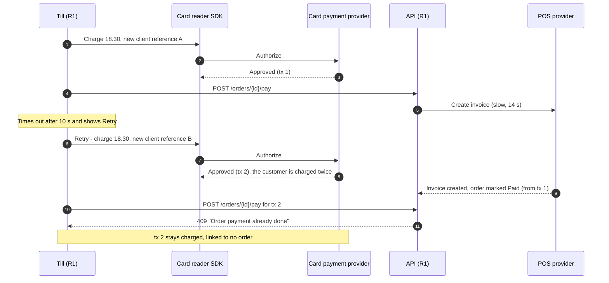

# Post-Incident Review: INC-2026-009 Duplicate Card Capture on Retry

## Document control

| Field | Value |
|---|---|
| Document ID | PIR-2026-009 |
| Version | 1.1 |
| Status | Approved |
| Owner | Business Analyst |
| Last updated | 2026-09-07 |
| Reviewers | Tech Lead (Incident Commander), Node.js developer (Technical Lead), Delivery Manager (Communications Lead), Finance Controller, Product Owner, QA Lead |

| Version | Date | Change |
|---|---|---|
| 1.0 | 2026-08-27 | Approved at the review meeting |
| 1.1 | 2026-09-07 | CAPA closed with R1.1; requirement changes baselined in SRS v1.3 (CR-007) |

## Incident summary

| Field | Value |
|---|---|
| Incident ID | INC-2026-009 |
| Title | Customers charged twice after a card confirmation timed out and the till's Retry charged again |
| Severity | SEV-2 |
| Status | Closed |
| Branches | LOC-01 Market Hall, LOC-02 Station Quarter, LOC-03 Riverside (Campus closed on Saturdays) |
| Start | 2026-08-22 18:05 (first duplicate charge) |
| Detected | 20:15 (customer shows two charges at Market Hall) |
| Mitigated | 21:05 (instruction to all branches; branches closed at 21:00) |
| Resolved | 2026-08-24 07:30 (hotfix 1.0.6: Retry removed, Verify payment added) |
| Incident Commander | Tech Lead |
| PIR author | Business Analyst |
| Related CR | CR-007 (payment attempts, invoice outbox, reconciliation) |
| Related ADR / NFR | ADR-003, NFR-REL-04, NFR-OBS-02 |

## 1. Executive summary

On Saturday evening 2026-08-22, the cloud POS provider had a performance problem: invoice calls took 8 to 20 seconds instead of under one. In R1, a counter card payment raised the invoice inside the confirmation request, and the till waited 10 seconds for the answer. When the confirmation timed out, the till showed "Payment could not be confirmed" with a Retry button, and Retry ran the whole card flow again. The card reader charged the card a second time, because nothing told it or the provider that the second charge belonged to the same payment.

Between 18:05 and 20:15, 23 customers at three branches were charged twice, EUR 412.60 in total. A customer at Market Hall showed the manager two charges in her banking app at 20:15. The team identified the pattern by 20:52, told all branches to stop using Retry, and refunded every duplicate through the provider on Sunday. A hotfix on Monday removed Retry. CR-007 then introduced payment attempts with an idempotency key that the provider also enforces, moved invoicing to an outbox, and added nightly reconciliation and a real-time double-capture alert (US-032, US-035).

## 2. Customer and business impact

| Dimension | Impact |
|---|---|
| Customers charged twice | 23: 9 app or web customers who paid at the counter, 14 walk-ins |
| Money | EUR 412.60 charged twice; refunded in full by 2026-08-23 14:00 |
| Card confirmation timeouts | 61 in total; staff tapped Retry 23 times. In the other 38, staff saw the order turn Paid in the queue and did not retry |
| Online payments | No double charge. 11 orders showed "Confirming payment" for up to 25 minutes, because webhooks also timed out on the invoice call and the provider retried them |
| Invoices | None missing or duplicated; the second charges had no order or invoice |
| Finance effort | About 6 hours on Sunday to match provider transactions to orders by hand |
| Customer contact | 4 phone calls and 1 email; app and web customers received an apology email; a counter notice was shown for a week |

### Duplicates by branch

| Branch | Duplicate charges | Amount refunded |
|---|---|---|
| LOC-01 Market Hall | 11 | EUR 201.30 |
| LOC-02 Station Quarter | 8 | EUR 139.80 |
| LOC-03 Riverside | 4 | EUR 71.50 |
| **Total** | **23** | **EUR 412.60** |

## 3. Timeline

All times local.

| Time | Event | Actor (role) |
|---|---|---|
| 2026-08-22 17:58 | POS provider invoice latency rises to 8-20 s (the provider posts an incident at 18:20) | POS provider |
| 18:05 | First confirmation timeout at Market Hall; Retry charges the card again (first duplicate) | System, counter staff |
| 18:05 to 20:15 | 61 timeouts across three branches; 23 Retries charge again | System, counter staff |
| 18:30 | Online orders start showing "Confirming payment" for minutes | System |
| **20:15** | **Detected:** a customer at Market Hall shows two identical charges | Customer, Branch Manager |
| 20:22 | Market Hall manager calls the support line | Branch Manager |
| 20:31 | On-call developer acknowledges; SEV-2 declared at 20:36 with the Tech Lead as IC | IC |
| 20:30 | POS provider latency back to normal | POS provider |
| 20:52 | Cause identified: orders with two provider transactions, the second without a Brasa payment, each after a confirmation timeout | Technical Lead |
| **21:05** | **Mitigated:** message to all branch managers: "After a card error do not tap Retry; check the queue; if the order is not Paid, take another payment method." Branches already closed at 21:00 | Communications Lead |
| 2026-08-23 09:00 | BA impact analysis from the provider's transaction report and Brasa payments (amounts and references only): 23 duplicates, EUR 412.60 | Business Analyst |
| 2026-08-23 10:30 | Finance Controller refunds the 23 duplicates through the provider dashboard; BA reconciles the refund list to the impact list | Finance Controller, Business Analyst |
| 2026-08-23 14:00 | All refunds accepted by the provider; apology emails sent to 9 account holders | Finance Controller, Communications Lead |
| **2026-08-24 07:30** | **Resolved:** hotfix 1.0.6: after a timeout the till offers only "Verify payment" | Technical Lead |
| 2026-08-24 | CR-007 raised (within 2 business days of the emergency change) | Tech Lead, Finance Controller |
| 2026-08-26 | CR-007 approved; ADR-003 accepted | CCB |
| 2026-08-27 | PIR review | Business Analyst |
| 2026-09-07 | R1.1 released with payment attempts, invoice outbox and reconciliation | Delivery team |

### How the second charge happened

## 4. Detection analysis

Detection took 2 hours 10 minutes and came from a customer.
- **No money signal existed.** Nothing compared provider transactions with Brasa payments, and nothing alerted on two successful charges for one order.
- **The till's error looked routine.** Staff had seen occasional confirmation errors before and had been told to retry.
- **The POS slowness was visible only on the provider's status page,** which nobody watched on a Saturday evening.
- **With today's controls:** the second charge cannot happen, because the attempt ID is the provider's idempotency key and a Pending attempt blocks new charges (BR-035). If a second capture still occurred (for example on a reader outside Brasa), NFR-OBS-02 (a) pages within 5 minutes and the nightly reconciliation lists it (BR-039). The invoice outbox age alert (NFR-OBS-02 e) would have shown the POS slowness by 18:13.

## 5. Response analysis

| Measure | Target (SEV-2) | Actual | Met? |
|---|---|---|---|
| Acknowledge | 15 min | 9 min (20:22 to 20:31) | Yes |
| IC assigned | 30 min from acknowledgement | 5 min | Yes |
| Updates to branch managers | Every 60 min | Met | Yes |
| Refunds | Same or next day (runbook) | Next day, 14:00 | Yes |

Mitigation relied on an instruction because the till had no feature flag for its retry behavior. Every money-moving control on the till now has a flag (CAPA-009-08).

## 6. Root cause analysis

### 6.1 Five whys

1. **Why were customers charged twice?** Because the till's Retry ran the card charge again after a successful charge.
2. **Why did Retry charge again?** Because the till could not tell "the charge failed" from "the charge succeeded but the confirmation did not come back"; both led to the same Retry.
3. **Why did the confirmation not come back?** Because the confirmation request raised the invoice at the POS provider synchronously, and the provider was taking up to 20 seconds.
4. **Why could a second charge go through at all?** Because a payment had no identity of its own: each tap created a new reference at the reader, and nothing on the server or at the provider linked the second charge to the first.
5. **Why was it built that way?** Because BR-035 in R1 said only "an order can be paid once" and the acceptance criteria covered "payment fails" and "payment canceled", but not "timeout after a successful charge". The requirement stated the outcome without the mechanism (attempt identity, idempotency, verification), and no test injected a slow confirmation.

**Root cause statement:** Counter card payments had no idempotent identity shared with the provider, the till's only recovery after a timeout was to charge again, and the requirements did not specify behavior for a timeout after a successful charge.

### 6.2 Contributing factors

| Category | Factor |
|---|---|
| Requirements | BR-035 without a mechanism; no AC for a timeout after charge; no reconciliation or money-anomaly requirement |
| Technology | Invoice raised inside the payment confirmation; 10 s till timeout shorter than the worst POS latency; webhooks processed synchronously |
| Process | Staff guidance "retry on error" written for network errors before go-live |
| Monitoring | No alert on provider latency, outbox age or double capture |

### 6.3 Requirement-gap classification

| Cause | Classification | Evidence |
|---|---|---|
| No payment identity or idempotency | Requirements gap and design defect | BR-035, FR-PAY-04 in SRS v1.2 |
| Retry recharged the card | Design defect | Till error flow |
| Invoice inside the payment request | Design defect | FR-PAY-06 in SRS v1.2 ("after a payment succeeds") silent on synchronous or not |
| No reconciliation | Requirements gap | No FR before CR-007 |
| Never tested with a slow confirmation | Test gap | No case before TC-PAY-007 |

## 7. What went well, what went poorly, where we got lucky

| Went well | Went poorly | Lucky |
|---|---|---|
| The customer and the manager raised it the same evening | 2 h 10 min to detect, by a customer | The POS provider recovered at 20:30, 30 minutes before closing |
| Every duplicate was traceable from provider references and refunded the next day | Staff were trained to retry | It happened on a Saturday evening, the quietest trading period of the week |
| The BA's impact list matched the Finance Controller's refund list one to one | Finance spent 6 hours matching by hand | Campus, the busiest card branch on weekdays, was closed |

## 8. Corrective and preventive actions

| ID | Action | Type | Owner | Due | Status | Reference |
|---|---|---|---|---|---|---|
| CAPA-009-01 | Remove Retry after a card timeout; add Verify payment (hotfix 1.0.6) | Mitigate | Tech Lead | 2026-08-24 | Done | — |
| CAPA-009-02 | Payment attempts whose ID is the provider's merchant reference and idempotency key; one Pending or Succeeded attempt per order | Prevent | Tech Lead | 2026-09-07 | Done | CR-007, ADR-003, US-032, BR-035 |
| CAPA-009-03 | Invoices raised through an outbox, never inside a payment request | Prevent | Tech Lead | 2026-09-07 | Done | FR-PAY-06, BR-037 |
| CAPA-009-04 | Webhooks acknowledged at once and processed once per event ID | Prevent | Tech Lead | 2026-09-07 | Done | FR-PAY-03 |
| CAPA-009-05 | Nightly reconciliation of provider transactions, payments and invoices | Detect | Finance Controller, BA | 2026-09-07 | Done | FR-PAY-10, BR-039, US-035 |
| CAPA-009-06 | Real-time alert on two successful payments for one order | Detect | Tech Lead | 2026-09-04 | Done | NFR-OBS-02 (a) |
| CAPA-009-07 | Alert when the invoice outbox is older than 15 minutes | Detect | Tech Lead | 2026-09-04 | Done | NFR-OBS-02 (e) |
| CAPA-009-08 | Feature flags for every money-moving till control | Mitigate | Tech Lead | 2026-09-07 | Done | Release checklist |
| CAPA-009-09 | Duplicate-charge runbook and new staff guidance ("verify, never charge again") | Process | Delivery Manager | 2026-08-28 | Done | Incident process section 5 |
| CAPA-009-10 | Definition of Ready and Done items for idempotency | Process | Business Analyst | 2026-08-31 | Done | DoR R10, DoD D11 |

## 9. Requirement and documentation changes

| Artifact | Change | Baselined in |
|---|---|---|
| BR-035 | Rewritten: at most one successful payment; no new charge while an attempt is Pending or Succeeded; a retried confirmation never starts a new charge | SRS v1.3 |
| BR-037 | Invoice exactly once per paid order, keyed by order ID, through the outbox | SRS v1.3 |
| BR-039 | New: nightly reconciliation | SRS v1.3 |
| FR-PAY-05, FR-PAY-10 | New | SRS v1.3 |
| FR-PAY-06 | Changed: asynchronous invoicing | SRS v1.3 |
| NFR-OBS-02, NFR-REL-04 | Triggers (a) and (e); zero duplicate invoices | SRS v1.3 |
| Business rules table 3.6 | New decision table for payment attempts | [business-rules.md](../../02-requirements/business-rules.md) |
| US-032, US-035 | New stories; US-031 and US-033 revised | [EP-05](../../05-delivery/user-stories/EP-05-payments-and-invoicing.md) |
| OpenAPI | `startPaymentAttempt`, `verifyPaymentAttempt` | [openapi.yaml](../../04-api/openapi.yaml) |

## 10. Lessons learned

1. **A rule that protects money needs its mechanism written next to it.** "Paid once" is an outcome; attempts, idempotency keys and verification are how it is kept. The BA now writes both for every money rule.
2. **Never put a slow third party inside a request a person is waiting on.** The customer's payment does not depend on the receipt being ready.
3. **Recovery must not repeat the risky step.** After a timeout the safe action is to ask, not to do it again.
4. **Money needs a daily match.** Reconciliation would have found this the next morning even without a customer complaint.

## Approval

| Role | Decision | Date |
|---|---|---|
| Incident Commander (Tech Lead) | Approved | 2026-08-27 |
| Finance Controller | Approved | 2026-08-27 |
| Product Owner (Operations Director) | Approved | 2026-08-27 |
| Business Analyst (author) | Prepared | 2026-08-25 |

## Related documents

- [Incident management process](../incident-management-process.md)
- [ADR-003 Idempotent payments and invoice outbox](../../03-design/architecture/adr/ADR-003-idempotent-payments-and-invoice-outbox.md)
- [Change request log (CR-007)](../../05-delivery/change-request-log.md)
- [EP-05 Payments and invoicing stories](../../05-delivery/user-stories/EP-05-payments-and-invoicing.md)
- [Test cases](../../06-quality/test-cases.md)
