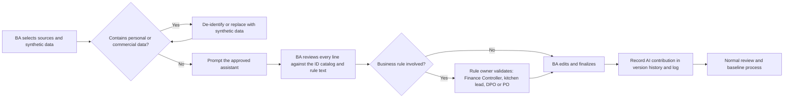

# AI-Assisted Business Analysis

## Document control

| Field | Value |
|---|---|
| Document ID | BRS-AI-01 |
| Version | 1.2 |
| Status | Approved |
| Owner | Business Analyst |
| Last updated | 2026-10-02 |
| Reviewers | Operations Director (Product Owner), Data Protection Officer (external), Tech Lead, QA Lead |

| Version | Date | Change |
|---|---|---|
| 1.0 | 2026-01-16 | Guardrails approved by the Operations Director and the Data Protection Officer before first use in discovery |
| 1.1 | 2026-08-21 | Spec Kit workflow added with spec 001 |
| 1.2 | 2026-10-02 | Contribution log and review findings updated through SRS v1.4 and the first week of R1.2 |

### Purpose and scope

This page explains how the Business Analyst used AI assistants on Brasa: what the assistants were allowed to do, what the BA never delegated, and what review of their output caught. It covers six activities:
- synthesis of discovery interviews and observations;
- first-draft user stories and Gherkin;
- test ideas for numeric and time rules;
- consistency and traceability checks;
- Mermaid diagram drafting;
- spec-driven development with GitHub Spec Kit (`/specify`, `/plan`, `/tasks`).

The worked example of the last one is [spec 001: rush-hour slot throttling](specs/001-rush-hour-slot-throttling/spec.md).

In short, AI made the BA faster at first drafts and at finding inconsistencies across about 60 documents. It made no decisions, owned no IDs, set no business rules and never saw real customer data.

## 1. Where AI fits in the BA workflow

| Activity | How the assistant was used | What the BA did | Example in this repo |
|---|---|---|---|
| Discovery synthesis | Clustered 24 de-identified interview summaries and 8 observation logs into candidate pain-point themes with counts | Recounted every theme by hand, merged and split themes, removed unsupported quotes, decided which themes changed scope | [Current vs future state](../01-discovery/current-vs-future-state.md) |
| First-draft stories and Gherkin | Drafted story text and scenarios from pasted FR and BR text plus synthetic test data | Checked every scenario against the rule text, fixed boundaries and arithmetic, removed invented behavior, assigned AC IDs | [EP-04 Customer ordering](../05-delivery/user-stories/EP-04-customer-ordering-and-notifications.md) |
| Test ideas | Proposed boundary values and equivalence classes for the slot engine, pricing, tips and time windows | Verified every expected value against the worked examples WE-1 and WE-2; added the cases the assistant missed | [Test cases](../06-quality/test-cases.md) |
| Consistency and traceability checks | Compared ID catalogs, changed sections and numbers repeated across documents; listed candidate findings | Triaged each finding as real or false; fixed the real ones; never accepted a proposed new ID | [Traceability matrix](../02-requirements/requirements-traceability-matrix.md) |
| Mermaid diagram drafting | Converted numbered process steps into flowcharts, sequence diagrams and state machines | Checked every node against observation notes and rule text; quoted labels; validated rendering | [Process flows](../03-design/diagrams/process-flows.md) |
| Spec-driven development | Ran Spec Kit `/specify`, `/plan` and `/tasks` from sources the BA selected | Resolved every `[NEEDS CLARIFICATION]` with the decision owner; mapped each requirement to canonical IDs; rejected unsafe proposals | [Spec 001](specs/001-rush-hour-slot-throttling/spec.md), [plan](specs/001-rush-hour-slot-throttling/plan.md), [tasks](specs/001-rush-hour-slot-throttling/tasks.md) |

## 2. Guardrails

Approved by the Operations Director and the Data Protection Officer on 2026-01-16 and applied to every use.

1. **No personal data in prompts, ever.** No customer names, emails, phone numbers, order histories, staff rotas or screenshots of production screens. Interview notes were de-identified by the BA before synthesis: role and branch only, no names.
2. **Synthetic data only.** Examples use the repo's fictional test data: customers such as CUS-1001 Clara Mendes, emails at example.com and brasa.example, and orders such as MH-0142 and SQ-0401 from [test-data](../06-quality/test-data/README.md).
3. **No commercial secrets.** Supplier prices, margins and the build contract stay out of prompts. The cost/benefit model in the BRD was built without an assistant.
4. **Approved tools only.** The team used the company-approved enterprise AI assistant with prompt retention off and no training on inputs. Personal accounts and browser extensions were not allowed.
5. **Every output is reviewed by the BA before anyone else sees it.** AI output is a draft, never a deliverable.
6. **The people who own a rule validate it.** Money and VAT go to the Finance Controller, kitchen timing to the kitchen leads, personal data to the Data Protection Officer, and priorities to the Product Owner, exactly as if the BA had written the text unaided.
7. **IDs and traceability belong to the BA.** The assistant may reference IDs pasted into the prompt. It may not create FR, BR, US, NFR, TC, CR or INC IDs. A proposed new ID is rejected, and the content is mapped to an existing ID or raised through change control.
8. **Record the AI's contribution.** Version history notes when a first draft was AI-generated (see the [spec](specs/001-rush-hour-slot-throttling/spec.md) and [tasks](specs/001-rush-hour-slot-throttling/tasks.md)), and section 6 below logs every artifact.

## 3. Workflow



## 4. Example prompts and what happened to the output

Each prompt is reproduced as used, with synthetic or de-identified inputs only.

### 4.1 Discovery synthesis (2026-01-30)

```text
You are helping a business analyst synthesize discovery research for a restaurant
group with four pickup-and-counter branches. Input: 24 interview summaries (INT-01
to INT-24) and 8 lunch-rush observation logs (OBS-01 to OBS-08). They are de-identified:
role and branch only (owner, operations, finance, branch manager, kitchen lead,
counter staff, tax adviser), no names.

Task: propose pain-point themes. For each theme give a short name, the interview
and observation numbers where it appears, a count, and one short quote that
appears verbatim in the input. Do not invent or paraphrase quotes. Flag any theme
supported by fewer than 3 sources as weak.
```

| Accepted | Corrected by the BA |
|---|---|
| 9 of 12 proposed themes and their grouping | Merged "phone interruptions" and "phone orders written wrong" into one theme, because they share a root cause (the phone is the only pre-order channel) |
| The weak-theme flag, which surfaced "clocks on shared devices disagree" (2 sources) for a closer look; it became BR-020 (server clock only) | Split "kitchen timing" into "tickets arrive in the wrong order" (kitchen leads) and "promised times are guesses" (counter staff), because they lead to different requirements |
| | Recounted every theme: the assistant counted OBS-03 and OBS-07 twice, because the counter and kitchen logs from the same branch and day were pasted as one block |
| | Removed one quote that did not appear in the input, despite the instruction |

### 4.2 First-draft stories and Gherkin for US-021 and US-030 (2026-03-24)

```text
Draft user stories and Gherkin acceptance criteria for US-021 "Check my cart and
its total" and US-030 "Pay online with an optional tip". Use only the rules pasted
below (FR-ORD-05, FR-PAY-02, BR-021 to BR-026, BR-036). Synthetic data: order MH-0142 at Market Hall: 1 Chicken Grill Bowl
9.40 with Halloumi 1.50 and Garlic sauce 0.50, without Red onion and Coriander;
2 Chicken Wrap 7.90 with Extra chicken 2.20, without Pickled chili; 1 Sparkling
lemonade 2.90. Food VAT 10%, drinks 20%, prices include VAT. Include boundary
examples for tip rounding. Name scenarios US-021-AC1, US-030-AC1 and so on. Do not
add behavior that is not in the rules.

[rule text pasted here]
```

| Accepted | Corrected by the BA |
|---|---|
| Story structure and the line-by-line pricing table for US-021 | The draft credited 0.30 for each removed ingredient, as the previous system did. BR-021 and DEC-03 say removing an ingredient never changes the price; the total is 34.50, not 33.30 |
| The tip scenario outline for US-030 with 0%, 5%, 10% and 15% | The draft rounded the 5% tip of 1.725 to 1.72 (half even). BR-036 says half up: 1.73, charged 36.23. The Finance Controller confirmed both numbers against the POS invoice |
| | An invented "service charge" line was removed; no rule mentions one |
| | The BA added the WE-1 cross-check, so that US-021 and US-030 use exactly the numbers of SRS Appendix B (total 34.50, tip 1.73, charged 36.23) |

### 4.3 Test ideas for the slot engine (2026-03-12)

```text
Generate boundary-value and equivalence-class test ideas for three rules.
BR-010: online pickup minutes start at now + L, rounded up to the next whole minute; L = 10.
BR-011: kitchen minutes P = ceil(U x m x f); m = 1.0; f = 0.5 when the pickup
minute is inside the rush window 11:45-13:30, otherwise 1.0.
BR-012: an order with pickup minute T holds kitchen minutes T - P to T - 1.
For each idea show the input, the expected result and the arithmetic.
```

| Accepted | Corrected by the BA |
|---|---|
| 26 test ideas, including drinks-only carts (U = 0, P = 0) and carts at the 30-unit online limit | The assistant treated 13:30 as inside the rush and gave P = 2 for 3 units. The rush window is [11:45, 13:30): at 13:30, P = ceil(3 x 1.0 x 1.0) = 3. The pair 13:29 / 13:30 became a boundary row in business rules table 3.1 |
| Equivalence classes for the lead time (now exactly on a minute, now with seconds) | At 12:04:20 the assistant offered 12:14 as the earliest minute. 12:04:20 + 10 minutes = 12:14:20, rounded up to 12:15 (WE-2) |
| | Added "a kitchen minute that is already over" (row A5), which the assistant did not consider and which the previous system got wrong |

### 4.4 Consistency and traceability check for SRS v1.3 (2026-09-02)

```text
Below are (1) the ID catalog: every FR, BR, US and NFR with its text, (2) the draft
SRS v1.3 change section for CR-003, CR-004 and CR-007, (3) the acceptance criteria
of US-022, US-028, US-031, US-033 and US-041, and (4) ADR-002, ADR-003 and the two
post-incident reviews.
Check: (a) every ID referenced exists in the catalog; (b) every BR linked to a
changed FR is reviewed; (c) any number that appears in more than one place agrees
(durations, amounts, counts); (d) list acceptance criteria that mention a changed
rule but were not updated.
Output a table: finding, location, evidence, severity. Do not propose new IDs.
```

| Accepted | Corrected or rejected by the BA |
|---|---|
| US-028 still described a 30-day account suspension; updated to Prepay-only (CR-003) | Rejected: "15 minutes in BR-030 conflicts with + 15 minutes in BR-040". These are different rules (cancellation cutoff and the reminder email) that share a duration |
| ADR-002 said the tills were silent for 35 minutes; the PIR timeline shows 40. Aligned to 40 everywhere | Rejected: "the 8-minute Prepay-only hold conflicts with the 10-minute lead time". Different settings with different purposes |
| A test case for the till still expected a Retry button after a card timeout; updated to Verify payment (TC-PAY-007) | Rejected: a proposed new business rule for Verify payment. The behavior belongs to BR-035 and FR-PAY-05; no new ID |
| 5 further wording findings | |

### 4.5 Spec Kit `/specify` for the rush-hour throttle (2026-08-12)

```text
/specify Rush-hour throttle for online pickup orders at a branch. During the rush
window, orders placed in the app or on the web must not be able to take every
kitchen minute in advance. Part of each quarter-hour stays free for walk-in
customers at the till and is opened to online orders shortly before it starts.
The till is never limited. Administrators set the share per branch. Sources:
CR-006, BR-009 to BR-020, FR-BRN-06 to FR-BRN-11, business rules table 3.1,
ADR-001, NFR-PERF-01, NFR-PERF-02. Mark anything not covered by these sources as
[NEEDS CLARIFICATION].
```

| Accepted | Corrected or rejected by the BA |
|---|---|
| The spec skeleton, the primary user story and the first acceptance scenarios, which the BA rebuilt on the SQ-0401 to SQ-0407 bookings | The draft counted the 12:46 candidate (kitchen minutes 12:44 and 12:45) as 2 minutes in the 12:30 block and marked it unavailable. Minutes count block by block (C-04): 1 + 8 = 9 in the first block and 1 + 4 = 5 in the second, so 12:46 is available |
| 11 `[NEEDS CLARIFICATION]` markers; 9 were real gaps and went to their decision owners | Rejected: a "Kept for walk-in customers" label on unavailable minutes. The Product Owner and the UX Designer decided against it (C-05) |
| The edge-case list as a starting point | Removed an invented error code, THROTTLED. A customer who loses the last online minute gets the existing 409 SLOT_TAKEN (C-07) |
| | In `/plan`, rejected an external key-value store with expiring keys for the counter: it is not transactional with the reservations and adds infrastructure without an ADR (plan R-02) |
| | Renamed the template's FR-001 numbering to SPEC-FR-001, and mapped each requirement to CR-006. When CR-006 was approved, the BA created BR-018, FR-BRN-12 and US-013 through change control and remapped |

## 5. AI did / BA did

| Area | AI did | BA did |
|---|---|---|
| Discovery synthesis | Proposed clusters and counts from de-identified notes | De-identified inputs; recounted, merged and split themes; chose what changed scope |
| Stories and Gherkin | Produced first drafts of story text and scenario structure | Verified against rule text, fixed boundaries and arithmetic, removed invented behavior, assigned IDs, walked through with QA and developers |
| Test ideas | Generated boundary and equivalence candidates | Checked expected values against WE-1 and WE-2, added missed classes, prioritized with the QA Lead |
| Consistency checks | Compared a large document set quickly and listed candidate findings | Triaged real and false findings, fixed the real ones, refused new IDs |
| Diagrams | Converted text steps into Mermaid syntax | Checked each node against observations and rules, quoted labels, validated rendering |
| Spec Kit | Generated spec, plan and task skeletons and clarification markers | Selected sources, resolved every clarification with its owner, ran the constitution check, mapped SPEC-FR to canonical IDs, checked test coverage per requirement |
| Decisions | None | Facilitated every decision with the person accountable for it (see the [RACI](../01-discovery/stakeholder-register-raci.md)) |
| Data | Saw only synthetic or de-identified text | Kept all real data out of prompts |

## 6. AI contribution log

| Date | Artifact | AI contribution | Reviewed by |
|---|---|---|---|
| 2026-01-30 | [Current vs future state](../01-discovery/current-vs-future-state.md), pain-point themes | Candidate themes from interviews and observations | Business Analyst, UX Designer |
| 2026-02-03 | [Current vs future state](../01-discovery/current-vs-future-state.md), AS-IS map | First draft of the AS-IS Mermaid flow | Business Analyst; validated with two branch managers |
| 2026-03-10 to 2026-04-24 | [User stories](../05-delivery/epics.md) of EP-02, EP-04 and EP-05 | First-draft Gherkin for 17 stories | Business Analyst, QA Lead; Finance Controller for EP-05 |
| 2026-03-12 | [Test cases](../06-quality/test-cases.md) for BR-010 to BR-012 | Boundary-value candidates | Business Analyst, QA Lead |
| 2026-07-20 to 2026-08-28 | [Post-incident reviews](../07-operations/incident-management-process.md) | Timeline tables formatted from the incident channel log (exported without personal data) | Business Analyst, Incident Commanders |
| 2026-08-12 to 2026-08-21 | [Spec 001](specs/001-rush-hour-slot-throttling/spec.md), [plan](specs/001-rush-hour-slot-throttling/plan.md), [tasks](specs/001-rush-hour-slot-throttling/tasks.md) | Spec Kit drafts | Business Analyst, Tech Lead, Operations Director, Station Quarter Branch Manager |
| 2026-09-02 | [SRS v1.3](../02-requirements/SRS.md) change section | Consistency check across stories, ADRs and reviews | Business Analyst |
| 2026-09-16 | [SRS v1.4](../02-requirements/SRS.md) and the RTM | Consistency check of CR-006 changes | Business Analyst |

## 7. What review caught

Across the logged uses, review found the same few failure patterns again and again. They are why the guardrails exist.

| Failure pattern | Times caught | Example |
|---|---|---|
| Invented identifiers, codes or lines | 4 | THROTTLED, a "service charge" line, a proposed new BR for Verify payment, template FR-001 numbering |
| Plausible but wrong arithmetic | 4 | Tip rounded half even (1.72); removal credits (33.30); 13:30 inside the rush; 12:46 counted twice in one block |
| Behavior that contradicts a rule or decision | 2 | A walk-in label on unavailable minutes; an external store for the cap |
| Counting errors in synthesis | 1 theme | Two observation logs counted twice |
| Fabricated quotes | 1 | A "quote" not present in the input |
| False-positive inconsistencies | 2 | 15-minute cutoff vs + 15-minute email; 8-minute hold vs 10-minute lead time |

## Related documents

- [Spec 001: rush-hour slot throttling](specs/001-rush-hour-slot-throttling/spec.md)
- [Spec 001 plan](specs/001-rush-hour-slot-throttling/plan.md)
- [Spec 001 tasks](specs/001-rush-hour-slot-throttling/tasks.md)
- [Current vs future state](../01-discovery/current-vs-future-state.md)
- [Stakeholder register and RACI](../01-discovery/stakeholder-register-raci.md)
- [Software requirements specification](../02-requirements/SRS.md)
- [Business rules](../02-requirements/business-rules.md)
- [Requirements traceability matrix](../02-requirements/requirements-traceability-matrix.md)
- [Definition of Ready and Done](../05-delivery/definition-of-ready-and-done.md)
