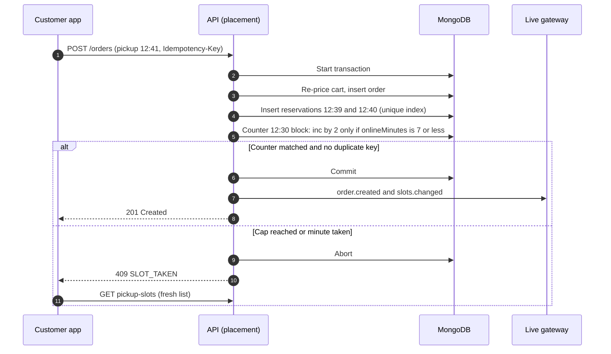

# Implementation Plan: Rush-Hour Slot Throttling

## Document control

| Field | Value |
|---|---|
| Document ID | BRS-SPEC-001-PLAN |
| Version | 1.2 |
| Status | Approved |
| Owner | Business Analyst |
| Last updated | 2026-09-24 |
| Reviewers | Tech Lead (approver), Node.js developers, Flutter developer, React developer, QA Lead |

| Version | Date | Change |
|---|---|---|
| 1.0 | 2026-08-20 | Generated with `/plan` from spec v1.1; technical sections edited by the Tech Lead; constitution check and traceability by the Business Analyst |
| 1.1 | 2026-09-10 | R-02 changed after the first Sprint 11 tests: counting reservations inside the placement transaction allowed write skew, so the online count moved to a counter document with a conditional increment (ADR-001 amendment of 2026-09-10) |
| 1.2 | 2026-09-24 | After UAT-12: release notification moved to its own job with a single-run key; minimum-version check of the reason code added to phase 4 |

**Branch**: `001-rush-hour-slot-throttling` | **Date**: 2026-08-20 | **Spec**: [spec.md](spec.md)
**Input**: Feature specification from `08-ai-assisted-ba/specs/001-rush-hour-slot-throttling/spec.md`

### Purpose and scope

This plan turns the [rush-hour throttle spec](spec.md) into a technical approach: context, constitution check, research decisions, data model deltas, contracts and the phase plan. In the standard Spec Kit layout, research, data model, contracts and quickstart are separate files. In this portfolio they are consolidated here, so the file set stays at spec, plan and tasks. The Tech Lead owns the technical decisions. The Business Analyst owns the constitution check, the mapping back to SPEC-FR and canonical IDs, and the acceptance approach. Slot reservation itself is decided in [ADR-001](../../../03-design/architecture/adr/ADR-001-server-authoritative-slot-reservation.md); this plan extends it and does not re-decide it.

## Summary

During a branch's rush window, online orders may hold at most floor(n x S / 100) kitchen minutes of each block of n minutes (normally 9 of 15), until the block is released 20 minutes before it starts (BR-018, FR-BRN-12). The slot engine adds one row, A9, after the existing rows of business rules table 3.1. It reads a per-block counter of online minutes, and the API returns the new reason ONLINE_CAP. Placement increments the counter in the same MongoDB transaction that inserts the kitchen reservations, with a filter that fails when the cap would be exceeded. That single-document conflict is what makes the cap hold under concurrency. A worker job notifies open pickup sheets when each block is released. The till path does not change. Two fields and one collection are added; no endpoint is added.

## Technical Context

| Item | Value |
|---|---|
| Language/Version | Node.js LTS (JavaScript) for the API and the worker; Dart (Flutter) for the customer app and the till; JavaScript (React 18 with Redux) for the web panel and the Admin Panel |
| Primary Dependencies | Express, Mongoose, Socket.IO with the MongoDB adapter, MongoDB-backed job scheduler |
| Storage | MongoDB replica set; multi-document transactions for placement (ADR-001) |
| Testing | Unit tests with decision-table rows as data; API contract tests generated from `04-api/openapi.yaml`; integration tests against a disposable replica set with the virtual clock; Flutter widget tests; load test at the peak profile and at 1.5 x (TC-NFR-001) |
| Target Platform | Customer app on iOS 16+ and Android 10+; web panel and Admin Panel in the last two versions of the main browsers; till on iPadOS 16+ (NFR-CMP-01) |
| Project Type | Mobile, web and API (`api`, `worker`, `app`, `web`, `admin`, `till`) |
| Performance Goals | Pickup-slot list 800 ms or less at p95 (NFR-PERF-01); placement 1.5 s or less at p95 (NFR-PERF-02); both also at 1.5 x the peak profile (NFR-PERF-05) |
| Constraints | No new infrastructure without an ADR; additive changes within `/v1` (NFR-MNT-02); no personal data in metrics (NFR-OBS-01); server clock only (BR-020) |
| Scale/Scope | 4 branches; peak 90 orders an hour per branch; 7 rush blocks per weekday and 6 on Saturday at branches with the throttle on |

## Constitution Check

The Brasa delivery constitution is the set of principles every feature plan is checked against. The Business Analyst ran the check at `/plan` time and again after the change of R-02.

| Principle | What it requires | How this plan complies | Result |
|---|---|---|---|
| I. The server decides availability | Only the slot engine decides whether a minute is available; clients render what it returns (ADR-001) | Row A9 lives in the slot engine; apps receive ONLINE_CAP and render it as unavailable (SPEC-FR-003, SPEC-FR-012) | Pass |
| II. Walk-ins are never refused | No rule may stop the till from taking an order (BR-019) | The till skips row A9, and till edits of online orders are never refused (SPEC-FR-006) | Pass |
| III. Invariants live in the database | A rule that must hold under concurrency is enforced by a constraint or a conditional write in the same transaction | The cap is a conditional increment on one counter document per block, in the placement transaction (SPEC-FR-008) | Pass (after v1.1; v1.0 failed this principle, see complexity tracking) |
| IV. Server clock only | Time rules use the server clock in the branch's time zone (BR-020) | Release and block membership are computed from server time; the virtual clock is used in tests only (SPEC-FR-004) | Pass |
| V. Test-first business rules | Every BR has an automated test before the code (NFR-MNT-01) | Tasks T005 to T017 precede implementation; BR-018 rows R1 to R4 run as decision-table data | Pass |
| VI. Additive contracts | No breaking change within `/v1` (NFR-MNT-02) | One enum value and one settings object added; unknown reasons fall back to "unavailable" from app 1.0.5, the minimum supported version | Pass |
| VII. Lean stack and clean telemetry | No new infrastructure component without an ADR; no personal data in logs or metrics | MongoDB and the existing worker only; metrics carry branch, hour and counts (SPEC-FR-014) | Pass |

### Complexity tracking

| Deviation | Why needed | Simpler alternative rejected because |
|---|---|---|
| The online count is stored twice: in the reservations (the record) and in RUSH_BLOCK_COUNTER (principle III tension) | The counter is the only place where two concurrent placements conflict. It also keeps the slot list fast | Counting reservations at read time and inside the transaction (plan v1.0). The concurrency test (T009) placed two 1-minute online orders into a block holding 8 online minutes; both transactions read 8, inserted different minutes and committed, giving 10 of 9. Snapshot isolation does not detect a conflict between inserts of different documents |
| A block can exceed its cap through till edits of online orders | Principle II outranks the cap: the customer is standing at the counter | Refusing the edit would refuse a walk-in; recounting the order as a till order would hide that it came from the app |

## Phase 0: Research decisions

| ID | Question | Decision | Rationale | Alternatives considered |
|---|---|---|---|---|
| R-01 | What is counted? | Kitchen minutes per block, by the order's channel at placement (C-04, C-06) | The reserve is kitchen capacity; channel at placement is stable and auditable | Orders per block (ignores order size); units per block (ignores the rush factor) |
| R-02 | Where does the online count live, and how does the cap hold under concurrency? | RUSH_BLOCK_COUNTER, one document per branch, date and block, changed by `updateOne({... , onlineMinutes: {$lte: cap - k}}, {$inc: {onlineMinutes: k}})` inside the placement transaction; zero matches abort the transaction with 409 SLOT_TAKEN | Two placements into the same block write the same document, so one aborts with a write conflict; the driver retries it, and on retry the filter sees the committed count. Slot list reads 7 small documents per branch and day | Count reservations (write skew, see complexity tracking; 610 ms p95 at peak in the spike); in-process cache (wrong with two API instances); an external key-value store with expiring keys (proposed in the `/plan` draft; not transactional with the reservations and new infrastructure without an ADR) |
| R-03 | How is a block released? | Computed at read time: released when server time >= block start - R. A worker job only sends `slots.changed` at that moment | A late or failed job can delay a refresh but can never keep minutes wrongly blocked | A job that flips a "released" flag (a missed run would hold minutes back from customers) |
| R-04 | When do counters exist? | The worker creates the day's counters for every branch with the throttle on at 05:00, and rebuilds today's counters from the reservations when today's rush window or the share changes. Placement never upserts | An upsert with a conditional filter would bypass the cap on the first write of a block | Lazy creation on first placement |
| R-05 | Does an old app understand ONLINE_CAP? | Yes: since 1.0.5 the Flutter app and the web panel map unknown reasons to the generic unavailable state; 1.0.5 is the minimum supported version | Additive enum change without a forced update (NFR-MNT-02) | A new field `throttled: true` (two ways to say the same thing) |
| R-06 | Who may change the settings, and where are they stored? | `BRANCH.settings.rushThrottle {onlineSharePct, releaseMin}`; `updateBranch` returns 403 when a Manager sends this object; audit event with before and after values | Same pattern as the other kitchen-capacity settings (SRS section 3.3) | A separate settings endpoint (more surface, same rule) |
| R-07 | How are SC-01 to SC-04 measured? | SC-01 from order data (channel TILL, placed in the rush, pickup minus placement time); SC-02 and ONLINE_CAP counts as metrics per branch and hour; SC-03 by the nightly counter check; SC-04 by the load test | No new screen and no personal data | A new report in the Admin Panel (not needed for a 5-week evaluation) |

## Phase 1: Design and contracts

### Data model deltas

Field definitions are in the [data dictionary](../../../03-design/data/data-dictionary.md) and the [ERD](../../../03-design/data/erd.md).

| Collection | Change | Detail |
|---|---|---|
| BRANCH | New `settings.rushThrottle` | `onlineSharePct` 40 to 100 (100 = off), default 60; `releaseMin` 10 to 45, default 20. Migration sets 60/20 at Market Hall and Station Quarter, 100/20 at Riverside and Campus (C-08) |
| KITCHEN_RESERVATION | New field `channel` | APP, WEB or TILL, copied from the order. Migration backfills open orders of the day; archived reservations are not changed |
| RUSH_BLOCK_COUNTER | New collection | `branchId`, `date`, `blockStart`, `blockLengthMin`, `onlineMinutes`; unique (branchId, date, blockStart) |
| AUDIT_EVENT | New action for throttle changes | Actor, branch, before and after values (NFR-SEC-05) |

### Slot engine: row A9

```text
for each candidate pickup minute T of an online request:
    evaluate rows A1 to A8 of table 3.1 (unchanged); stop at the first match
    if share == 100: available                                   # throttle off
    for each rush block B that contains one of the kitchen minutes T-P .. T-1:
        if serverNow >= B.start - releaseMin: continue           # table 3.8, R2
        k = number of the candidate's kitchen minutes inside B
        if counter(B).onlineMinutes + k > floor(B.length * share / 100):
            unavailable, reason ONLINE_CAP                       # table 3.8, R4
    available                                                    # table 3.8, R3
```

Kitchen minutes outside [rush start, rush end) belong to no block and are never counted (table 3.8, R1).

### Contract changes

**`GET /branches/{branchId}/pickup-slots`**: `ONLINE_CAP` added to the `reason` enum. Response for the spec's scenario 1, at Station Quarter at 12:02:00 with a 2-minute cart (excerpt):

```json
{
  "branchId": "LOC-02",
  "date": "2026-10-02",
  "serverTime": "2026-10-02T12:02:00+02:00",
  "kitchenUnits": 3,
  "kitchenMinutes": 2,
  "earliest": "12:12",
  "emptyReason": null,
  "minutes": [
    { "time": "12:40", "available": false, "reason": "KITCHEN_FULL" },
    { "time": "12:41", "available": false, "reason": "ONLINE_CAP" },
    { "time": "12:42", "available": false, "reason": "ONLINE_CAP" },
    { "time": "12:43", "available": false, "reason": "KITCHEN_FULL" },
    { "time": "12:46", "available": true }
  ]
}
```

12:40 needs kitchen minute 12:38 (SQ-0406) and 12:43 needs 12:42 (SQ-0405), so row A6 decides those minutes before the throttle is evaluated (SPEC-FR-007).

**`PATCH /branches/{branchId}`**: accepts `settings.rushThrottle`.

```json
{ "settings": { "rushThrottle": { "onlineSharePct": 60, "releaseMin": 20 } } }
```

| Case | Response |
|---|---|
| Administrator, values in range | 200 with the branch; audit event; today's counters rebuilt; `slots.changed` sent |
| Manager sends `rushThrottle` | 403 FORBIDDEN. The Admin Panel shows the fields read-only to Managers, so only a direct API call meets this |
| `onlineSharePct` outside 40 to 100 | 422 VALIDATION_FAILED, field message "Enter an online share between 40% and 100%." |
| `releaseMin` outside 10 to 45 | 422 VALIDATION_FAILED, field message "Enter a release time between 10 and 45 minutes." |

**`POST /orders`**: no contract change. A new cause of the existing 409 SLOT_TAKEN ("{time} was just taken. Choose another time."), after which the app requests a fresh list, as for any taken minute.

**Live updates**: `slots.changed` is also sent at each block's release, to `branch:{branchId}` and `slots:{branchId}` ([realtime events](../../../04-api/realtime-events.md)).

### Placement sequence



### Quickstart (acceptance walkthrough)

1. On staging, load the spec 001 bookings (SQ-0401 to SQ-0407) at the training branch and set its virtual clock to Friday 2026-10-02 12:02:00.
2. In the customer app, build a cart with 3 grill bowls and open the pickup sheet: 12:41 and 12:42 are not offered; 12:46 is.
3. Keep the app's sheet open and advance the clock to 12:10:00: the sheet refreshes and now offers 12:41 and 12:42.
4. Reload the bookings, set the clock to 12:05:00 and take a 2-minute walk-in on the till for 12:41: placed with kitchen minutes 12:39 and 12:40.
5. Sign in to the Admin Panel as a Manager: the throttle fields are read-only. As an Administrator, save 35%: the field message appears.
6. Run the nightly counter check: no difference between counters and reservations.

## Phase 2: Task planning approach

`/tasks` generated [tasks.md](tasks.md) from this plan with these rules, which the Business Analyst reviewed:

- Contract first: the OpenAPI changes are made before any test or code.
- Tests before implementation for every business rule and contract; each test names the SPEC-FR and canonical ID it proves.
- The API, worker and client tracks run in parallel once the contract and tests exist; tasks touching different files are marked `[P]`.
- Every task names its file or area and the SPEC-FR it serves.

## Phase plan

| Phase | Scope | Output | Dates | Exit criterion |
|---|---|---|---|---|
| 0. Research | R-01 to R-07 | Decisions above | 2026-08-18 to 2026-08-20 | Tech Lead and Operations Director agree |
| 1. Design and contracts | Data model deltas, contract changes, quickstart | This plan; OpenAPI changes | 2026-08-20 to 2026-08-21 | Contract reviewed by the QA Lead and the client developers |
| 2. Task planning | `/tasks` | tasks.md | 2026-08-21 | Sprint 11 planning accepts the tasks |
| 3. Build (Sprint 11) | T001 to T027 | Feature behind the per-branch share (100 = off) | 2026-09-07 to 2026-09-18 | All tests green; Definition of Done met |
| 4. Validate | T028 to T031: load test, minimum-version check, UAT-12, R1.2 regression | TC-BRN-011, TC-BRN-012, TC-NFR-001 passed; UAT-12 signed off | 2026-09-21 to 2026-09-25 | No open Critical or High defect |
| 5. Release and measure | R1.2 on 2026-09-28; SC-01 to SC-04 weekly | First-week results in the spec | 2026-09-28 to 2026-10-30 | Review of SC-01 and of Riverside and Campus on 2026-10-30 |

## Progress Tracking

- [x] Phase 0: Research complete
- [x] Phase 1: Design complete
- [x] Phase 2: Task planning complete
- [x] Phase 3: Tasks implemented
- [x] Phase 4: Validation passed
- [ ] Phase 5: Measurement complete (until 2026-10-30)
- [x] Initial constitution check: PASS
- [x] Post-design constitution check: PASS (after v1.1)
- [x] All clarifications resolved
- [x] Complexity deviations documented

## Related documents

- [Feature specification](spec.md)
- [Tasks](tasks.md)
- [ADR-001 Server-authoritative slot reservation](../../../03-design/architecture/adr/ADR-001-server-authoritative-slot-reservation.md)
- [ADR-002 Live updates as sequenced notifications](../../../03-design/architecture/adr/ADR-002-live-updates-snapshot-and-sequence.md)
- [Data dictionary](../../../03-design/data/data-dictionary.md)
- [OpenAPI specification](../../../04-api/openapi.yaml)
- [Realtime events](../../../04-api/realtime-events.md)
- [Test strategy and plan](../../../06-quality/test-strategy-and-plan.md)
