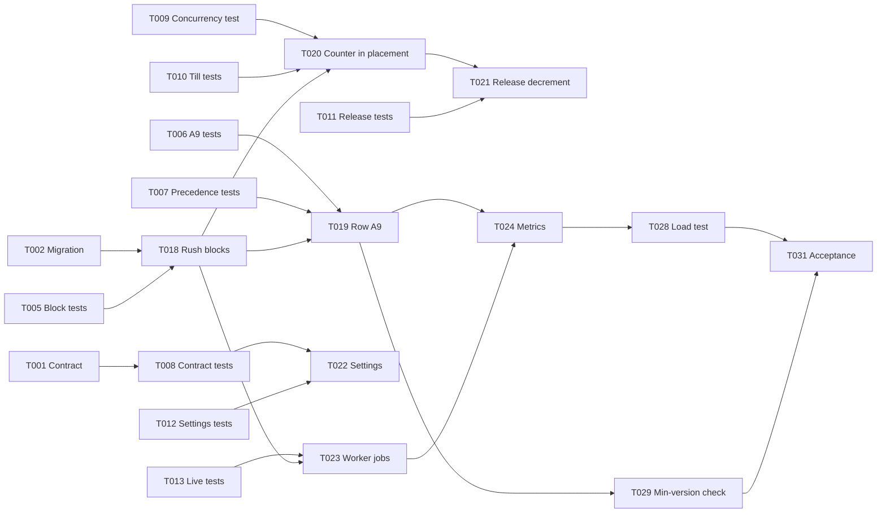

# Tasks: Rush-Hour Slot Throttling

## Document control

| Field | Value |
|---|---|
| Document ID | BRS-SPEC-001-TASKS |
| Version | 1.2 |
| Status | Complete |
| Owner | Business Analyst |
| Last updated | 2026-09-24 |
| Reviewers | Tech Lead, Node.js developers, Flutter developer, React developer, QA Lead |

| Version | Date | Change |
|---|---|---|
| 1.0 | 2026-08-21 | Generated with `/tasks` from plan v1.0; the Business Analyst added SPEC-FR links and acceptance references; the Tech Lead adjusted file paths and dependencies |
| 1.1 | 2026-09-10 | T020 reworked for the counter document after T009 kept failing against the first implementation (plan v1.1) |
| 1.2 | 2026-09-24 | T023 given a single-run key per block and T029 added after UAT-12; all tasks complete |

**Input**: Design documents from `08-ai-assisted-ba/specs/001-rush-hour-slot-throttling/`
**Prerequisites**: [plan.md](plan.md) (required), [spec.md](spec.md); research, data model, contracts and quickstart are consolidated in plan.md

### Purpose and scope

This is the ordered, executable task list for the rush-hour throttle. Tests come before implementation, every task names the file or area it changes, and every task links to the SPEC-FR requirement it serves (and through it to the canonical FR, BR or NFR in the spec). The Business Analyst uses the list to confirm that each requirement has at least one test task and one implementation task, and to run the acceptance walkthrough at the end.

## Format: `[ID] [P?] Description (file or area) -> SPEC-FR`

- **[P]**: can run in parallel with other [P] tasks in the same phase (different files, no dependency on an unfinished task).
- Paths are in the monorepo: `api` and `worker` (Node.js), `app` and `till` (Flutter), `web` and `admin` (React). Repository documentation paths are relative to the repo root.
- `[x]` marks completed tasks. All tasks were completed in Sprint 11 or the R1.2 validation week.

## Phase 3.1: Setup

- [x] T001 Add `ONLINE_CAP` to the pickup-minute `reason` enum and `settings.rushThrottle` to the branch schemas in `04-api/openapi.yaml`; the CI contract diff must report additive changes only (contract first) -> SPEC-FR-003, SPEC-FR-011, SPEC-FR-012
- [x] T002 [P] Migration: `settings.rushThrottle` per branch (60/20 at Market Hall and Station Quarter, 100/20 at Riverside and Campus), `channel` on KITCHEN_RESERVATION with a backfill for today's open orders, and the RUSH_BLOCK_COUNTER collection with its unique index, in `api/src/migrations/2026-09-07-rush-throttle.js` -> SPEC-FR-001, SPEC-FR-005, SPEC-FR-011
- [x] T003 [P] Fixtures SQ-0401 to SQ-0407 for the training branch on Friday 2026-10-02 in `api/test/fixtures/spec001-throttle.js`, registered in `06-quality/test-data/README.md` -> all
- [x] T004 [P] Business rules table 3.8 rows R1 to R4 as decision-table test data in `api/test/data/decision-tables/table-3-8.json` -> SPEC-FR-003, SPEC-FR-004

## Phase 3.2: Tests first (must fail before Phase 3.3 starts)

- [x] T005 [P] Unit test: blocks and caps for rush 11:45-13:30 (7 blocks, cap 9), Saturday 18:00-19:30 (6 blocks), 11:45-13:20 (last block 13:15-13:19, cap 3) and a day without a rush window, in `api/src/slots/__tests__/rushBlocks.test.js` -> SPEC-FR-001, SPEC-FR-002
- [x] T006 [P] Unit test: row A9 with scenarios 1, 2, 3, 5 and 6 (12:41 and 12:42 ONLINE_CAP at 12:02:00; 12:46 available at 9 of 9 and 5 of 9; 12:41 at 12:09:59 and 12:10:00; kitchen minutes from 13:30; the 13:31 straddle) in `api/src/slots/__tests__/throttleRule.test.js` -> SPEC-FR-003, SPEC-FR-004, SPEC-FR-005
- [x] T007 [P] Unit test: rows A1 to A8 decide first; 12:40 and 12:43 report KITCHEN_FULL, a busy-window minute reports BUSY_WINDOW and a delay-blocked minute DELAY_BLOCK, in `api/src/slots/__tests__/slotEngine.precedence.test.js` -> SPEC-FR-007
- [x] T008 [P] Contract test: pickup-slots returns ONLINE_CAP; `PATCH /branches/{branchId}` returns 403 for a Manager sending `rushThrottle` and 422 for 35% and for 9 minutes; `POST /orders` returns the 409 SLOT_TAKEN problem, in `api/test/contract/throttle.contract.test.js` -> SPEC-FR-003, SPEC-FR-008, SPEC-FR-011
- [x] T009 [P] Integration test: 20 parallel online placements of 1-minute orders into the 12:30 block holding 8 online minutes give exactly one 201 and nineteen 409 SLOT_TAKEN; the counter shows 9 and agrees with the reservations (scenario 8), in `api/test/integration/slots/throttleConcurrency.test.js` -> SPEC-FR-008
- [x] T010 [P] Integration test: Noor's walk-in at 12:05:00 for 12:41 is placed and the online count stays 8 (scenario 4); a till edit that adds kitchen minutes to an unpaid online order in a block at its cap is saved without refusal, and no online minute is offered in that block until its release (C-06), in `api/test/integration/slots/throttleTill.test.js` -> SPEC-FR-006
- [x] T011 [P] Integration test: cancellation of SQ-0405 at 12:04:00 takes the count from 8 to 6 in the same transaction (scenario 9); collection, no-show and an expired Prepay-only hold also decrement, in `api/test/integration/slots/throttleRelease.test.js` -> SPEC-FR-009
- [x] T012 [P] Integration test: share lowered to 40% at 12:03:00 leaves every order unchanged, offers no online minute in the 12:30 block until 12:10:00 and writes an audit event 60 to 40 (scenario 10); a change of today's rush window rebuilds the counters from the reservations, in `api/test/integration/branches/throttleSettings.test.js` -> SPEC-FR-011, SPEC-FR-013
- [x] T013 [P] Integration test: `slots.changed` reaches `branch:LOC-02` and `slots:LOC-02` within 2 seconds of the 12:10:00 release and of a cancellation, in `api/test/integration/live/slotsChanged.test.js` -> SPEC-FR-004, SPEC-FR-010
- [x] T014 [P] Unit test: throttle metrics carry branch, hour and counts only, with no customer, order or device identifiers, in `api/src/slots/__tests__/metrics.test.js` -> SPEC-FR-014
- [x] T015 [P] Flutter widget test: ONLINE_CAP and an unknown reason render as an unavailable minute with no text about walk-ins, in `app/test/pickup/pickup_grid_reason_test.dart` -> SPEC-FR-012
- [x] T016 [P] React test: the web panel pickup grid behaves as in T015, in `web/src/pickup/__tests__/PickupGrid.test.jsx` -> SPEC-FR-012
- [x] T017 [P] React test: Admin Panel throttle fields are editable for Paul (Administrator) and read-only for Marta (Manager); field messages for 35% and 9 minutes, in `admin/src/branches/__tests__/ThrottleSettings.test.jsx` -> SPEC-FR-011

## Phase 3.3: Core implementation (only after Phase 3.2 tests fail)

### API and worker track

- [x] T018 Rush block calculator: blocks, caps and release times from the branch settings and the server clock in the branch's time zone, in `api/src/slots/rushBlocks.js` (depends on T005) -> SPEC-FR-001, SPEC-FR-002, SPEC-FR-004, SPEC-FR-015
- [x] T019 Row A9 in the slot engine after rows A1 to A8, skipped for the till and when the share is 100, reading the day's counters once per request, in `api/src/slots/slotEngine.js` (depends on T006, T007, T018) -> SPEC-FR-003, SPEC-FR-005, SPEC-FR-006, SPEC-FR-007, SPEC-FR-015
- [x] T020 Conditional counter increment inside the placement transaction; zero matches abort with 409 SLOT_TAKEN; plain increment for released blocks and till edits, in `api/src/slots/rushCounters.js` and `api/src/orders/placeOrder.js` (depends on T009, T010, T018) -> SPEC-FR-006, SPEC-FR-008
- [x] T021 Decrement in the same transaction as every release of kitchen minutes (cancel, collect, no-show, Prepay-only expiry), in `api/src/orders/releaseKitchenMinutes.js` (depends on T011, T020) -> SPEC-FR-009
- [x] T022 Settings: range validation, Administrator-only check, audit event, rebuild of today's counters and release jobs, in `api/src/branches/updateBranch.js` (depends on T008, T012) -> SPEC-FR-011, SPEC-FR-013
- [x] T023 Worker jobs: create the day's counters at 05:00; one release notification per block at start minus R with a single-run key (branch, date, block); nightly comparison of counters and reservations, in `worker/src/jobs/rushThrottle.js` (depends on T013, T018) -> SPEC-FR-004, SPEC-FR-010
- [x] T024 Throttle metrics per branch and hour, and online minutes per block at release, in `api/src/slots/metrics.js` (depends on T014, T019, T023) -> SPEC-FR-014

### Client track (parallel with the API track once T001 and T015 to T017 exist)

- [x] T025 [P] Customer app: reason mapping with the unknown-reason fallback; the pickup sheet sends `picker.open` and `picker.close` and reloads on `slots.changed`, in `app/lib/pickup/pickup_sheet.dart` -> SPEC-FR-010, SPEC-FR-012
- [x] T026 [P] Web panel: the same behavior in `web/src/pickup/PickupGrid.jsx` -> SPEC-FR-010, SPEC-FR-012
- [x] T027 [P] Admin Panel: throttle settings on the branch form, read-only for Managers, in `admin/src/branches/ThrottleSettings.jsx` -> SPEC-FR-011

## Phase 3.4: Integration

- [x] T028 Load test at the peak profile and at 1.5 x with the throttle on at Market Hall and Station Quarter (TC-NFR-001); record slot-list and placement p95 (depends on T019 to T024) -> SPEC-FR-015
- [x] T029 Minimum-version check: app 1.0.5 and the previous web bundle against a staging API that returns ONLINE_CAP (depends on T019) -> SPEC-FR-012

## Phase 3.5: Polish and acceptance

- [x] T030 [P] Update TC-BRN-011 and TC-BRN-012 in `06-quality/test-cases.csv`, the rows for FR-BRN-12, BR-018 and US-013 in `02-requirements/requirements-traceability-matrix.csv`, and UAT-12 in `06-quality/uat-plan-and-scripts.md` (Business Analyst) -> all
- [x] T031 Acceptance walkthrough of spec scenarios 1 to 10 with the Operations Director and the QA Lead, then UAT-12 with Station Quarter staff (Business Analyst) (depends on T028, T029) -> all

## Dependencies



- Tests T005 to T017 must exist and fail before T018 to T027 start.
- T018 blocks every API task; T020 blocks every task that writes the counter.
- T025 to T027 can start once T001 and the client tests T015 to T017 exist.

## Parallel example

After T001 to T004, launch the tests together because they touch different files:

```text
T005 rushBlocks.test.js
T006 throttleRule.test.js
T007 slotEngine.precedence.test.js
T009 throttleConcurrency.test.js
T010 throttleTill.test.js
T011 throttleRelease.test.js
T015 pickup_grid_reason_test.dart
T017 ThrottleSettings.test.jsx
```

## Requirement coverage check (Business Analyst)

| SPEC-FR | Test tasks | Implementation tasks |
|---|---|---|
| SPEC-FR-001 | T005 | T002, T018 |
| SPEC-FR-002 | T005 | T018 |
| SPEC-FR-003 | T006, T008 | T001, T019 |
| SPEC-FR-004 | T006, T013 | T018, T023 |
| SPEC-FR-005 | T006 | T002, T019 |
| SPEC-FR-006 | T010 | T019, T020 |
| SPEC-FR-007 | T007 | T019 |
| SPEC-FR-008 | T008, T009 | T020 |
| SPEC-FR-009 | T011 | T021 |
| SPEC-FR-010 | T013 | T023, T025, T026 |
| SPEC-FR-011 | T008, T012, T017 | T001, T002, T022, T027 |
| SPEC-FR-012 | T015, T016, T029 | T001, T025, T026 |
| SPEC-FR-013 | T012 | T022 |
| SPEC-FR-014 | T014 | T024 |
| SPEC-FR-015 | T028 | T018, T019 |

Canonical acceptance: TC-BRN-011 (scenarios 1 to 4), TC-BRN-012 (scenarios 5 and 7), TC-NFR-001 (SPEC-FR-015) and UAT-12.

## Validation checklist

- [x] Every contract change has a contract test (T008)
- [x] Every SPEC-FR has at least one test task and one implementation task (table above)
- [x] All tests come before implementation
- [x] Parallel tasks are truly independent (different files)
- [x] Each task names its file or area
- [x] No task modifies the same file as another [P] task in the same phase

## Related documents

- [Feature specification](spec.md)
- [Implementation plan](plan.md)
- [AI-assisted BA README](../../README.md)
- [EP-02 Branches & Pickup Slots](../../../05-delivery/user-stories/EP-02-branches-and-pickup-slots.md)
- [Definition of Ready and Done](../../../05-delivery/definition-of-ready-and-done.md)
- [Test cases](../../../06-quality/test-cases.md)
- [Requirements traceability matrix](../../../02-requirements/requirements-traceability-matrix.md)
