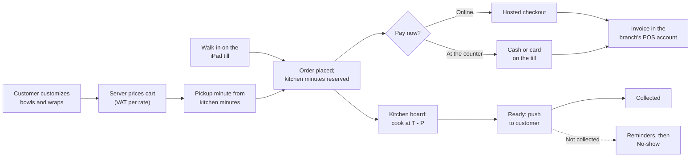

# Brasa: Business Analysis Case Study for a Restaurant Pickup-Ordering and Till Platform

**An end-to-end, traceable Business Analysis portfolio for a live ordering platform with four apps on one backend.** It runs from discovery to production incident reviews and a spec-driven feature.

> **Fictional case study.** Brasa, Brasa Grill, its branches, and every person, figure and record in this repository are fictional, and all data is synthetic. The work is modeled on real-world delivery experience and contains no client material. Compliance content shows how requirements support regulations; it is not legal advice.

> **Read it in the browser.** The [case study page](https://ayushsingh0456.github.io/case-studies/brasa.html) walks through the work, and the [document library](https://ayushsingh0456.github.io/library.html?project=brasa) opens every file here with diagrams rendered. Formatted PDFs: [BRD](https://ayushsingh0456.github.io/assets/docs/brasa-BRD.pdf) · [SRS](https://ayushsingh0456.github.io/assets/docs/brasa-SRS.pdf).

---

## The product in one paragraph

Brasa Grill (fictional) sells grill bowls and wraps from four branches in one EU country. Before Brasa, lunch customers either queued or phoned, the counter wrote orders on paper, and the kitchen guessed when to start. Brasa is one platform with four apps:
- a **Customer Mobile App** (Flutter, iOS and Android) and a **Customer Web Ordering panel** (React), where customers sign in with an emailed code, customize items, pick an exact pickup minute and pay online or at the counter;
- a **Counter Staff iPad till** (Flutter, landscape) for walk-in and dine-in orders by cash or card;
- an **Admin Panel** (React) for Administrators and Managers, with live kitchen and counter boards.

The hard parts are where a BA earns their keep:
- pickup times must come from real kitchen capacity, not from a slot grid;
- a removed ingredient never changes the price, and VAT must be rounded exactly as the POS rounds it;
- a customer must never be charged twice, and every paid order needs exactly one invoice;
- a screen in a busy kitchen must never look live when it is not.



## At a glance

| Artifact | Count | Where |
|---|---|---|
| Business objectives with baseline and target KPIs | 6 | [BRD](02-requirements/BRD.md) |
| Personas / stakeholders in the register | 7 / 20 | [Personas](01-discovery/personas.md), [RACI](01-discovery/stakeholder-register-raci.md) |
| Functional requirements (ISO/IEC/IEEE 29148 SRS) | 72 | [SRS](02-requirements/SRS.md) |
| Business rules / decision tables | 45 / 8 | [Business rules](02-requirements/business-rules.md) |
| Non-functional requirements (ISO/IEC 25010) | 28 | [NFRs](02-requirements/non-functional-requirements.md) |
| Epics / user stories / Gherkin acceptance criteria / story points | 6 / 42 / 214 / 203 | [Epics](05-delivery/epics.md), [Jira CSV](05-delivery/jira-import.csv) |
| Mermaid diagrams (C4, swimlane flows, sequence, state, ERD, Gantt) | 39 | [03-design](03-design/), across the repo |
| Low-fidelity wireframes (annotated SVG) | 5 | [Wireframes](03-design/wireframes/README.md) |
| API operations (OpenAPI 3.1, validated) | 42 | [openapi.yaml](04-api/openapi.yaml), [live events](04-api/realtime-events.md) |
| Test cases / UAT scripts | 90 / 12 | [Test cases](06-quality/test-cases.md), [UAT](06-quality/uat-plan-and-scripts.md) |
| Change requests (2 rejected with rationale) | 7 | [CR log](05-delivery/change-request-log.md) |
| Architecture decision records | 3 | [ADRs](03-design/architecture/adr/) |
| Post-incident reviews (blameless) / incidents in the register | 2 / 11 | [Incident process](07-operations/incident-management-process.md) |
| Spec Kit feature pack (spec, plan, tasks) | 1 | [Spec 001](08-ai-assisted-ba/specs/001-rush-hour-slot-throttling/spec.md) |

Every FR traces to an objective, business rules, stories, API operations and tests in the [traceability matrix](02-requirements/requirements-traceability-matrix.md), which is generated from those sources rather than maintained by hand. Of the 90 test cases, 87 pass, 2 fail with open defects and 1 is blocked by a provider sandbox limit.

### The worked examples

The same numbers appear in the SRS, the business rules, the stories, the test cases, the test data and the wireframes.
- **WE-1, order total (MH-0142).** A Chicken Grill Bowl at 9.40 with Halloumi 1.50 and Garlic sauce 0.50, without red onion and coriander (no credit), two Chicken Wraps at 7.90 with Extra chicken 2.20, and a Sparkling lemonade at 2.90: total **34.50**. VAT is extracted once per rate: 10% on 31.60 = 2.87 and 20% on 2.90 = 0.48, so **3.35** (per-line rounding would give 3.36). A 5% tip is 1.725, rounded half up to **1.73**, so the card is charged **36.23**.
- **WE-2, pickup slots at the rush.** At 12:04:20 with a 10-minute lead time, the earliest pickup is 12:15. Three kitchen units at a rush factor of 0.5 need ceil(1.5) = 2 kitchen minutes. With five orders already booked, the first minute whose two kitchen minutes are both free is **12:28**. Clara chooses **12:31**, which holds kitchen minutes 12:29 and 12:30, with a cancellation deadline of 12:16.

---

## Start here: a 10-minute tour

1. **[BRD: executive summary and objectives](02-requirements/BRD.md).** The problem in numbers, six objectives with results to date, and what is out of scope.
2. **[SRS Appendix B: worked examples](02-requirements/SRS.md#appendix-b-worked-examples)** and the field-level validation for checkout and the till.
3. **[Business rules: decision tables 3.1 and 3.8](02-requirements/business-rules.md#3-decision-tables).** Pickup-minute availability, and the rush throttle that keeps capacity for walk-ins.
4. **[User stories: EP-02 branches and pickup slots](05-delivery/user-stories/EP-02-branches-and-pickup-slots.md).** INVEST stories with boundary-value Gherkin, including WE-2 (US-011).
5. **[Post-incident review: duplicate card capture on retry](07-operations/incidents/INC-2026-009-duplicate-card-capture-on-retry.md).** How 23 double charges became CR-007, payment attempts with idempotency keys and a nightly reconciliation.
6. **[Change request log](05-delivery/change-request-log.md).** Includes why "let customers cancel until the order is Ready" was **rejected** (CR-005).
7. **[Spec 001: rush-hour slot throttling](08-ai-assisted-ba/specs/001-rush-hour-slot-throttling/spec.md).** A BA-owned Spec Kit spec that AI coding agents implemented, with the clarifications and the arithmetic checked by hand.

---

## Repository map

```
README.md
01-discovery/        Project charter, stakeholder register and RACI, 7 personas,
                     AS-IS / TO-BE with quantified pain points, market and competitor scan
02-requirements/     BRD, SRS, 45 business rules with 8 decision tables, 28 NFRs,
                     compliance mapping, glossary, traceability matrix (md + csv)
03-design/
  architecture/      C4 context and containers, technology stack, ADR-001..003
  data/              ERD, data dictionary
  diagrams/          Swimlane process flows, sequence diagrams, state machines
  wireframes/        5 annotated low-fidelity SVG wireframes (mobile, iPad till, kitchen board)
04-api/              OpenAPI 3.1 spec (42 operations), API guidelines and error catalog,
                     live-update events
05-delivery/         Epics, 42 user stories in 6 files, Jira import CSV, release and sprint plan,
                     change requests, decision log, RAID log, Definition of Ready and Done
06-quality/          Test strategy and plan, 90 test cases (md + csv), 12 UAT scripts,
                     synthetic test data (catalog and orders)
07-operations/       Incident management process and register, 2 post-incident reviews
08-ai-assisted-ba/   Guardrails and prompts for AI-assisted BA work, and a GitHub Spec Kit
                     feature pack (spec.md / plan.md / tasks.md) for the rush-hour throttle
```

---

## What this demonstrates

| BA capability | Evidence in this repo |
|---|---|
| Elicitation and discovery | [AS-IS / TO-BE](01-discovery/current-vs-future-state.md) from 24 interviews, 8 rush observations, a call log, a POS export and a survey (n = 212); [personas](01-discovery/personas.md); [market scan and build-or-buy](01-discovery/market-and-competitor-scan.md) |
| Stakeholder management | [Register, power/interest grid, RACI and communication plan](01-discovery/stakeholder-register-raci.md) |
| Business requirements | [BRD](02-requirements/BRD.md) with objectives, business needs, scope, cost/benefit and sign-off |
| Requirements specification | [SRS](02-requirements/SRS.md): 29148 structure, interfaces, configuration ranges, field-level validation and messages, role-permission matrix, open issues |
| Business rules and decision modeling | [45 rules and 8 decision tables](02-requirements/business-rules.md) with hit policies, boundary examples and rule tensions |
| Non-functional requirements | [28 measurable NFRs](02-requirements/non-functional-requirements.md) mapped to ISO/IEC 25010 and verification methods |
| Process, system and data modeling | [Process flows](03-design/diagrams/process-flows.md), [sequences](03-design/diagrams/sequence-diagrams.md), [state machines](03-design/diagrams/state-machines.md), [ERD](03-design/data/erd.md), [data dictionary](03-design/data/data-dictionary.md) |
| API and integration analysis | [OpenAPI 3.1](04-api/openapi.yaml) with `x-requirements`, [error catalog](04-api/api-guidelines.md), [live events with sequence numbers](04-api/realtime-events.md) |
| Agile delivery | [Epics](05-delivery/epics.md), [stories with Gherkin](05-delivery/user-stories/EP-04-customer-ordering-and-notifications.md), [release and sprint plan](05-delivery/release-and-sprint-plan.md), [DoR and DoD](05-delivery/definition-of-ready-and-done.md) |
| Change control and governance | [Change requests with impact analysis](05-delivery/change-request-log.md), [RAID log](05-delivery/raid-log.md), [decision log](05-delivery/decision-log.md) |
| Quality and UAT | [Test strategy (ISO/IEC/IEEE 29119-3)](06-quality/test-strategy-and-plan.md), [test cases](06-quality/test-cases.md), [UAT scripts and sign-off](06-quality/uat-plan-and-scripts.md), [synthetic test data](06-quality/test-data/README.md) |
| Production support | [Incident process](07-operations/incident-management-process.md) and two blameless reviews with timeline, 5 Whys and CAPA: [INC-2026-004](07-operations/incidents/INC-2026-004-till-board-desync-after-reconnect.md), [INC-2026-009](07-operations/incidents/INC-2026-009-duplicate-card-capture-on-retry.md) |
| Regulated-domain awareness | [Compliance mapping](02-requirements/compliance-mapping.md): GDPR, VAT and invoicing, allergen information for distance sales, PSD2 strong customer authentication, card data scope, accessibility |
| AI-assisted analysis | [Guardrails, prompts and what review caught](08-ai-assisted-ba/README.md); [spec-driven feature pack](08-ai-assisted-ba/specs/001-rush-hour-slot-throttling/spec.md) |

---

## Judgement calls worth discussing

- **Kitchen minutes, not 15-minute slots.** A pickup minute is offered only if the order's kitchen minutes are free. In the prototype test, fixed slots left up to 40% of line capacity unused while still overbooking big orders (DEC-02, [ADR-001](03-design/architecture/adr/ADR-001-server-authoritative-slot-reservation.md)).
- **Walk-ins are never refused.** The till can always overbook (BR-019). When online pre-orders crowded out walk-ins at Station Quarter, CR-006 capped the online share of each rush quarter-hour instead of limiting the counter.
- **No credit for removed ingredients.** Removing onions saves no cost, and credits made prices drift from the POS articles (DEC-03, BR-021).
- **Receipts stay with a certified POS provider.** Brasa never signs fiscal receipts; it sends complete lines and rounds VAT per rate group exactly as the POS does (DEC-10, DEC-11).
- **Fair consequences.** An unpaid no-show leads to 30 days of Prepay-only, not a suspension, after 9 of 23 suspensions were disputed in three weeks (CR-003).
- **Saying no with evidence.** Cancel-until-Ready (CR-005) was rejected with a food-waste estimate of about EUR 1,020 a month; guest checkout (CR-002) was rejected because reminders and the no-show policy need a verified email.
- **Incidents change requirements.** A stale till after a router restart (INC-2026-004) led to sequenced events and snapshot resync (CR-004, [ADR-002](03-design/architecture/adr/ADR-002-live-updates-snapshot-and-sequence.md)). A double charge on retry (INC-2026-009) led to payment attempts with idempotency keys and an invoice outbox (CR-007, [ADR-003](03-design/architecture/adr/ADR-003-idempotent-payments-and-invoice-outbox.md)).

---

## Standards and techniques used

ISO/IEC/IEEE 29148 (requirements) · ISO/IEC 25010 (quality model) · ISO/IEC/IEEE 29119-3 (test documentation) · BABOK v3 techniques · INVEST and Gherkin (Given/When/Then) · MoSCoW · C4 model · BPMN-style swimlanes · UML state and sequence diagrams · DMN-style decision tables · OpenAPI 3.1 and RFC 9457 problem details · MADR architecture decision records · blameless post-incident reviews with 5 Whys and CAPA · GDPR · EU VAT invoicing · PSD2 SCA · PCI DSS scope reduction · WCAG 2.2 AA · GitHub Spec Kit.

## Using the files

- **Diagrams** render directly on GitHub (Mermaid). To edit one, paste the block into any Mermaid editor.
- **Jira:** import [`jira-import.csv`](05-delivery/jira-import.csv) through the CSV importer. It contains 6 epics and 42 stories with acceptance criteria, points, sprints and labels.
- **API:** open [`openapi.yaml`](04-api/openapi.yaml) in any OpenAPI 3.1 viewer. Every operation lists the requirements it implements (`x-requirements`) and the roles allowed (`x-roles`).
- **Test data:** see the [test-data README](06-quality/test-data/README.md). Totals, VAT and kitchen minutes in `orders.csv` can be recomputed by hand from the lines.

---

## About the author

**Ayush Kumar Singh** is a Business Analyst working on SaaS, mobile and operations products. His work covers:
- requirements and SRS authoring;
- user stories and acceptance criteria;
- process and data modeling;
- UAT;
- incident documentation and change control.

LinkedIn: [linkedin.com/in/ayush-singh-914495189](https://www.linkedin.com/in/ayush-singh-914495189/)

This case study is self-directed. It is modeled on real-world delivery experience and uses a fictional product, so it contains no client material and discloses no employer or client information.
